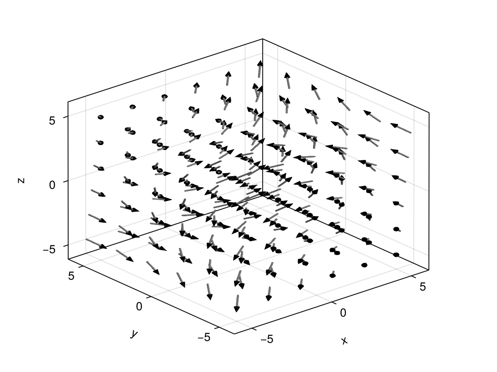
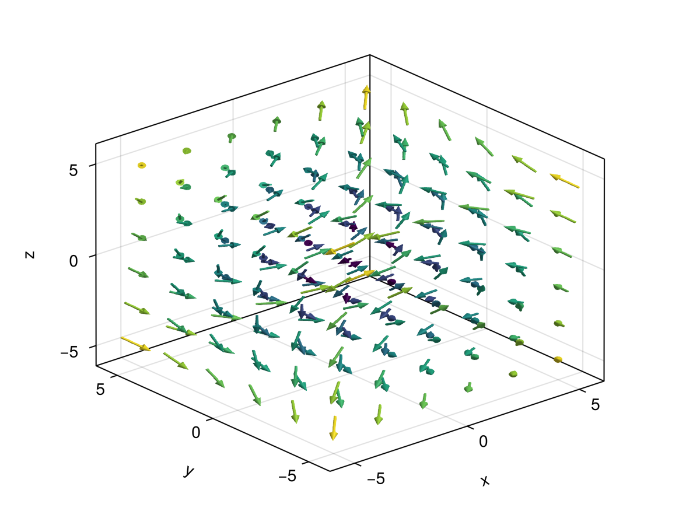
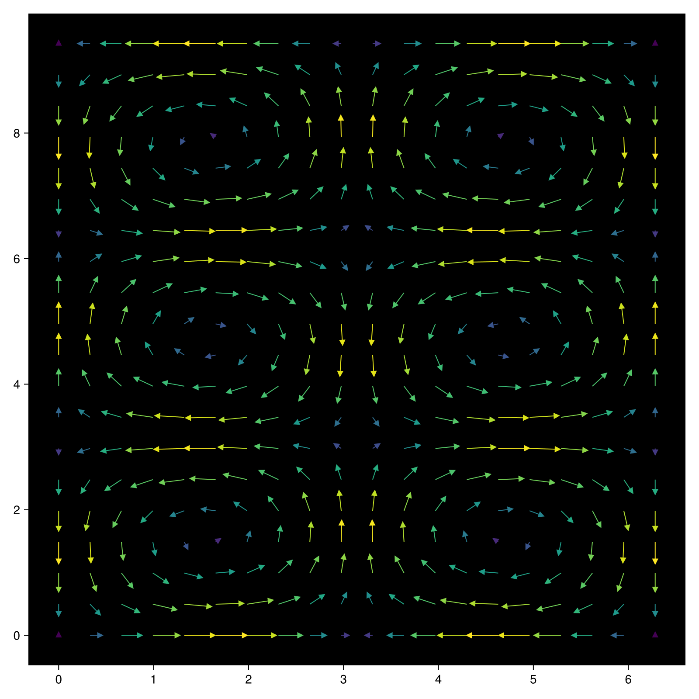

# arrows {#arrows}
<details class='jldocstring custom-block' open>
<summary><a id='MakieCore.arrows-reference-plots-arrows' href='#MakieCore.arrows-reference-plots-arrows'><span class="jlbinding">MakieCore.arrows</span></a> <Badge type="info" class="jlObjectType jlFunction" text="Function" /></summary>


```julia
arrows(points, directions; kwargs...)
arrows(x, y, u, v)
arrows(x::AbstractVector, y::AbstractVector, u::AbstractMatrix, v::AbstractMatrix)
arrows(x, y, z, u, v, w)
arrows(x, y, [z], f::Function)
```


Plots arrows at the specified points with the specified components. `u` and `v` are interpreted as vector components (`u` being the x and `v` being the y), and the vectors are plotted with the tails at `x`, `y`.

If `x, y, u, v` are `<: AbstractVector`, then each &#39;row&#39; is plotted as a single vector.

If `u, v` are `<: AbstractMatrix`, then `x` and `y` are interpreted as specifications for a grid, and `u, v` are plotted as arrows along the grid.

`arrows` can also work in three dimensions.

If a `Function` is provided in place of `u, v, [w]`, then it must accept a `Point` as input, and return an appropriately dimensioned `Point`, `Vec`, or other array-like output.

**Plot type**

The plot type alias for the `arrows` function is `Arrows`.


<Badge type="info" class="source-link" text="source"><a href="https://github.com/MakieOrg/Makie.jl/blob/406a09fe6f430d0a43f0f3cf1a876583e9bafbf5/MakieCore/src/recipes.jl#L520-L656" target="_blank" rel="noreferrer">source</a></Badge>

</details>


## Examples {#Examples}
<a id="example-b721d02" />


```julia
using CairoMakie
f = Figure(size = (800, 800))
Axis(f[1, 1], backgroundcolor = "black")

xs = LinRange(0, 2pi, 20)
ys = LinRange(0, 3pi, 20)
us = [sin(x) * cos(y) for x in xs, y in ys]
vs = [-cos(x) * sin(y) for x in xs, y in ys]
strength = vec(sqrt.(us .^ 2 .+ vs .^ 2))

arrows!(xs, ys, us, vs, arrowsize = 10, lengthscale = 0.3,
    arrowcolor = strength, linecolor = strength)

f
```


<a id="example-ea4ba5d" />


```julia
using GLMakie
ps = [Point3f(x, y, z) for x in -5:2:5 for y in -5:2:5 for z in -5:2:5]
ns = map(p -> 0.1 * Vec3f(p[2], p[3], p[1]), ps)
arrows(
    ps, ns, fxaa=true, # turn on anti-aliasing
    linecolor = :gray, arrowcolor = :black,
    linewidth = 0.1, arrowsize = Vec3f(0.3, 0.3, 0.4),
    align = :center, axis=(type=Axis3,)
)
```



<a id="example-fbb4d73" />


```julia
using GLMakie
using LinearAlgebra

ps = [Point3f(x, y, z) for x in -5:2:5 for y in -5:2:5 for z in -5:2:5]
ns = map(p -> 0.1 * Vec3f(p[2], p[3], p[1]), ps)
lengths = norm.(ns)
arrows(
    ps, ns, fxaa=true, # turn on anti-aliasing
    color=lengths,
    linewidth = 0.1, arrowsize = Vec3f(0.3, 0.3, 0.4),
    align = :center, axis=(type=Axis3,)
)
```




`arrows` can also take a function `f(x::Point{N})::Point{N}` which returns the arrow vector when given the arrow&#39;s origin.
<a id="example-4f23aee" />


```julia
using CairoMakie
fig = Figure(size = (800, 800))
ax = Axis(fig[1, 1], backgroundcolor = "black")
xs = LinRange(0, 2pi, 20)
ys = LinRange(0, 3pi, 20)
# explicit method
us = [sin(x) * cos(y) for x in xs, y in ys]
vs = [-cos(x) * sin(y) for x in xs, y in ys]
strength = vec(sqrt.(us .^ 2 .+ vs .^ 2))
# function method
arrow_fun(x) = Point2f(sin(x[1])*cos(x[2]), -cos(x[1])*sin(x[2]))
arrows!(ax, xs, ys, arrow_fun, arrowsize = 10, lengthscale = 0.3,
    arrowcolor = strength, linecolor = strength)
fig
```




## Attributes {#Attributes}

### align {#align}

Defaults to `:origin`

Sets how arrows are positioned. By default arrows start at the given positions and extend along the given directions. If this attribute is set to `:head`, `:lineend`, `:tailend`, `:headstart` or `:center` the given positions will be between the head and tail of each arrow instead.

### alpha {#alpha}

Defaults to `1.0`

The alpha value of the colormap or color attribute. Multiple alphas like in `plot(alpha=0.2, color=(:red, 0.5)`, will get multiplied.

### arrowcolor {#arrowcolor}

Defaults to `automatic`

Sets the color of the arrow head. Will copy `color` if set to `automatic`.

### arrowhead {#arrowhead}

Defaults to `automatic`

Defines the marker (2D) or mesh (3D) that is used as the arrow head. The default for is `'▲'` in 2D and a cone mesh in 3D. For the latter the mesh should start at `Point3f(0)` and point in positive z-direction.

### arrowsize {#arrowsize}

Defaults to `automatic`

Scales the size of the arrow head. This defaults to `0.3` in the 2D case and `Vec3f(0.2, 0.2, 0.3)` in the 3D case. For the latter the first two components scale the radius (in x/y direction) and the last scales the length of the cone. If the arrowsize is set to 1, the cone will have a diameter and length of 1.

### arrowtail {#arrowtail}

Defaults to `automatic`

Defines the mesh used to draw the arrow tail in 3D. It should start at `Point3f(0)` and extend in negative z-direction. The default is a cylinder. This has no effect on the 2D plot.

### backlight {#backlight}

Defaults to `0.0`

Sets a weight for secondary light calculation with inverted normals.

### clip_planes {#clip_planes}

Defaults to `automatic`

Clip planes offer a way to do clipping in 3D space. You can set a Vector of up to 8 `Plane3f` planes here, behind which plots will be clipped (i.e. become invisible). By default clip planes are inherited from the parent plot or scene. You can remove parent `clip_planes` by passing `Plane3f[]`.

### color {#color}

Defaults to `:black`

Sets the color of arrowheads and lines. Can be overridden separately using `linecolor` and `arrowcolor`.

### colormap {#colormap}

Defaults to `@inherit colormap :viridis`

Sets the colormap that is sampled for numeric `color`s. `PlotUtils.cgrad(...)`, `Makie.Reverse(any_colormap)` can be used as well, or any symbol from ColorBrewer or PlotUtils. To see all available color gradients, you can call `Makie.available_gradients()`.

### colorrange {#colorrange}

Defaults to `automatic`

The values representing the start and end points of `colormap`.

### colorscale {#colorscale}

Defaults to `identity`

The color transform function. Can be any function, but only works well together with `Colorbar` for `identity`, `log`, `log2`, `log10`, `sqrt`, `logit`, `Makie.pseudolog10` and `Makie.Symlog10`.

### depth_shift {#depth_shift}

Defaults to `0.0`

Adjusts the depth value of a plot after all other transformations, i.e. in clip space, where `-1 <= depth <= 1`. This only applies to GLMakie and WGLMakie and can be used to adjust render order (like a tunable overdraw).

### diffuse {#diffuse}

Defaults to `1.0`

Sets how strongly the red, green and blue channel react to diffuse (scattered) light.

### fxaa {#fxaa}

Defaults to `automatic`

Adjusts whether the plot is rendered with fxaa (anti-aliasing, GLMakie only).

### highclip {#highclip}

Defaults to `automatic`

The color for any value above the colorrange.

### inspectable {#inspectable}

Defaults to `@inherit inspectable`

Sets whether this plot should be seen by `DataInspector`. The default depends on the theme of the parent scene.

### inspector_clear {#inspector_clear}

Defaults to `automatic`

Sets a callback function `(inspector, plot) -> ...` for cleaning up custom indicators in DataInspector.

### inspector_hover {#inspector_hover}

Defaults to `automatic`

Sets a callback function `(inspector, plot, index) -> ...` which replaces the default `show_data` methods.

### inspector_label {#inspector_label}

Defaults to `automatic`

Sets a callback function `(plot, index, position) -> string` which replaces the default label generated by DataInspector.

### lengthscale {#lengthscale}

Defaults to `1.0`

Scales the length of the arrow tail.

### linecolor {#linecolor}

Defaults to `automatic`

Sets the color used for the arrow tail which is represented by a line in 2D. Will copy `color` if set to `automatic`.

### linestyle {#linestyle}

Defaults to `nothing`

Sets the linestyle used in 2D. Does not apply to 3D plots.

### linewidth {#linewidth}

Defaults to `automatic`

Scales the width/diameter of the arrow tail. Defaults to `1` for 2D and `0.05` for the 3D case.

### lowclip {#lowclip}

Defaults to `automatic`

The color for any value below the colorrange.

### markerspace {#markerspace}

Defaults to `:pixel`

No docs available.

### material {#material}

Defaults to `nothing`

RPRMakie only attribute to set complex RadeonProRender materials.         _Warning_, how to set an RPR material may change and other backends will ignore this attribute

### model {#model}

Defaults to `automatic`

Sets a model matrix for the plot. This overrides adjustments made with `translate!`, `rotate!` and `scale!`.

### nan_color {#nan_color}

Defaults to `:transparent`

The color for NaN values.

### normalize {#normalize}

Defaults to `false`

By default the lengths of the directions given to `arrows` are used to scale the length of the arrow tails. If this attribute is set to true the directions are normalized, skipping this scaling.

### overdraw {#overdraw}

Defaults to `false`

Controls if the plot will draw over other plots. This specifically means ignoring depth checks in GL backends

### quality {#quality}

Defaults to `32`

Defines the number of angle subdivisions used when generating the arrow head and tail meshes. Consider lowering this if you have performance issues. Only applies to 3D plots.

### shading {#shading}

Defaults to `automatic`

Sets the lighting algorithm used. Options are `NoShading` (no lighting), `FastShading` (AmbientLight + PointLight) or `MultiLightShading` (Multiple lights, GLMakie only). Note that this does not affect RPRMakie.

### shininess {#shininess}

Defaults to `32.0`

Sets how sharp the reflection is.

### space {#space}

Defaults to `:data`

Sets the transformation space for box encompassing the plot. See `Makie.spaces()` for possible inputs.

### specular {#specular}

Defaults to `0.2`

Sets how strongly the object reflects light in the red, green and blue channels.

### ssao {#ssao}

Defaults to `false`

Adjusts whether the plot is rendered with ssao (screen space ambient occlusion). Note that this only makes sense in 3D plots and is only applicable with `fxaa = true`.

### transform_marker {#transform_marker}

Defaults to `automatic`

Controls whether marker attributes get transformed by the model matrix.

### transformation {#transformation}

Defaults to `:automatic`

No docs available.

### transparency {#transparency}

Defaults to `false`

Adjusts how the plot deals with transparency. In GLMakie `transparency = true` results in using Order Independent Transparency.

### visible {#visible}

Defaults to `true`

Controls whether the plot will be rendered or not.
