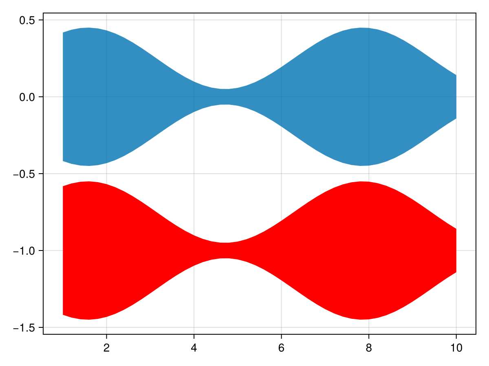
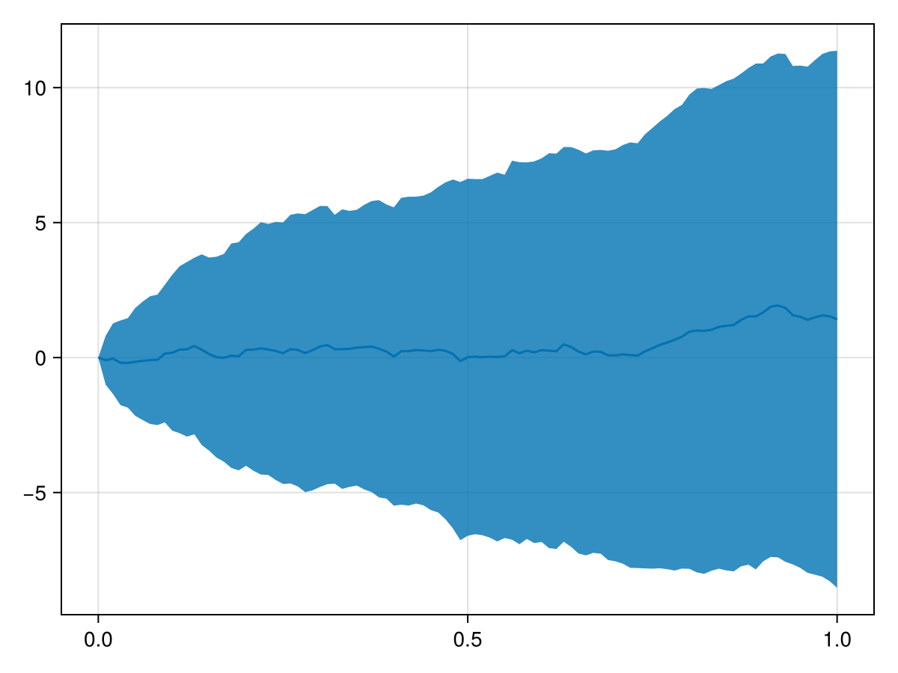
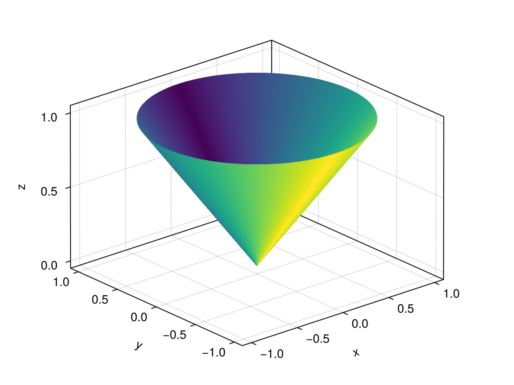
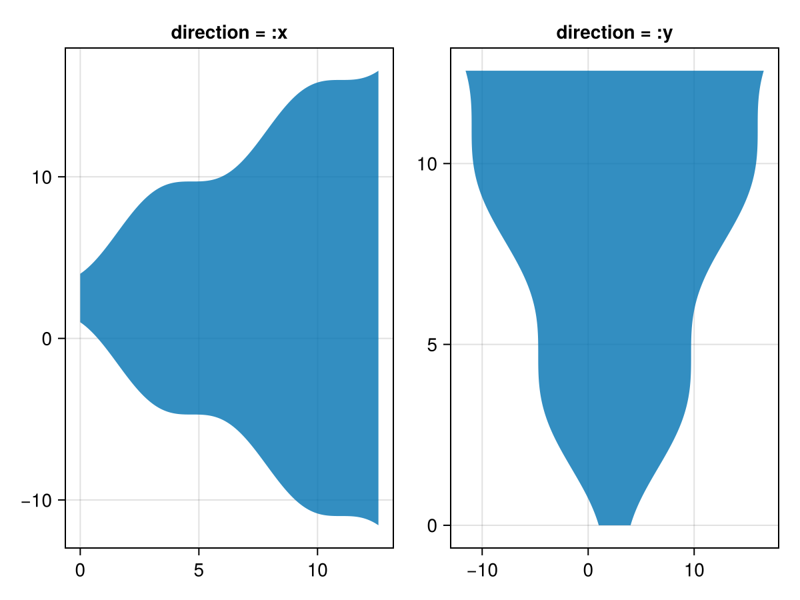

# band {#band}
<details class='jldocstring custom-block' open>
<summary><a id='Makie.band-reference-plots-band' href='#Makie.band-reference-plots-band'><span class="jlbinding">Makie.band</span></a> <Badge type="info" class="jlObjectType jlFunction" text="Function" /></summary>


```julia
band(x, ylower, yupper; kwargs...)
band(lower, upper; kwargs...)
band(x, lowerupper; kwargs...)
```


Plots a band from `ylower` to `yupper` along `x`. The form `band(lower, upper)` plots a [ruled surface](https://en.wikipedia.org/wiki/Ruled_surface) between the points in `lower` and `upper`. Both bounds can be passed together as `lowerupper`, a vector of intervals.

**Plot type**

The plot type alias for the `band` function is `Band`.


<Badge type="info" class="source-link" text="source"><a href="https://github.com/MakieOrg/Makie.jl/blob/e1788feb7d2b5c349ae9fe7900dfde092b701913/MakieCore/src/recipes.jl#L520-L615" target="_blank" rel="noreferrer">source</a></Badge>

</details>


## Examples {#Examples}
<a id="example-ebfe663" />


```julia
using CairoMakie
f = Figure()
Axis(f[1, 1])

xs = 1:0.2:10
ys_low = -0.2 .* sin.(xs) .- 0.25
ys_high = 0.2 .* sin.(xs) .+ 0.25

band!(xs, ys_low, ys_high)
band!(xs, ys_low .- 1, ys_high .-1, color = :red)

f
```



<a id="example-e5f0920" />


```julia
using CairoMakie
using Statistics

f = Figure()
Axis(f[1, 1])

n, m = 100, 101
t = range(0, 1, length=m)
X = cumsum(randn(n, m), dims = 2)
X = X .- X[:, 1]
μ = vec(mean(X, dims=1)) # mean
lines!(t, μ)              # plot mean line
σ = vec(std(X, dims=1))  # stddev
band!(t, μ + σ, μ - σ)   # plot stddev band
f
```



<a id="example-2e5a269" />


```julia
using GLMakie
lower = fill(Point3f(0,0,0), 100)
upper = [Point3f(sin(x), cos(x), 1.0) for x in range(0,2pi, length=100)]
col = repeat([1:50;50:-1:1],outer=2)
band(lower, upper, color=col, axis=(type=Axis3,))
```




## Attributes {#Attributes}

### alpha {#alpha}

Defaults to `1.0`

The alpha value of the colormap or color attribute. Multiple alphas like in `plot(alpha=0.2, color=(:red, 0.5)`, will get multiplied.

### backlight {#backlight}

Defaults to `0.0`

Sets a weight for secondary light calculation with inverted normals.

### clip_planes {#clip_planes}

Defaults to `automatic`

Clip planes offer a way to do clipping in 3D space. You can set a Vector of up to 8 `Plane3f` planes here, behind which plots will be clipped (i.e. become invisible). By default clip planes are inherited from the parent plot or scene. You can remove parent `clip_planes` by passing `Plane3f[]`.

### color {#color}

Defaults to `@inherit patchcolor`

Sets the color of the mesh. Can be a `Vector{<:Colorant}` for per vertex colors or a single `Colorant`. A `Matrix{<:Colorant}` can be used to color the mesh with a texture, which requires the mesh to contain texture coordinates. A `<: AbstractPattern` can be used to apply a repeated, pixel sampled pattern to the mesh, e.g. for hatching.

### colormap {#colormap}

Defaults to `@inherit colormap :viridis`

Sets the colormap that is sampled for numeric `color`s. `PlotUtils.cgrad(...)`, `Makie.Reverse(any_colormap)` can be used as well, or any symbol from ColorBrewer or PlotUtils. To see all available color gradients, you can call `Makie.available_gradients()`.

### colorrange {#colorrange}

Defaults to `automatic`

The values representing the start and end points of `colormap`.

### colorscale {#colorscale}

Defaults to `identity`

The color transform function. Can be any function, but only works well together with `Colorbar` for `identity`, `log`, `log2`, `log10`, `sqrt`, `logit`, `Makie.pseudolog10` and `Makie.Symlog10`.

### cycle {#cycle}

Defaults to `[:color => :patchcolor]`

No docs available.

### depth_shift {#depth_shift}

Defaults to `0.0`

Adjusts the depth value of a plot after all other transformations, i.e. in clip space, where `-1 <= depth <= 1`. This only applies to GLMakie and WGLMakie and can be used to adjust render order (like a tunable overdraw).

### diffuse {#diffuse}

Defaults to `1.0`

Sets how strongly the red, green and blue channel react to diffuse (scattered) light.

### direction {#direction}

Defaults to `:x`

The direction of the band. If set to `:y`, x and y coordinates will be flipped, resulting in a vertical band. This setting applies only to 2D bands.
<a id="example-c51d951" />


```julia
using CairoMakie
fig = Figure()
location = range(0, 4pi, length = 200)
lower =   cos.(location) .- location
upper = .-cos.(location) .+ location .+ 5
band(fig[1, 1], location, lower, upper,
    axis = (; title = "direction = :x"))
band(fig[1, 2], location, lower, upper, direction = :y,
    axis = (; title = "direction = :y"))
fig
```




### fxaa {#fxaa}

Defaults to `true`

Adjusts whether the plot is rendered with fxaa (anti-aliasing, GLMakie only).

### highclip {#highclip}

Defaults to `automatic`

The color for any value above the colorrange.

### inspectable {#inspectable}

Defaults to `@inherit inspectable`

Sets whether this plot should be seen by `DataInspector`. The default depends on the theme of the parent scene.

### inspector_clear {#inspector_clear}

Defaults to `automatic`

Sets a callback function `(inspector, plot) -> ...` for cleaning up custom indicators in DataInspector.

### inspector_hover {#inspector_hover}

Defaults to `automatic`

Sets a callback function `(inspector, plot, index) -> ...` which replaces the default `show_data` methods.

### inspector_label {#inspector_label}

Defaults to `automatic`

Sets a callback function `(plot, index, position) -> string` which replaces the default label generated by DataInspector.

### interpolate {#interpolate}

Defaults to `true`

sets whether colors should be interpolated

### lowclip {#lowclip}

Defaults to `automatic`

The color for any value below the colorrange.

### matcap {#matcap}

Defaults to `nothing`

No docs available.

### material {#material}

Defaults to `nothing`

RPRMakie only attribute to set complex RadeonProRender materials.         _Warning_, how to set an RPR material may change and other backends will ignore this attribute

### model {#model}

Defaults to `automatic`

Sets a model matrix for the plot. This overrides adjustments made with `translate!`, `rotate!` and `scale!`.

### nan_color {#nan_color}

Defaults to `:transparent`

The color for NaN values.

### overdraw {#overdraw}

Defaults to `false`

Controls if the plot will draw over other plots. This specifically means ignoring depth checks in GL backends

### shading {#shading}

Defaults to `NoShading`

Sets the lighting algorithm used. Options are `NoShading` (no lighting), `FastShading` (AmbientLight + PointLight) or `MultiLightShading` (Multiple lights, GLMakie only). Note that this does not affect RPRMakie.

### shininess {#shininess}

Defaults to `32.0`

Sets how sharp the reflection is.

### space {#space}

Defaults to `:data`

Sets the transformation space for box encompassing the plot. See `Makie.spaces()` for possible inputs.

### specular {#specular}

Defaults to `0.2`

Sets how strongly the object reflects light in the red, green and blue channels.

### ssao {#ssao}

Defaults to `false`

Adjusts whether the plot is rendered with ssao (screen space ambient occlusion). Note that this only makes sense in 3D plots and is only applicable with `fxaa = true`.

### transformation {#transformation}

Defaults to `:automatic`

No docs available.

### transparency {#transparency}

Defaults to `false`

Adjusts how the plot deals with transparency. In GLMakie `transparency = true` results in using Order Independent Transparency.

### uv_transform {#uv_transform}

Defaults to `automatic`

Sets a transform for uv coordinates, which controls how a texture is mapped to a mesh. The attribute can be `I`, `scale::VecTypes{2}`, `(translation::VecTypes{2}, scale::VecTypes{2})`, any of :rotr90, :rotl90, :rot180, :swap_xy/:transpose, :flip_x, :flip_y, :flip_xy, or most generally a `Makie.Mat{2, 3, Float32}` or `Makie.Mat3f` as returned by `Makie.uv_transform()`. They can also be changed by passing a tuple `(op3, op2, op1)`.

### visible {#visible}

Defaults to `true`

Controls whether the plot will be rendered or not.
