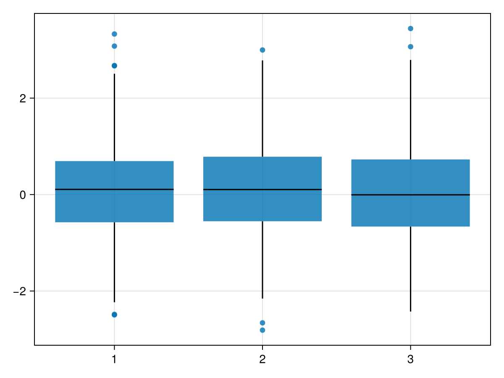
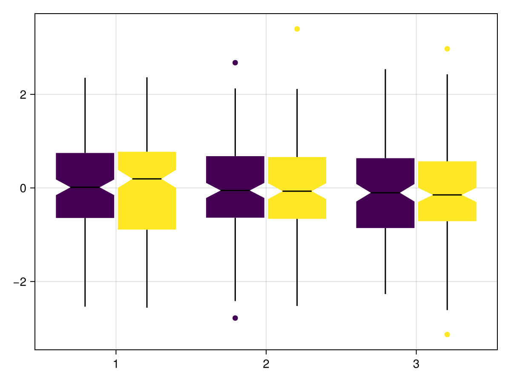
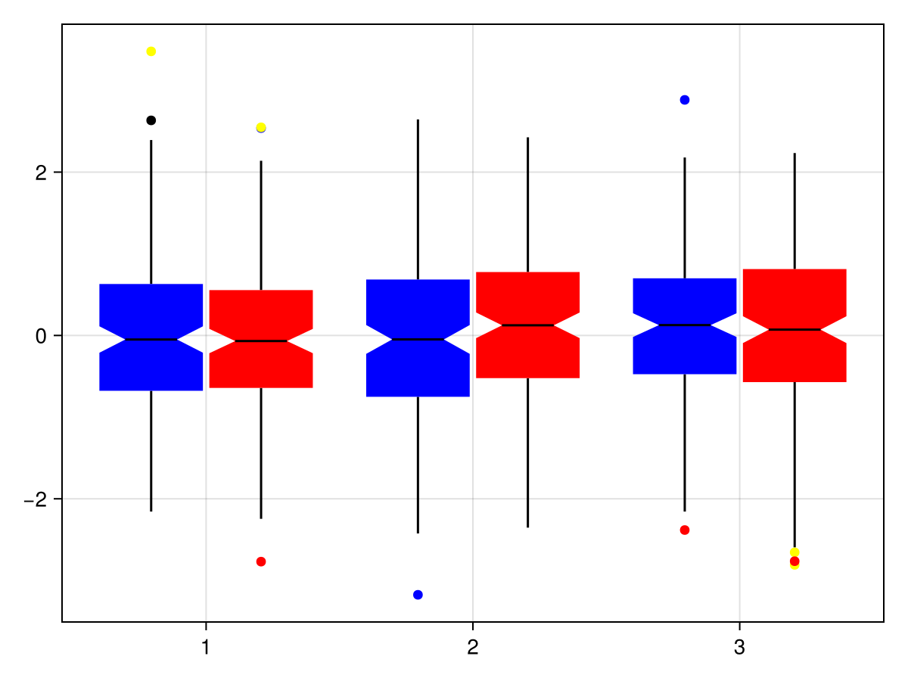
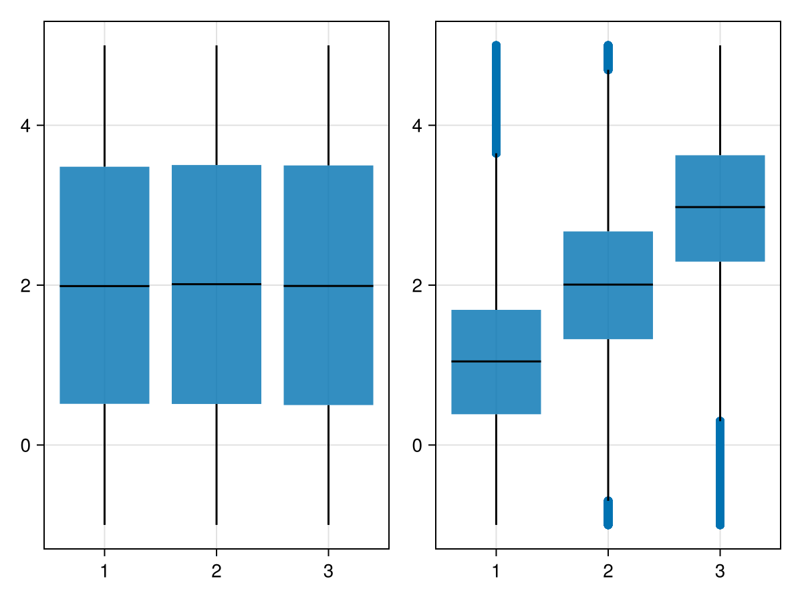
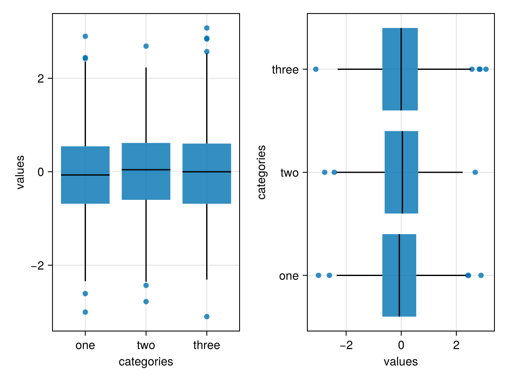

# boxplot {#boxplot}
<details class='jldocstring custom-block' open>
<summary><a id='Makie.boxplot-reference-plots-boxplot' href='#Makie.boxplot-reference-plots-boxplot'><span class="jlbinding">Makie.boxplot</span></a> <Badge type="info" class="jlObjectType jlFunction" text="Function" /></summary>


```julia
boxplot(x, y; kwargs...)
```


Draw a Tukey style boxplot. The boxplot has 3 components:
- a `crossbar` spanning the interquartile (IQR) range with a midline marking the   median
  
- an `errorbar` whose whiskers span `range * iqr`
  
- points marking outliers, that is, data outside the whiskers
  

**Arguments**
- `x`: positions of the categories
  
- `y`: variables within the boxes
  

**Plot type**

The plot type alias for the `boxplot` function is `BoxPlot`.


<Badge type="info" class="source-link" text="source"><a href="https://github.com/MakieOrg/Makie.jl/blob/406a09fe6f430d0a43f0f3cf1a876583e9bafbf5/MakieCore/src/recipes.jl#L520-L599" target="_blank" rel="noreferrer">source</a></Badge>

</details>


## Examples {#Examples}
<a id="example-b937472" />


```julia
using CairoMakie
categories = rand(1:3, 1000)
values = randn(1000)

boxplot(categories, values)
```



<a id="example-604d74c" />


```julia
using CairoMakie
categories = rand(1:3, 1000)
values = randn(1000)
dodge = rand(1:2, 1000)

boxplot(categories, values, dodge = dodge, show_notch = true, color = dodge)
```




Colors are customizable. The `color` attribute refers to the color of the boxes, whereas `outliercolor` refers to the color of the outliers. If not scalars (e.g. `:red`), these attributes must have the length of the data. If `outliercolor` is not provided, outliers will have the same color as their box, as shown above.

::: tip Note

For all indices corresponding to points within the same box, `color` (but not `outliercolor`) must have the same value.

:::
<a id="example-808b560" />


```julia
using CairoMakie
categories = rand(1:3, 1000)
values = randn(1000)
dodge = rand(1:2, 1000)

boxplot(categories, values, dodge = dodge, show_notch = true, color = map(d->d==1 ? :blue : :red, dodge) , outliercolor = rand([:red, :green, :blue, :black, :yellow], 1000))
```




#### Using statistical weights {#Using-statistical-weights}
<a id="example-22ccc5e" />


```julia
using CairoMakie
using Distributions

N = 100_000
x = rand(1:3, N)
y = rand(Uniform(-1, 5), N)

w = pdf.(Normal(), x .- y)

fig = Figure()

boxplot(fig[1,1], x, y)
boxplot(fig[1,2], x, y, weights = w)

fig
```




#### Horizontal axis {#Horizontal-axis}
<a id="example-2b655e7" />


```julia
using CairoMakie
fig = Figure()

categories = rand(1:3, 1000)
values = randn(1000)

ax_vert = Axis(fig[1,1];
    xlabel = "categories",
    ylabel = "values",
    xticks = (1:3, ["one", "two", "three"])
)
ax_horiz = Axis(fig[1,2];
    xlabel="values", # note that x/y still correspond to horizontal/vertical axes respectively
    ylabel="categories",
    yticks=(1:3, ["one", "two", "three"])
)

# Note: same order of category/value, despite different axes
boxplot!(ax_vert, categories, values) # `orientation=:vertical` is default
boxplot!(ax_horiz, categories, values; orientation=:horizontal)

fig
```




## Attributes {#Attributes}

### color {#color}

Defaults to `@inherit patchcolor`

No docs available.

### colormap {#colormap}

Defaults to `@inherit colormap`

No docs available.

### colorrange {#colorrange}

Defaults to `automatic`

No docs available.

### colorscale {#colorscale}

Defaults to `identity`

No docs available.

### cycle {#cycle}

Defaults to `[:color => :patchcolor]`

No docs available.

### dodge {#dodge}

Defaults to `automatic`

Vector of `Integer` (length of data) of grouping variable to create multiple side-by-side boxes at the same `x` position.

### dodge_gap {#dodge_gap}

Defaults to `0.03`

Spacing between dodged boxes.

### gap {#gap}

Defaults to `0.2`

Shrinking factor, `width -> width * (1 - gap)`.

### inspectable {#inspectable}

Defaults to `@inherit inspectable`

No docs available.

### marker {#marker}

Defaults to `@inherit marker`

No docs available.

### markersize {#markersize}

Defaults to `@inherit markersize`

No docs available.

### mediancolor {#mediancolor}

Defaults to `@inherit linecolor`

No docs available.

### medianlinewidth {#medianlinewidth}

Defaults to `@inherit linewidth`

No docs available.

### n_dodge {#n_dodge}

Defaults to `automatic`

No docs available.

### notchwidth {#notchwidth}

Defaults to `0.5`

Multiplier of `width` for narrowest width of notch.

### orientation {#orientation}

Defaults to `:vertical`

Orientation of box (`:vertical` or `:horizontal`).

### outliercolor {#outliercolor}

Defaults to `automatic`

No docs available.

### outlierstrokecolor {#outlierstrokecolor}

Defaults to `@inherit markerstrokecolor`

No docs available.

### outlierstrokewidth {#outlierstrokewidth}

Defaults to `@inherit markerstrokewidth`

No docs available.

### range {#range}

Defaults to `1.5`

Multiple of IQR controlling whisker length.

### show_median {#show_median}

Defaults to `true`

Show median as midline.

### show_notch {#show_notch}

Defaults to `false`

Draw the notch.

### show_outliers {#show_outliers}

Defaults to `true`

Show outliers as points.

### strokecolor {#strokecolor}

Defaults to `@inherit patchstrokecolor`

No docs available.

### strokewidth {#strokewidth}

Defaults to `@inherit patchstrokewidth`

No docs available.

### weights {#weights}

Defaults to `automatic`

Vector of statistical weights (length of data). By default, each observation has weight `1`.

### whiskercolor {#whiskercolor}

Defaults to `@inherit linecolor`

No docs available.

### whiskerlinewidth {#whiskerlinewidth}

Defaults to `@inherit linewidth`

No docs available.

### whiskerwidth {#whiskerwidth}

Defaults to `0.0`

Multiplier of `width` for width of T&#39;s on whiskers, or `:match` to match `width`.

### width {#width}

Defaults to `automatic`

Width of the box before shrinking.
