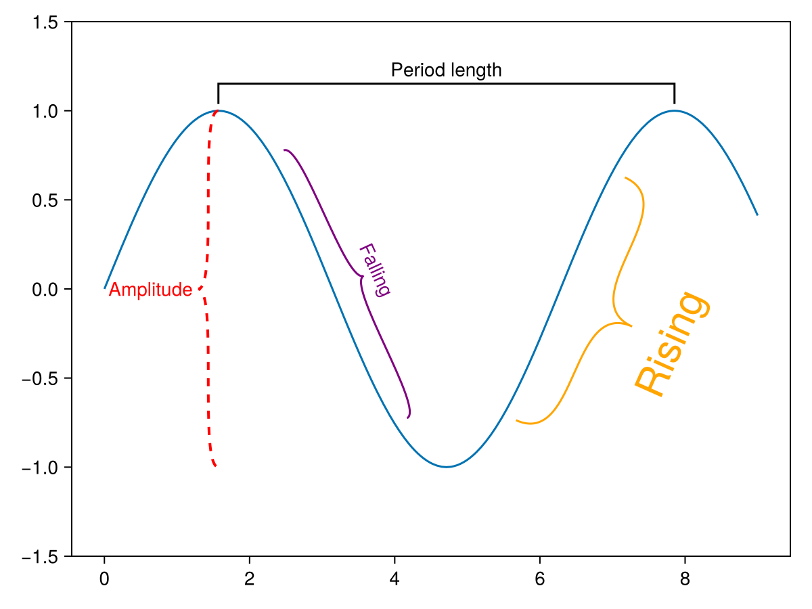
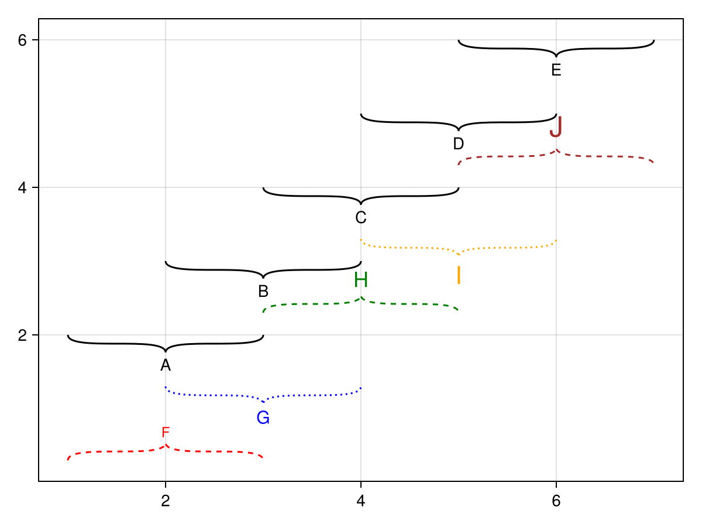
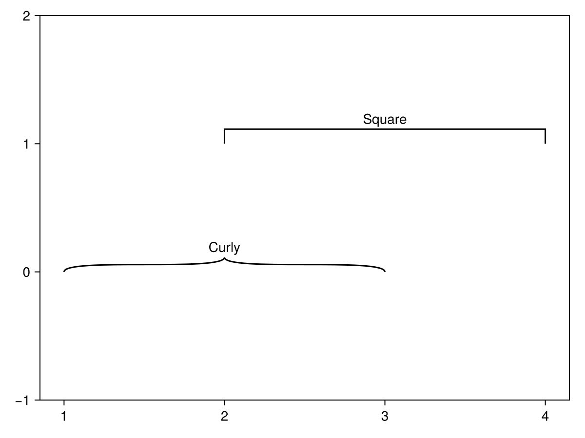

# bracket {#bracket}
<details class='jldocstring custom-block' open>
<summary><a id='Makie.bracket-reference-plots-bracket' href='#Makie.bracket-reference-plots-bracket'><span class="jlbinding">Makie.bracket</span></a> <Badge type="info" class="jlObjectType jlFunction" text="Function" /></summary>


```julia
bracket(x1, y1, x2, y2; kwargs...)
bracket(x1s, y1s, x2s, y2s; kwargs...)
bracket(point1, point2; kwargs...)
bracket(vec_of_point_tuples; kwargs...)
```


Draws a bracket between each pair of points (x1, y1) and (x2, y2) with a text label at the midpoint.

By default each label is rotated parallel to the line between the bracket points.

**Plot type**

The plot type alias for the `bracket` function is `Bracket`.


<Badge type="info" class="source-link" text="source"><a href="https://github.com/MakieOrg/Makie.jl/blob/406a09fe6f430d0a43f0f3cf1a876583e9bafbf5/MakieCore/src/recipes.jl#L520-L573" target="_blank" rel="noreferrer">source</a></Badge>

</details>


## Examples {#Examples}

#### Scalar arguments {#Scalar-arguments}
<a id="example-7af80c9" />


```julia
using CairoMakie
f, ax, l = lines(0..9, sin; axis = (; xgridvisible = false, ygridvisible = false))
ylims!(ax, -1.5, 1.5)

bracket!(pi/2, 1, 5pi/2, 1, offset = 5, text = "Period length", style = :square)

bracket!(pi/2, 1, pi/2, -1, text = "Amplitude", orientation = :down,
    linestyle = :dash, rotation = 0, align = (:right, :center), textoffset = 4, linewidth = 2, color = :red, textcolor = :red)

bracket!(2.3, sin(2.3), 4.0, sin(4.0),
    text = "Falling", offset = 10, orientation = :up, color = :purple, textcolor = :purple)

bracket!(Point(5.5, sin(5.5)), Point(7.0, sin(7.0)),
    text = "Rising", offset = 10, orientation = :down, color = :orange, textcolor = :orange,
    fontsize = 30, textoffset = 30, width = 50)
f
```




#### Vector arguments {#Vector-arguments}
<a id="example-76d8504" />


```julia
using CairoMakie
f = Figure()
ax = Axis(f[1, 1])

bracket!(ax,
    1:5,
    2:6,
    3:7,
    2:6,
    text = ["A", "B", "C", "D", "E"],
    orientation = :down,
)

bracket!(ax,
    [(Point2f(i, i-0.7), Point2f(i+2, i-0.7)) for i in 1:5],
    text = ["F", "G", "H", "I", "J"],
    color = [:red, :blue, :green, :orange, :brown],
    linestyle = [:dash, :dot, :dash, :dot, :dash],
    orientation = [:up, :down, :up, :down, :up],
    textcolor = [:red, :blue, :green, :orange, :brown],
    fontsize = range(12, 24, length = 5),
)

f
```




#### Styles {#Styles}
<a id="example-ca74933" />


```julia
using CairoMakie
f = Figure()
ax = Axis(f[1, 1], xgridvisible = false, ygridvisible = false)
ylims!(ax, -1, 2)
bracket!(ax, 1, 0, 3, 0, text = "Curly", style = :curly)
bracket!(ax, 2, 1, 4, 1, text = "Square", style = :square)

f
```




## Attributes {#Attributes}

### align {#align}

Defaults to `(:center, :center)`

No docs available.

### color {#color}

Defaults to `@inherit linecolor`

No docs available.

### font {#font}

Defaults to `@inherit font`

No docs available.

### fontsize {#fontsize}

Defaults to `@inherit fontsize`

No docs available.

### joinstyle {#joinstyle}

Defaults to `@inherit joinstyle`

No docs available.

### justification {#justification}

Defaults to `automatic`

No docs available.

### linecap {#linecap}

Defaults to `@inherit linecap`

No docs available.

### linestyle {#linestyle}

Defaults to `:solid`

No docs available.

### linewidth {#linewidth}

Defaults to `@inherit linewidth`

No docs available.

### miter_limit {#miter_limit}

Defaults to `@inherit miter_limit`

No docs available.

### offset {#offset}

Defaults to `0`

The offset of the bracket perpendicular to the line from start to end point in screen units.     The direction depends on the `orientation` attribute.

### orientation {#orientation}

Defaults to `:up`

Which way the bracket extends relative to the line from start to end point. Can be `:up` or `:down`.

### rotation {#rotation}

Defaults to `automatic`

No docs available.

### style {#style}

Defaults to `:curly`

No docs available.

### text {#text}

Defaults to `""`

No docs available.

### textcolor {#textcolor}

Defaults to `@inherit textcolor`

No docs available.

### textoffset {#textoffset}

Defaults to `automatic`

No docs available.

### width {#width}

Defaults to `15`

The width of the bracket (perpendicularly away from the line from start to end point) in screen units.
