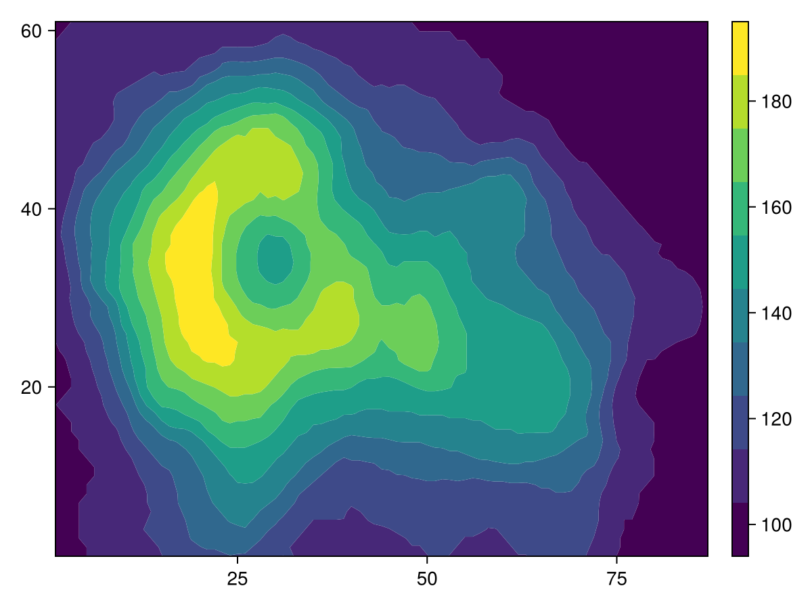
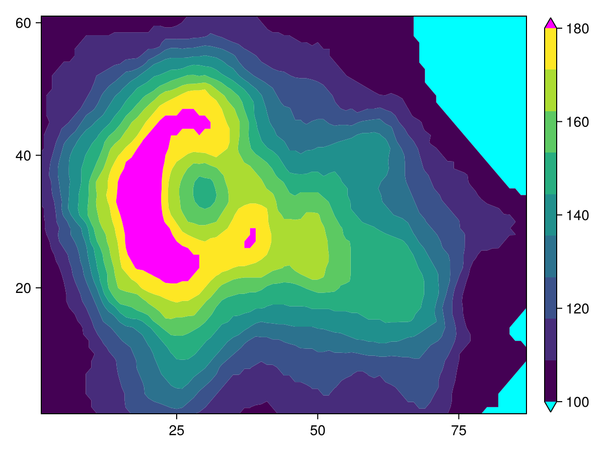
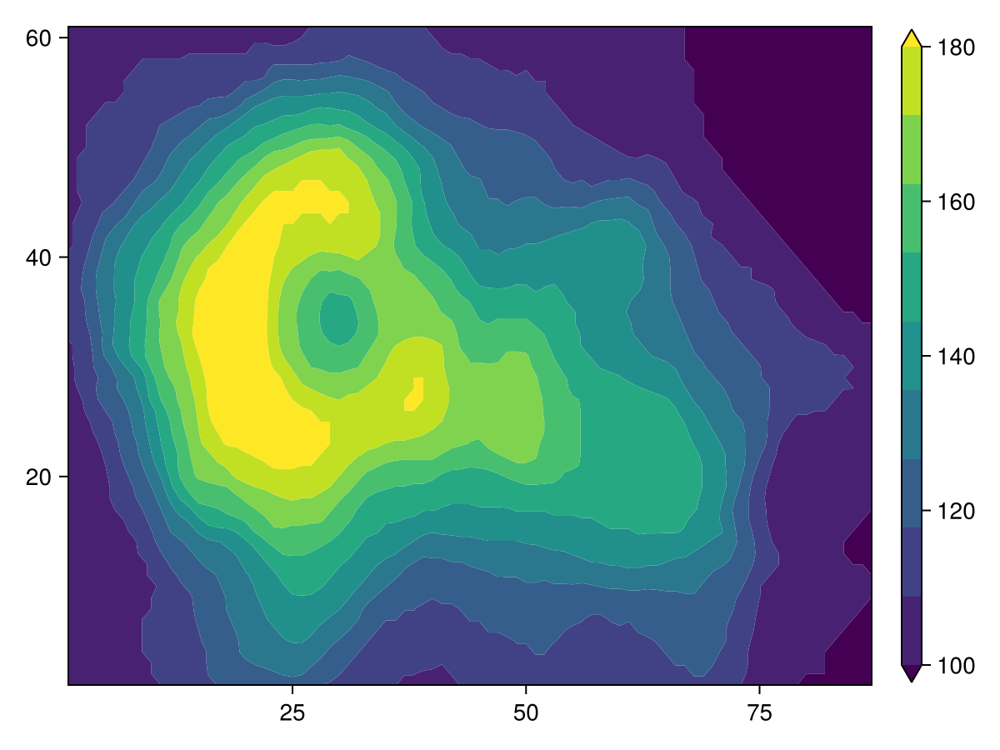
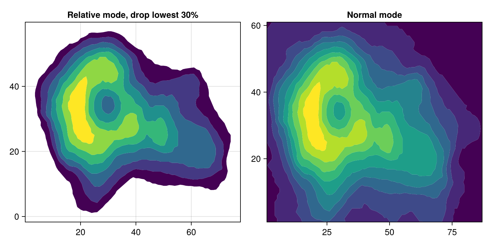
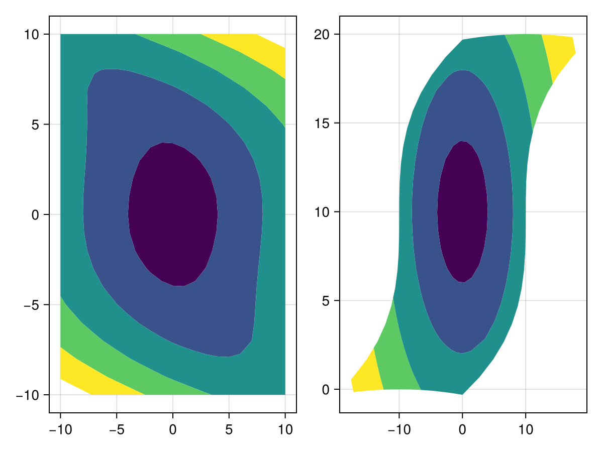

# contourf {#contourf}
<details class='jldocstring custom-block' open>
<summary><a id='Makie.contourf-reference-plots-contourf' href='#Makie.contourf-reference-plots-contourf'><span class="jlbinding">Makie.contourf</span></a> <Badge type="info" class="jlObjectType jlFunction" text="Function" /></summary>


```julia
contourf(xs, ys, zs; kwargs...)
```


Plots a filled contour of the height information in `zs` at horizontal grid positions `xs` and vertical grid positions `ys`.

`xs` and `ys` can be vectors for rectilinear grids or matrices for curvilinear grids, similar to how [`surface`](/reference/plots/surface#surface) works.

**Plot type**

The plot type alias for the `contourf` function is `Contourf`.


<Badge type="info" class="source-link" text="source"><a href="https://github.com/MakieOrg/Makie.jl/blob/d2876406fadce67d5357789b0b71495e7971e5c1/MakieCore/src/recipes.jl#L520-L595" target="_blank" rel="noreferrer">source</a></Badge>

</details>

<a id="example-23449a2" />


```julia
using CairoMakie
using DelimitedFiles


volcano = readdlm(Makie.assetpath("volcano.csv"), ',', Float64)

f = Figure()
Axis(f[1, 1])

co = contourf!(volcano, levels = 10)

Colorbar(f[1, 2], co)

f
```



<a id="example-d6e9f80" />


```julia
using CairoMakie
using DelimitedFiles


volcano = readdlm(Makie.assetpath("volcano.csv"), ',', Float64)

f = Figure()
ax = Axis(f[1, 1])

co = contourf!(volcano,
    levels = range(100, 180, length = 10),
    extendlow = :cyan, extendhigh = :magenta)

tightlimits!(ax)

Colorbar(f[1, 2], co)

f
```



<a id="example-358d1a8" />


```julia
using CairoMakie
using DelimitedFiles


volcano = readdlm(Makie.assetpath("volcano.csv"), ',', Float64)

f = Figure()
ax = Axis(f[1, 1])

co = contourf!(volcano,
    levels = range(100, 180, length = 10),
    extendlow = :auto, extendhigh = :auto)

tightlimits!(ax)

Colorbar(f[1, 2], co)

f
```




#### Relative mode {#Relative-mode}

Sometimes it&#39;s beneficial to drop one part of the range of values, usually towards the outer boundary. Rather than specifying the levels to include manually, you can set the `mode` attribute to `:relative` and specify the levels from 0 to 1, relative to the current minimum and maximum value.
<a id="example-cd10f7a" />


```julia
using CairoMakie
using DelimitedFiles


volcano = readdlm(Makie.assetpath("volcano.csv"), ',', Float64)

f = Figure(size = (800, 400))

Axis(f[1, 1], title = "Relative mode, drop lowest 30%")
contourf!(volcano, levels = 0.3:0.1:1, mode = :relative)

Axis(f[1, 2], title = "Normal mode")
contourf!(volcano, levels = 10)

f
```




### Curvilinear grids {#Curvilinear-grids}

`contourf` also supports _curvilinear_ grids, where `x` and `y` are both matrices of the same size as `z`. This is similar to the input that [`surface`](/reference/plots/surface#surface) accepts.

Let&#39;s warp a regular grid of `x` and `y` by some nonlinear function, and plot its contours:
<a id="example-1a71895" />


```julia
using CairoMakie
x = -10:10
y = -10:10
# The curvilinear grid:
xs = [x + 0.01y^3 for x in x, y in y]
ys = [y + 10cos(x/40) for x in x, y in y]
# Now, for simplicity, we calculate the `zs` values to be
# the radius from the center of the grid (0, 10).
zs = sqrt.(xs .^ 2 .+ (ys .- 10) .^ 2)
# We can use Makie's tick finders to get some nice looking contour levels:
levels = Makie.get_tickvalues(Makie.LinearTicks(7), extrema(zs)...)
# and now, we plot!
f = Figure()
ax1 = Axis(f[1, 1])
ctrf1 = contourf!(ax1, x, y, zs; levels = levels)
ax2 = Axis(f[1, 2])
ctrf2 = contourf!(ax2, xs, ys, zs; levels = levels)
f
```




## Attributes {#Attributes}

### clip_planes {#clip_planes}

Defaults to `automatic`

Clip planes offer a way to do clipping in 3D space. You can set a Vector of up to 8 `Plane3f` planes here, behind which plots will be clipped (i.e. become invisible). By default clip planes are inherited from the parent plot or scene. You can remove parent `clip_planes` by passing `Plane3f[]`.

### colormap {#colormap}

Defaults to `@inherit colormap`

No docs available.

### colorscale {#colorscale}

Defaults to `identity`

No docs available.

### depth_shift {#depth_shift}

Defaults to `0.0`

Adjusts the depth value of a plot after all other transformations, i.e. in clip space, where `-1 <= depth <= 1`. This only applies to GLMakie and WGLMakie and can be used to adjust render order (like a tunable overdraw).

### extendhigh {#extendhigh}

Defaults to `nothing`

In `:normal` mode, if you want to show a band from the high edge to `Inf`, set `extendhigh` to `:auto` to give the extension the same color as the last level, or specify a color directly (default `nothing` means no extended band).

### extendlow {#extendlow}

Defaults to `nothing`

In `:normal` mode, if you want to show a band from `-Inf` to the low edge, set `extendlow` to `:auto` to give the extension the same color as the first level, or specify a color directly (default `nothing` means no extended band).

### fxaa {#fxaa}

Defaults to `true`

Adjusts whether the plot is rendered with fxaa (anti-aliasing, GLMakie only).

### inspectable {#inspectable}

Defaults to `@inherit inspectable`

Sets whether this plot should be seen by `DataInspector`. The default depends on the theme of the parent scene.

### inspector_clear {#inspector_clear}

Defaults to `automatic`

Sets a callback function `(inspector, plot) -> ...` for cleaning up custom indicators in DataInspector.

### inspector_hover {#inspector_hover}

Defaults to `automatic`

Sets a callback function `(inspector, plot, index) -> ...` which replaces the default `show_data` methods.

### inspector_label {#inspector_label}

Defaults to `automatic`

Sets a callback function `(plot, index, position) -> string` which replaces the default label generated by DataInspector.

### levels {#levels}

Defaults to `10`

Can be either
- an `Int` that produces n equally wide levels or bands
  
- an `AbstractVector{<:Real}` that lists n consecutive edges from low to high, which result in n-1 levels or bands
  

If `levels` is an `Int`, the contourf plot will be rectangular as all `zs` values will be covered edge to edge. This is why `Axis` defaults to tight limits for such contourf plots. If you specify `levels` as an `AbstractVector{<:Real}`, however, note that the axis limits include the default margins because the contourf plot can have an irregular shape. You can use `tightlimits!(ax)` to tighten the limits similar to the `Int` behavior.

### mode {#mode}

Defaults to `:normal`

Determines how the `levels` attribute is interpreted, either `:normal` or `:relative`. In `:normal` mode, the levels correspond directly to the z values. In `:relative` mode, you specify edges by the fraction between minimum and maximum value of `zs`. This can be used for example to draw bands for the upper 90% while excluding the lower 10% with `levels = 0.1:0.1:1.0, mode = :relative`.

### model {#model}

Defaults to `automatic`

Sets a model matrix for the plot. This overrides adjustments made with `translate!`, `rotate!` and `scale!`.

### nan_color {#nan_color}

Defaults to `:transparent`

No docs available.

### overdraw {#overdraw}

Defaults to `false`

Controls if the plot will draw over other plots. This specifically means ignoring depth checks in GL backends

### space {#space}

Defaults to `:data`

Sets the transformation space for box encompassing the plot. See `Makie.spaces()` for possible inputs.

### ssao {#ssao}

Defaults to `false`

Adjusts whether the plot is rendered with ssao (screen space ambient occlusion). Note that this only makes sense in 3D plots and is only applicable with `fxaa = true`.

### transformation {#transformation}

Defaults to `:automatic`

No docs available.

### transparency {#transparency}

Defaults to `false`

Adjusts how the plot deals with transparency. In GLMakie `transparency = true` results in using Order Independent Transparency.

### visible {#visible}

Defaults to `true`

Controls whether the plot will be rendered or not.
