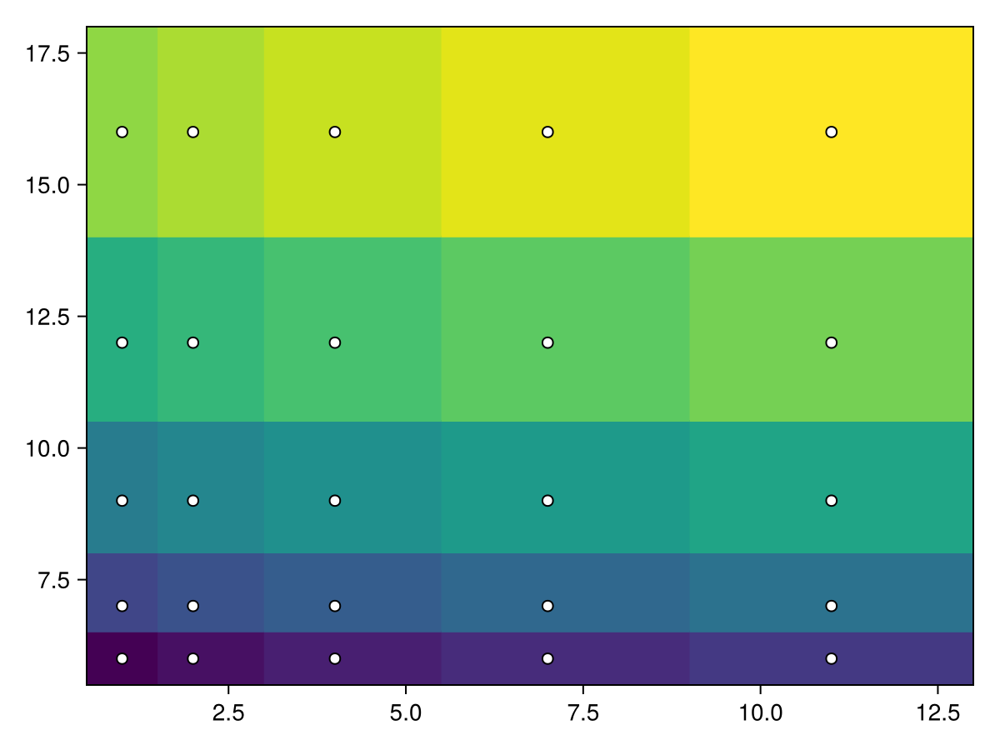
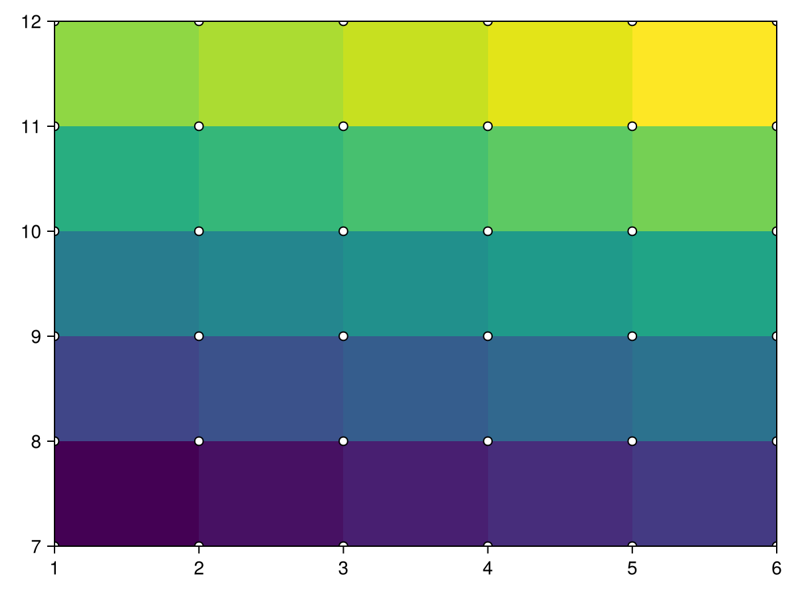
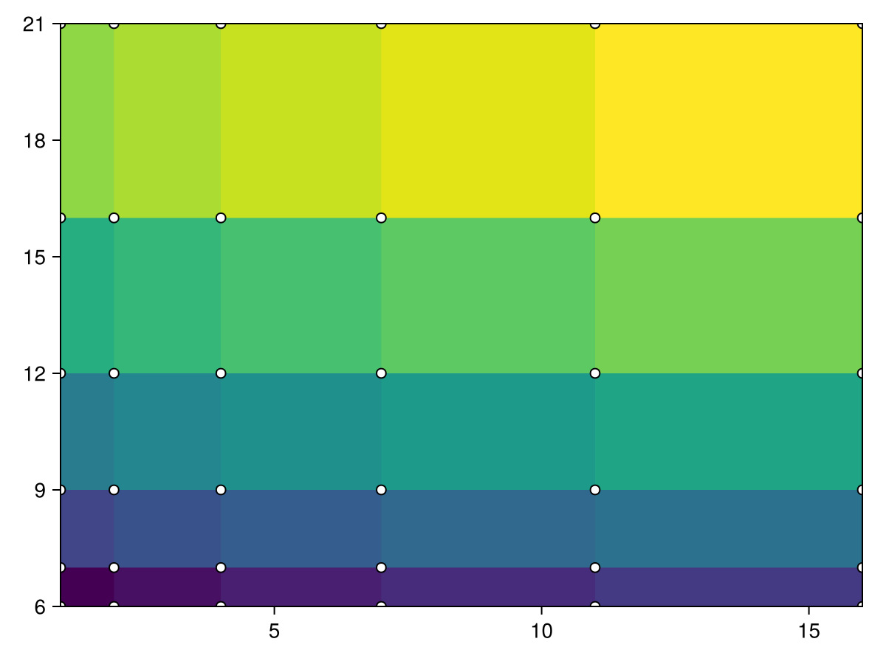
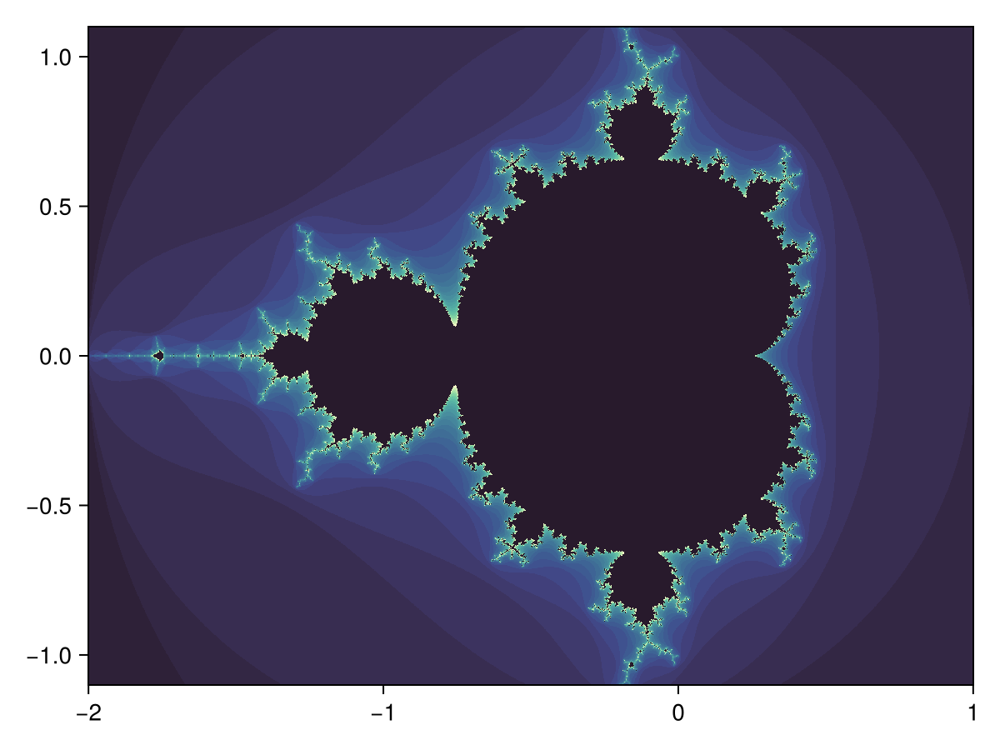
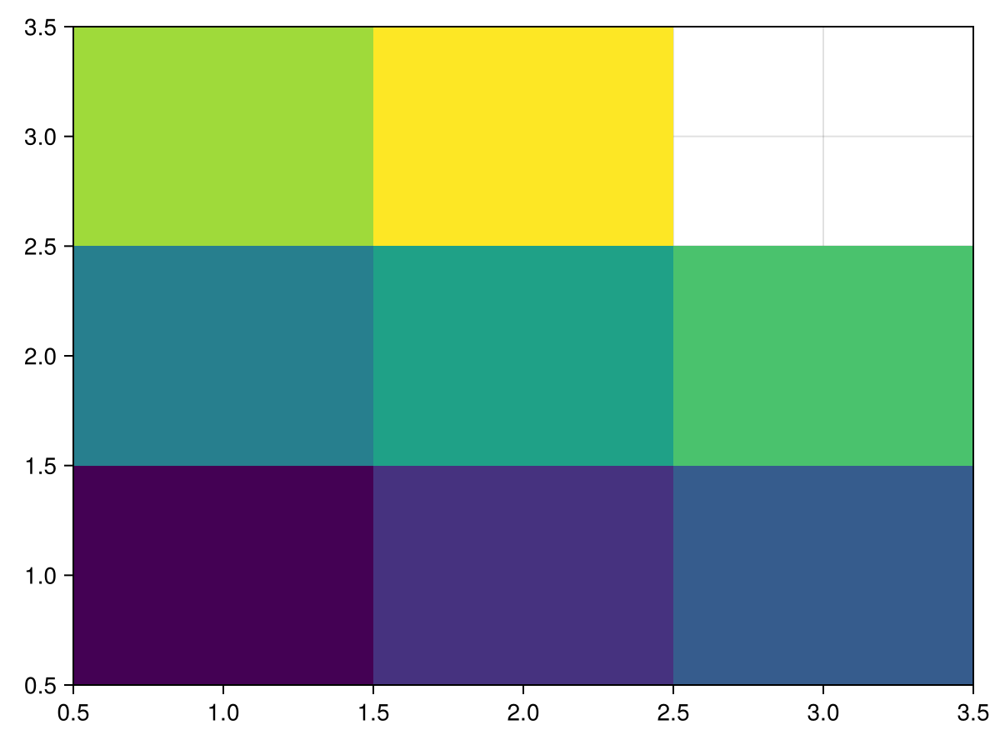
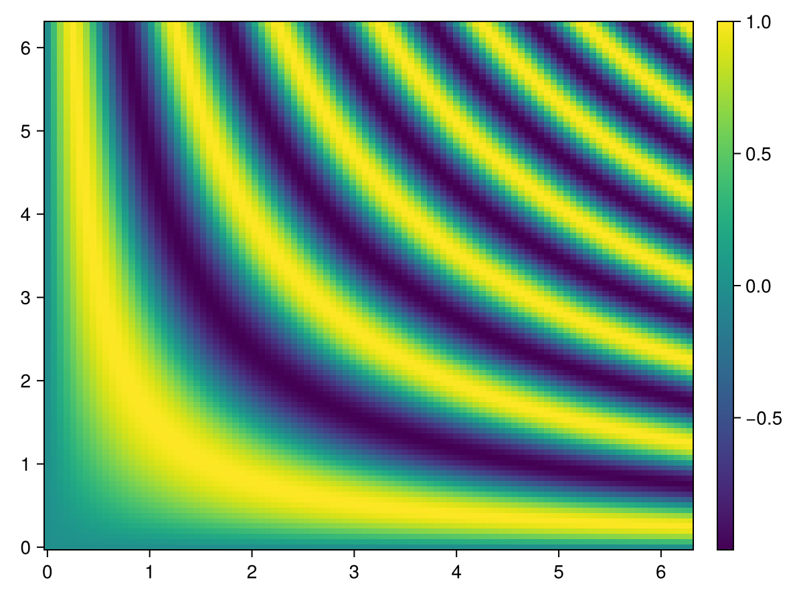
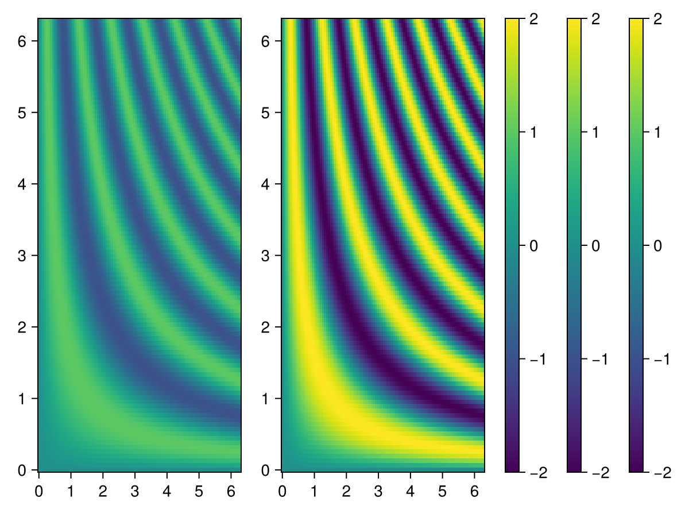
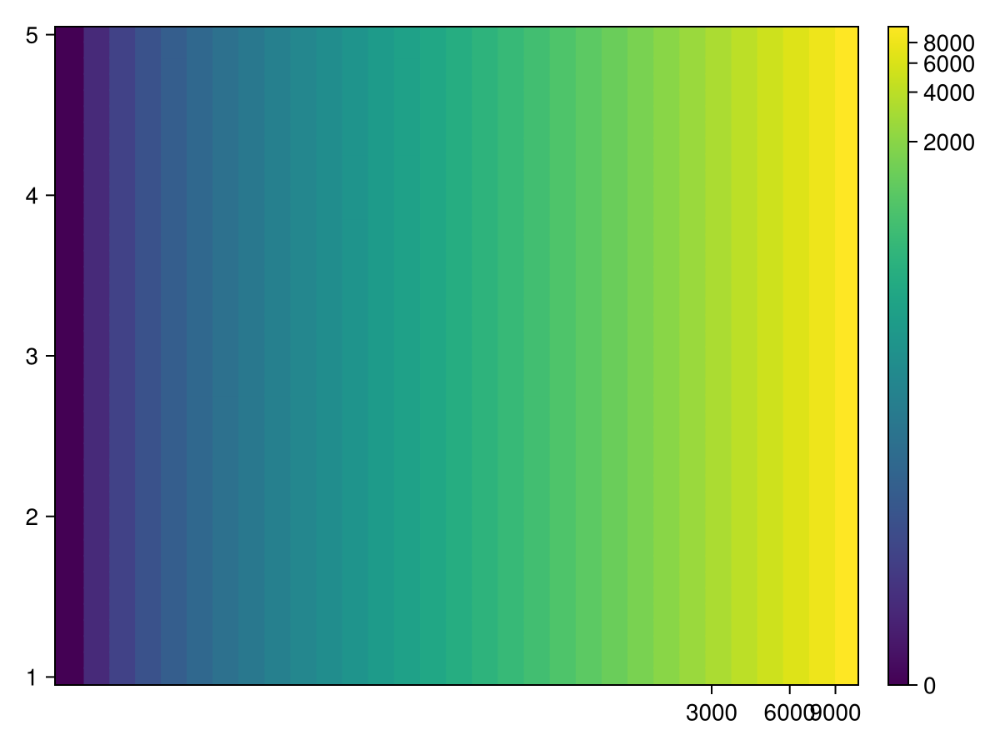
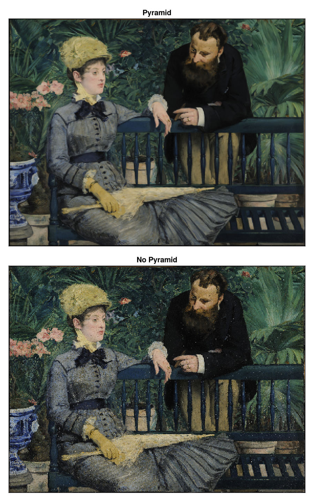

# heatmap {#heatmap}
<details class='jldocstring custom-block' open>
<summary><a id='MakieCore.heatmap-reference-plots-heatmap' href='#MakieCore.heatmap-reference-plots-heatmap'><span class="jlbinding">MakieCore.heatmap</span></a> <Badge type="info" class="jlObjectType jlFunction" text="Function" /></summary>


```julia
heatmap(x, y, matrix)
heatmap(x, y, func)
heatmap(matrix)
heatmap(xvector, yvector, zvector)
```


Plots a heatmap as a collection of rectangles. `x` and `y` can either be of length `i` and `j` where `(i, j)` is `size(matrix)`, in this case the rectangles will be placed around these grid points like voronoi cells. Note that for irregularly spaced `x` and `y`, the points specified by them are not centered within the resulting rectangles.

`x` and `y` can also be of length `i+1` and `j+1`, in this case they are interpreted as the edges of the rectangles.

Colors of the rectangles are derived from `matrix[i, j]`. The third argument may also be a `Function` (i, j) -&gt; v which is then evaluated over the grid spanned by `x` and `y`.

Another allowed form is using three vectors `xvector`, `yvector` and `zvector`. In this case it is assumed that no pair of elements `x` and `y` exists twice. Pairs that are missing from the resulting grid will be treated as if `zvector` had a `NaN`     element at that position.

If `x` and `y` are omitted with a matrix argument, they default to `x, y = axes(matrix)`.

Note that `heatmap` is slower to render than `image` so `image` should be preferred for large, regularly spaced grids.

**Plot type**

The plot type alias for the `heatmap` function is `Heatmap`.


<Badge type="info" class="source-link" text="source"><a href="https://github.com/MakieOrg/Makie.jl/blob/e1788feb7d2b5c349ae9fe7900dfde092b701913/MakieCore/src/recipes.jl#L520-L603" target="_blank" rel="noreferrer">source</a></Badge>

</details>


## Examples {#Examples}

### Two vectors and a matrix {#Two-vectors-and-a-matrix}

In this example, `x` and `y` specify the points around which the heatmap cells are placed.
<a id="example-776d3b6" />


```julia
using CairoMakie
f = Figure()
ax = Axis(f[1, 1])

centers_x = 1:5
centers_y = 6:10
data = reshape(1:25, 5, 5)

heatmap!(ax, centers_x, centers_y, data)

scatter!(ax, [(x, y) for x in centers_x for y in centers_y], color=:white, strokecolor=:black, strokewidth=1)

f
```


The same approach works for irregularly spaced cells. Note how the rectangles are not centered around the points, because the boundaries are between adjacent points like voronoi cells.
<a id="example-604a447" />


```julia
using CairoMakie
f = Figure()
ax = Axis(f[1, 1])

centers_x = [1, 2, 4, 7, 11]
centers_y = [6, 7, 9, 12, 16]
data = reshape(1:25, 5, 5)

heatmap!(ax, centers_x, centers_y, data)

scatter!(ax, [(x, y) for x in centers_x for y in centers_y], color=:white, strokecolor=:black, strokewidth=1)
f
```




If we add one more element to `x` and `y`, they now specify the edges of the rectangular cells. Here&#39;s a regular grid:
<a id="example-54f00d8" />


```julia
using CairoMakie
f = Figure()
ax = Axis(f[1, 1])

edges_x = 1:6
edges_y = 7:12
data = reshape(1:25, 5, 5)

heatmap!(ax, edges_x, edges_y, data)

scatter!(ax, [(x, y) for x in edges_x for y in edges_y], color=:white, strokecolor=:black, strokewidth=1)
f
```




We can do the same with an irregular grid as well:
<a id="example-37aa9cb" />


```julia
using CairoMakie
f = Figure()
ax = Axis(f[1, 1])

borders_x = [1, 2, 4, 7, 11, 16]
borders_y = [6, 7, 9, 12, 16, 21]
data = reshape(1:25, 5, 5)

heatmap!(ax, borders_x, borders_y, data)
scatter!(ax, [(x, y) for x in borders_x for y in borders_y], color=:white, strokecolor=:black, strokewidth=1)
f
```




### Using a `Function` instead of a `Matrix` {#Using-a-Function-instead-of-a-Matrix}

When using a `Function` of the form `(i, j) -> v` as the `values` argument, it is evaluated over the grid spanned by `x` and `y`.
<a id="example-adc46b0" />


```julia
using CairoMakie
function mandelbrot(x, y)
    z = c = x + y*im
    for i in 1:30.0; abs(z) > 2 && return i; z = z^2 + c; end; 0
end

heatmap(-2:0.001:1, -1.1:0.001:1.1, mandelbrot,
    colormap = Reverse(:deep))
```




### Three vectors {#Three-vectors}

There must be no duplicate combinations of x and y, but it is allowed to leave out values.
<a id="example-2c1c008" />


```julia
using CairoMakie
xs = [1, 2, 3, 1, 2, 3, 1, 2, 3]
ys = [1, 1, 1, 2, 2, 2, 3, 3, 3]
zs = [1, 2, 3, 4, 5, 6, 7, 8, NaN]

heatmap(xs, ys, zs)
```




### Colorbar for single heatmap {#Colorbar-for-single-heatmap}

To get a scale for what the colors represent, add a colorbar. The colorbar is placed within the figure in the first argument, and the scale and colormap can be conveniently set by passing the relevant heatmap to it.
<a id="example-d1d4229" />


```julia
using CairoMakie
xs = range(0, 2π, length=100)
ys = range(0, 2π, length=100)
zs = [sin(x*y) for x in xs, y in ys]

fig, ax, hm = heatmap(xs, ys, zs)
Colorbar(fig[:, end+1], hm)

fig
```




### Colorbar for multiple heatmaps {#Colorbar-for-multiple-heatmaps}

When there are several heatmaps in a single figure, it can be useful to have a single colorbar represent all of them. It is important to then have synchronized scales and colormaps for the heatmaps and colorbar. This is done by setting the colorrange explicitly, so that it is independent of the data shown by that particular heatmap.

Since the heatmaps in the example below have the same colorrange and colormap, any of them can be passed to `Colorbar` to give the colorbar the same attributes. Alternatively, the colorbar attributes can be set explicitly.
<a id="example-705371a" />


```julia
using CairoMakie
xs = range(0, 2π, length=100)
ys = range(0, 2π, length=100)
zs1 = [sin(x*y) for x in xs, y in ys]
zs2 = [2sin(x*y) for x in xs, y in ys]

joint_limits = (-2, 2)  # here we pick the limits manually for simplicity instead of computing them

fig, ax1, hm1 = heatmap(xs, ys, zs1,  colorrange = joint_limits)
ax2, hm2 = heatmap(fig[1, end+1], xs, ys, zs2, colorrange = joint_limits)

Colorbar(fig[:, end+1], hm1)                     # These three
Colorbar(fig[:, end+1], hm2)                     # colorbars are
Colorbar(fig[:, end+1], colorrange = joint_limits)  # equivalent

fig
```




### Using a custom colorscale {#Using-a-custom-colorscale}

One can define a custom (color)scale using the `ReversibleScale` type. When the transformation is simple enough (`log`, `sqrt`, ...), the inverse transform is automatically deduced.
<a id="example-f8d057f" />


```julia
using CairoMakie
x = 10.0.^(1:0.1:4)
y = 1.0:0.1:5.0
z = broadcast((x, y) -> x - 10, x, y')

scale = ReversibleScale(x -> asinh(x / 2) / log(10), x -> 2sinh(log(10) * x))
fig, ax, hm = heatmap(x, y, z; colorscale = scale, axis = (; xscale = scale))
Colorbar(fig[1, 2], hm)

fig
```




## Plotting large Heatmaps {#Plotting-large-Heatmaps}

You can wrap your data into `Makie.Resampler`, to automatically resample large heatmaps only for the viewing area. When zooming in, it will update the resampled version, to show it at best fidelity. It blocks updates while any mouse or keyboard button is pressed, to not spam e.g. WGLMakie with data updates. This goes well with `Axis(figure; zoombutton=Keyboard.left_control)`. You can disable this behavior with:

`Resampler(data; update_while_button_pressed=true)`.

Example:

```julia
using Downloads, FileIO, GLMakie
# 30000×22943 image
path = Downloads.download("https://upload.wikimedia.org/wikipedia/commons/7/7e/In_the_Conservatory.jpg")
img = rotr90(load(path))
f, ax, pl = heatmap(Resampler(img); axis=(; aspect=DataAspect()), figure=(;size=size(img)./20))
hidedecorations!(ax)
f
```

<video mute autoplay loop playsinline controls src="/assets/heatmap-resampler.mp4" />


For better down sampling quality we recommend using `Makie.Pyramid` (might be moved to another package), which creates a simple gaussian pyramid for efficient and artifact free down sampling:

```julia
pyramid = Makie.Pyramid(img)
fsize = (size(img) ./ 30) .* (1, 2)
fig, ax, pl = heatmap(Resampler(pyramid);
    axis=(; aspect=DataAspect(), title="Pyramid"), figure=(; size=fsize))
hidedecorations!(ax)
ax, pl = heatmap(fig[2, 1], Resampler(img1);
    axis=(; aspect=DataAspect(), title="No Pyramid"))
hidedecorations!(ax)
save("heatmap-pyramid.png", fig)
```





Any other Array type is allowed in `Resampler`, and it may also implement it&#39;s own interpolation strategy by overloading:

```julia
function (array::ArrayType)(xrange::LinRange, yrange::LinRange)
    ...
end
```


## Attributes {#Attributes}

### alpha {#alpha}

Defaults to `1.0`

The alpha value of the colormap or color attribute. Multiple alphas like in `plot(alpha=0.2, color=(:red, 0.5)`, will get multiplied.

### clip_planes {#clip_planes}

Defaults to `automatic`

Clip planes offer a way to do clipping in 3D space. You can set a Vector of up to 8 `Plane3f` planes here, behind which plots will be clipped (i.e. become invisible). By default clip planes are inherited from the parent plot or scene. You can remove parent `clip_planes` by passing `Plane3f[]`.

### colormap {#colormap}

Defaults to `@inherit colormap :viridis`

Sets the colormap that is sampled for numeric `color`s. `PlotUtils.cgrad(...)`, `Makie.Reverse(any_colormap)` can be used as well, or any symbol from ColorBrewer or PlotUtils. To see all available color gradients, you can call `Makie.available_gradients()`.

### colorrange {#colorrange}

Defaults to `automatic`

The values representing the start and end points of `colormap`.

### colorscale {#colorscale}

Defaults to `identity`

The color transform function. Can be any function, but only works well together with `Colorbar` for `identity`, `log`, `log2`, `log10`, `sqrt`, `logit`, `Makie.pseudolog10` and `Makie.Symlog10`.

### depth_shift {#depth_shift}

Defaults to `0.0`

Adjusts the depth value of a plot after all other transformations, i.e. in clip space, where `-1 <= depth <= 1`. This only applies to GLMakie and WGLMakie and can be used to adjust render order (like a tunable overdraw).

### fxaa {#fxaa}

Defaults to `true`

Adjusts whether the plot is rendered with fxaa (anti-aliasing, GLMakie only).

### highclip {#highclip}

Defaults to `automatic`

The color for any value above the colorrange.

### inspectable {#inspectable}

Defaults to `@inherit inspectable`

Sets whether this plot should be seen by `DataInspector`. The default depends on the theme of the parent scene.

### inspector_clear {#inspector_clear}

Defaults to `automatic`

Sets a callback function `(inspector, plot) -> ...` for cleaning up custom indicators in DataInspector.

### inspector_hover {#inspector_hover}

Defaults to `automatic`

Sets a callback function `(inspector, plot, index) -> ...` which replaces the default `show_data` methods.

### inspector_label {#inspector_label}

Defaults to `automatic`

Sets a callback function `(plot, index, position) -> string` which replaces the default label generated by DataInspector.

### interpolate {#interpolate}

Defaults to `false`

Sets whether colors should be interpolated

### lowclip {#lowclip}

Defaults to `automatic`

The color for any value below the colorrange.

### model {#model}

Defaults to `automatic`

Sets a model matrix for the plot. This overrides adjustments made with `translate!`, `rotate!` and `scale!`.

### nan_color {#nan_color}

Defaults to `:transparent`

The color for NaN values.

### overdraw {#overdraw}

Defaults to `false`

Controls if the plot will draw over other plots. This specifically means ignoring depth checks in GL backends

### space {#space}

Defaults to `:data`

Sets the transformation space for box encompassing the plot. See `Makie.spaces()` for possible inputs.

### ssao {#ssao}

Defaults to `false`

Adjusts whether the plot is rendered with ssao (screen space ambient occlusion). Note that this only makes sense in 3D plots and is only applicable with `fxaa = true`.

### transformation {#transformation}

Defaults to `:automatic`

No docs available.

### transparency {#transparency}

Defaults to `false`

Adjusts how the plot deals with transparency. In GLMakie `transparency = true` results in using Order Independent Transparency.

### visible {#visible}

Defaults to `true`

Controls whether the plot will be rendered or not.
