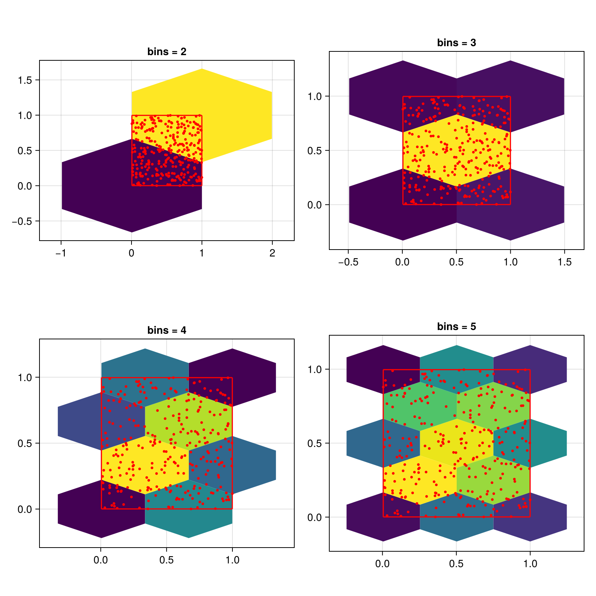
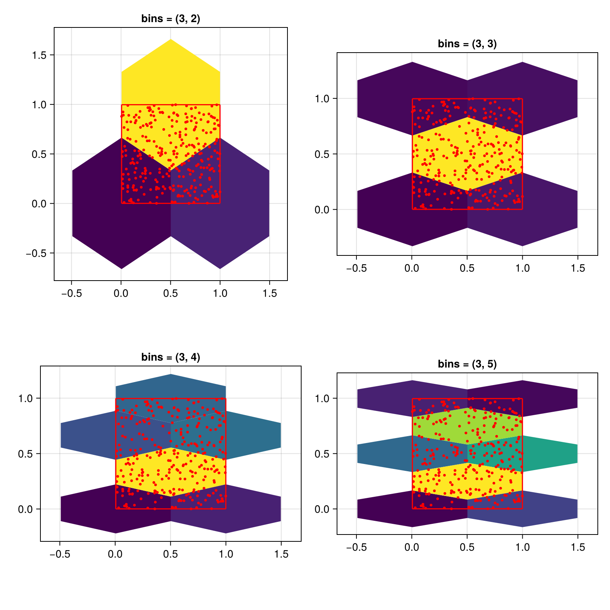
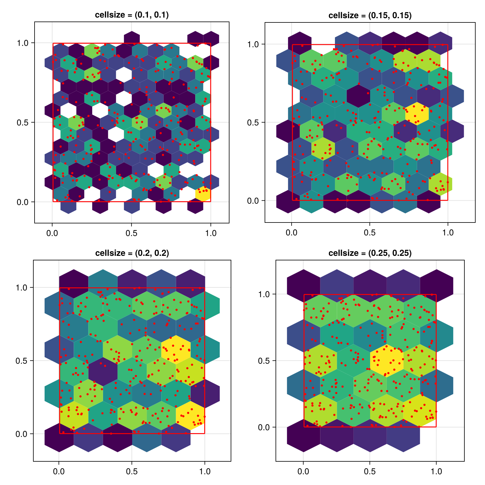
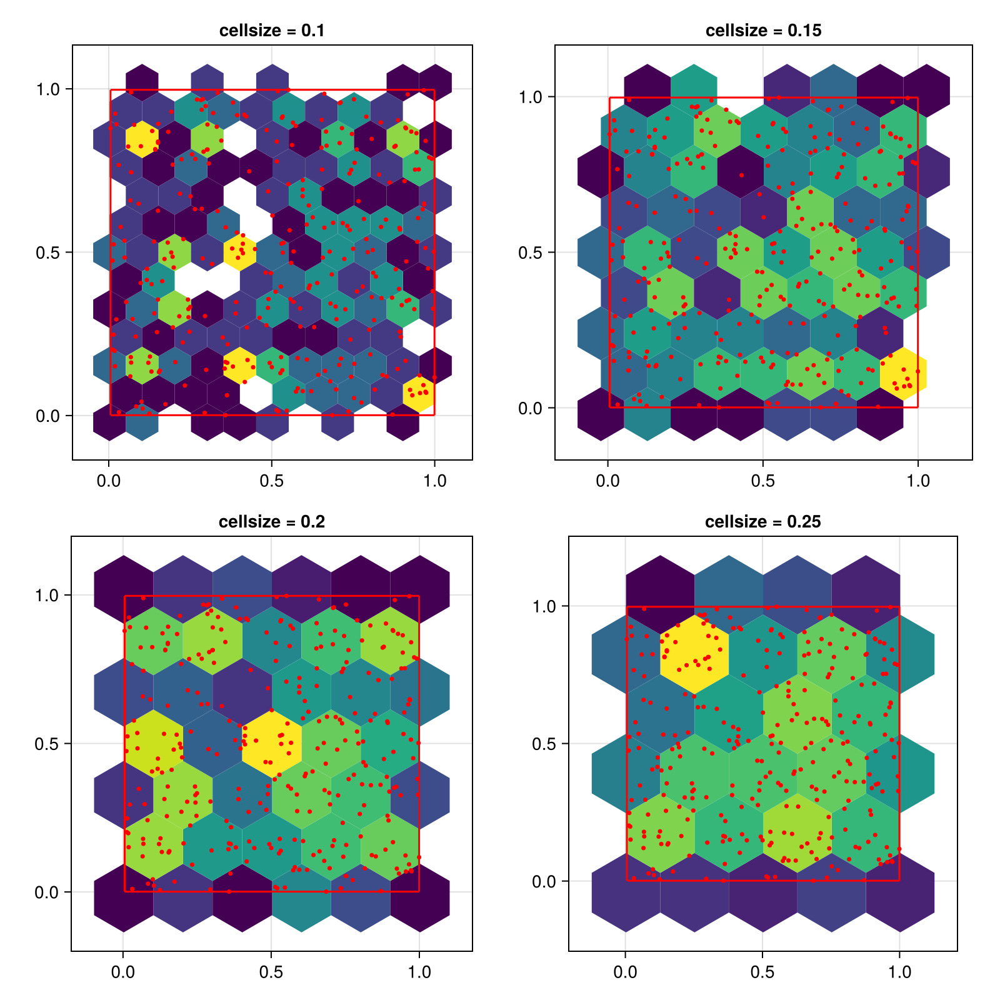
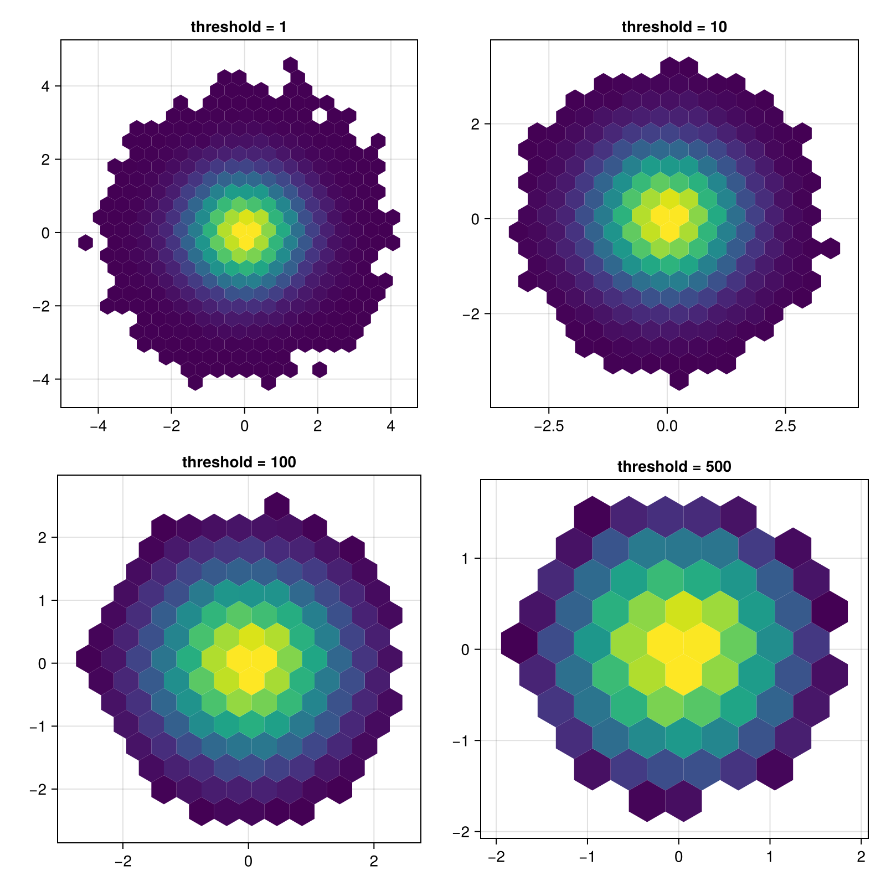
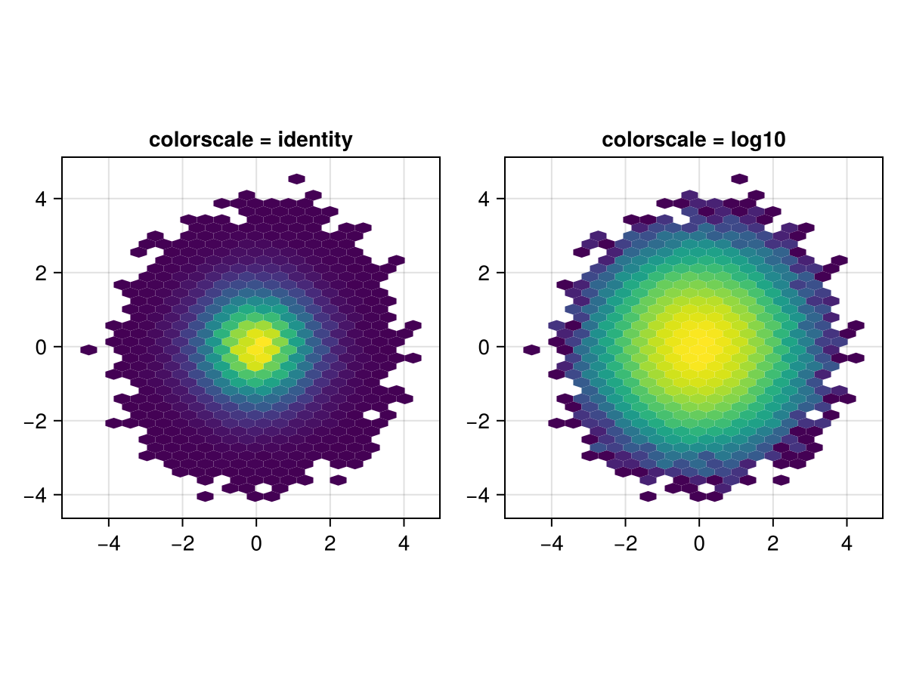
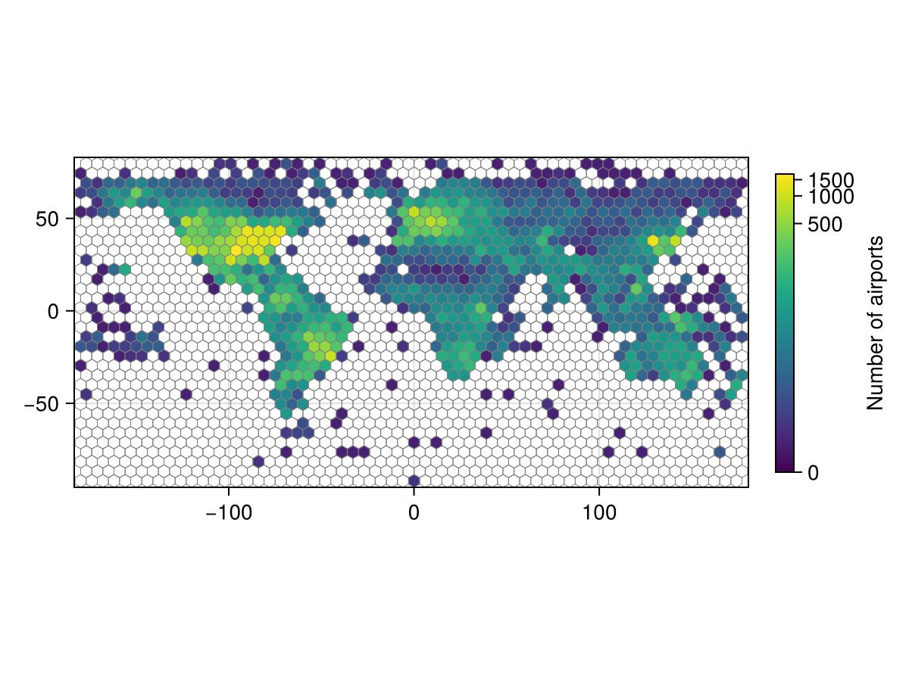
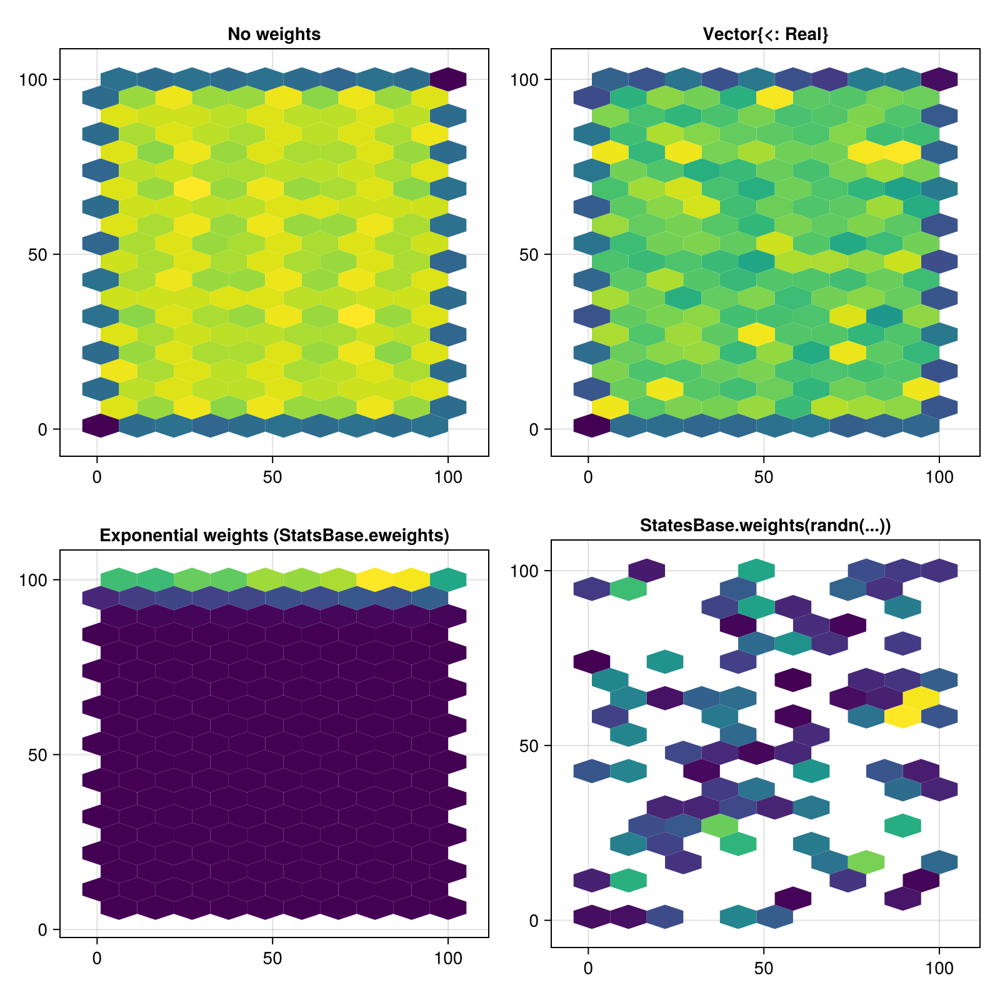

# hexbin {#hexbin}
<details class='jldocstring custom-block' open>
<summary><a id='Makie.hexbin-reference-plots-hexbin' href='#Makie.hexbin-reference-plots-hexbin'><span class="jlbinding">Makie.hexbin</span></a> <Badge type="info" class="jlObjectType jlFunction" text="Function" /></summary>


```julia
hexbin(xs, ys; kwargs...)
```


Plots a heatmap with hexagonal bins for the observations `xs` and `ys`.

**Plot type**

The plot type alias for the `hexbin` function is `Hexbin`.


<Badge type="info" class="source-link" text="source"><a href="https://github.com/MakieOrg/Makie.jl/blob/e1788feb7d2b5c349ae9fe7900dfde092b701913/MakieCore/src/recipes.jl#L520-L560" target="_blank" rel="noreferrer">source</a></Badge>

</details>


## Examples {#Examples}

### Setting the number of bins {#Setting-the-number-of-bins}

Setting `bins` to an integer sets the number of bins to this value for both x and y. The minimum number of bins in one dimension is 2.
<a id="example-df02510" />


```julia
using CairoMakie
using Random
Random.seed!(1234)

f = Figure(size = (800, 800))

x = rand(300)
y = rand(300)

for i in 2:5
    ax = Axis(f[fldmod1(i-1, 2)...], title = "bins = $i", aspect = DataAspect())
    hexbin!(ax, x, y, bins = i)
    wireframe!(ax, Rect2f(Point2f.(x, y)), color = :red)
    scatter!(ax, x, y, color = :red, markersize = 5)
end

f
```




You can also pass a tuple of integers to control x and y separately.
<a id="example-295d7ef" />


```julia
using CairoMakie
using Random
Random.seed!(1234)

f = Figure(size = (800, 800))

x = rand(300)
y = rand(300)

for i in 2:5
    ax = Axis(f[fldmod1(i-1, 2)...], title = "bins = (3, $i)", aspect = DataAspect())
    hexbin!(ax, x, y, bins = (3, i))
    wireframe!(ax, Rect2f(Point2f.(x, y)), color = :red)
    scatter!(ax, x, y, color = :red, markersize = 5)
end

f
```




### Setting the size of cells {#Setting-the-size-of-cells}

You can also control the cell size directly by setting the `cellsize` keyword. In this case, the `bins` setting is ignored.

The height of a hexagon is larger than its width. This is why setting the same size for x and y will result in uneven hexagons.
<a id="example-8d41b60" />


```julia
using CairoMakie
using Random
Random.seed!(1234)

f = Figure(size = (800, 800))

x = rand(300)
y = rand(300)

for (i, cellsize) in enumerate([0.1, 0.15, 0.2, 0.25])
    ax = Axis(f[fldmod1(i, 2)...], title = "cellsize = ($cellsize, $cellsize)", aspect = DataAspect())
    hexbin!(ax, x, y, cellsize = (cellsize, cellsize))
    wireframe!(ax, Rect2f(Point2f.(x, y)), color = :red)
    scatter!(ax, x, y, color = :red, markersize = 5)
end

f
```




To get evenly sized hexagons, set the cell size to a single number. This number defines the cell width, the height will be computed as `2 * step_x / sqrt(3)`. Note that the visual appearance of the hexagons will only be even if the x and y axis have the same scaling, which is why we use `aspect = DataAspect()` in these examples.
<a id="example-a2584a7" />


```julia
using CairoMakie
using Random
Random.seed!(1234)

f = Figure(size = (800, 800))

x = rand(300)
y = rand(300)

for (i, cellsize) in enumerate([0.1, 0.15, 0.2, 0.25])
    ax = Axis(f[fldmod1(i, 2)...], title = "cellsize = $cellsize", aspect = DataAspect())
    hexbin!(ax, x, y, cellsize = cellsize)
    wireframe!(ax, Rect2f(Point2f.(x, y)), color = :red)
    scatter!(ax, x, y, color = :red, markersize = 5)
end

f
```




### Hiding hexagons with low counts {#Hiding-hexagons-with-low-counts}

All hexagons with a count lower than `threshold` will be removed:
<a id="example-9589c9c" />


```julia
using CairoMakie
using Random
Random.seed!(1234)

f = Figure(size = (800, 800))

x = randn(100000)
y = randn(100000)

for (i, threshold) in enumerate([1, 10, 100, 500])
    ax = Axis(f[fldmod1(i, 2)...], title = "threshold = $threshold", aspect = DataAspect())
    hexbin!(ax, x, y, cellsize = 0.4, threshold = threshold)
end
f
```




### Changing the scale of the number of observations in a bin {#Changing-the-scale-of-the-number-of-observations-in-a-bin}

You can pass a scale function to via the `colorscale` keyword, which will be applied to the bin counts before plotting.
<a id="example-ccd5750" />


```julia
using CairoMakie
using Random
Random.seed!(1234)

x = randn(100000)
y = randn(100000)

f = Figure()
hexbin(f[1, 1], x, y, bins = 40,
    axis = (aspect = DataAspect(), title = "colorscale = identity"))
hexbin(f[1, 2], x, y, bins = 40, colorscale=log10,
    axis = (aspect = DataAspect(), title = "colorscale = log10"))
f
```




### Showing zero count hexagons {#Showing-zero-count-hexagons}

By setting `threshold = 0`, all hexagons that fit into the limits of the input data are shown. In this example, we add a transparent color to the start of the colormap and stroke each hexagon so the empty hexagons are visible but not too distracting.
<a id="example-21dcfe2" />


```julia
using CairoMakie
using DelimitedFiles


a = map(Point2f, eachrow(readdlm(assetpath("airportlocations.csv"))))

f, ax, hb = hexbin(a,
    cellsize = 6,
    axis = (; aspect = DataAspect()),
    threshold = 0,
    colormap = [Makie.to_color(:transparent); Makie.to_colormap(:viridis)],
    strokewidth = 0.5,
    strokecolor = :gray50,
    colorscale = Makie.pseudolog10)

tightlimits!(ax)

Colorbar(f[1, 2], hb,
    label = "Number of airports",
    height = Relative(0.5)
)
f
```




### Applying weights to observations {#Applying-weights-to-observations}
<a id="example-749411f" />


```julia
using CairoMakie

using Random
Random.seed!(1234)

f = Figure(size = (800, 800))

x = 1:100
y = 1:100
points = vec(Point2f.(x, y'))

weights = [nothing, rand(length(points)), Makie.StatsBase.eweights(length(points), 0.005), Makie.StatsBase.weights(randn(length(points)))]
weight_labels = ["No weights", "Vector{<: Real}", "Exponential weights (StatsBase.eweights)", "StatesBase.weights(randn(...))"]

for (i, (weight, title)) in enumerate(zip(weights, weight_labels))
    ax = Axis(f[fldmod1(i, 2)...], title = title, aspect = DataAspect())
    hexbin!(ax, points; weights = weight)
    autolimits!(ax)
end

f
```




## Attributes {#Attributes}

### alpha {#alpha}

Defaults to `1.0`

The alpha value of the colormap or color attribute. Multiple alphas like in `plot(alpha=0.2, color=(:red, 0.5)`, will get multiplied.

### bins {#bins}

Defaults to `20`

If an `Int`, sets the number of bins in x and y direction. If a `NTuple{2, Int}`, sets the number of bins for x and y separately.

### cellsize {#cellsize}

Defaults to `nothing`

If a `Real`, makes equally-sided hexagons with width `cellsize`. If a `Tuple{Real, Real}` specifies hexagon width and height separately.

### colormap {#colormap}

Defaults to `@inherit colormap :viridis`

Sets the colormap that is sampled for numeric `color`s. `PlotUtils.cgrad(...)`, `Makie.Reverse(any_colormap)` can be used as well, or any symbol from ColorBrewer or PlotUtils. To see all available color gradients, you can call `Makie.available_gradients()`.

### colorrange {#colorrange}

Defaults to `automatic`

The values representing the start and end points of `colormap`.

### colorscale {#colorscale}

Defaults to `identity`

The color transform function. Can be any function, but only works well together with `Colorbar` for `identity`, `log`, `log2`, `log10`, `sqrt`, `logit`, `Makie.pseudolog10` and `Makie.Symlog10`.

### highclip {#highclip}

Defaults to `automatic`

The color for any value above the colorrange.

### lowclip {#lowclip}

Defaults to `automatic`

The color for any value below the colorrange.

### nan_color {#nan_color}

Defaults to `:transparent`

The color for NaN values.

### strokecolor {#strokecolor}

Defaults to `:black`

No docs available.

### strokewidth {#strokewidth}

Defaults to `0`

No docs available.

### threshold {#threshold}

Defaults to `1`

The minimal number of observations in the bin to be shown. If 0, all zero-count hexagons fitting into the data limits will be shown.

### weights {#weights}

Defaults to `nothing`

Weights for each observation.  Can be `nothing` (each observation carries weight 1) or any `AbstractVector{<: Real}` or `StatsBase.AbstractWeights`.
