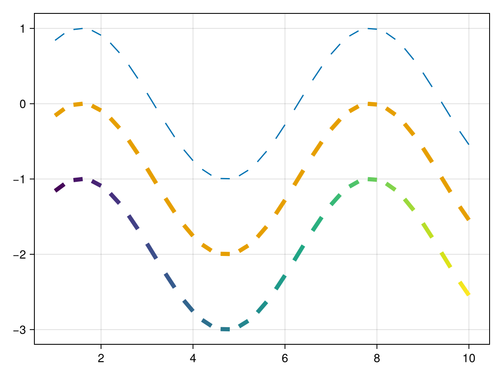
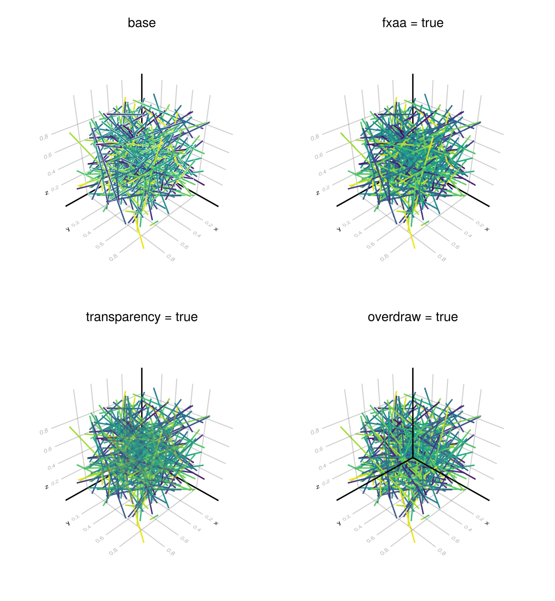

# linesegments {#linesegments}
<details class='jldocstring custom-block' open>
<summary><a id='MakieCore.linesegments-reference-plots-linesegments' href='#MakieCore.linesegments-reference-plots-linesegments'><span class="jlbinding">MakieCore.linesegments</span></a> <Badge type="info" class="jlObjectType jlFunction" text="Function" /></summary>


```julia
linesegments(positions)
linesegments(vector_of_2tuples_of_points)
linesegments(x, y)
linesegments(x, y, z)
```


Plots a line for each pair of points in `(x, y, z)`, `(x, y)`, or `positions`.

**Plot type**

The plot type alias for the `linesegments` function is `LineSegments`.


<Badge type="info" class="source-link" text="source"><a href="https://github.com/MakieOrg/Makie.jl/blob/406a09fe6f430d0a43f0f3cf1a876583e9bafbf5/MakieCore/src/recipes.jl#L520-L595" target="_blank" rel="noreferrer">source</a></Badge>

</details>


## Examples {#Examples}
<a id="example-f0da85d" />


```julia
using CairoMakie
f = Figure()
Axis(f[1, 1])

xs = 1:0.2:10
ys = sin.(xs)

linesegments!(xs, ys)
linesegments!(xs, ys .- 1, linewidth = 5)
linesegments!(xs, ys .- 2, linewidth = 5, color = LinRange(1, 5, length(xs)))

f
```




### Dealing with outline artifacts in GLMakie {#Dealing-with-outline-artifacts-in-GLMakie}

In GLMakie 3D line plots can generate outline artifacts depending on the order line segments are rendered in. Currently there are a few ways to mitigate this problem, but they all come at a cost:
- `fxaa = true` will disable the native anti-aliasing of line segments and use fxaa instead. This results in less detailed lines.
  
- `transparency = true` will disable depth testing to a degree, resulting in all lines being rendered without artifacts. However with this lines will always have some level of transparency.
  
- `overdraw = true` will disable depth testing entirely (read and write) for the plot, removing artifacts. This will however change the z-order of line segments and allow plots rendered later to show up on top of the linesegments plot.
  
<a id="example-67e16ba" />


```julia
using GLMakie
ps = rand(Point3f, 500)
cs = rand(500)
f = Figure(size = (600, 650))
Label(f[1, 1], "base", tellwidth = false)
linesegments(f[2, 1], ps, color = cs, fxaa = false)
Label(f[1, 2], "fxaa = true", tellwidth = false)
linesegments(f[2, 2], ps, color = cs, fxaa = true)
Label(f[3, 1], "transparency = true", tellwidth = false)
linesegments(f[4, 1], ps, color = cs, transparency = true)
Label(f[3, 2], "overdraw = true", tellwidth = false)
linesegments(f[4, 2], ps, color = cs, overdraw = true)
f
```




## Attributes {#Attributes}

### alpha {#alpha}

Defaults to `1.0`

The alpha value of the colormap or color attribute. Multiple alphas like in `plot(alpha=0.2, color=(:red, 0.5)`, will get multiplied.

### clip_planes {#clip_planes}

Defaults to `automatic`

Clip planes offer a way to do clipping in 3D space. You can set a Vector of up to 8 `Plane3f` planes here, behind which plots will be clipped (i.e. become invisible). By default clip planes are inherited from the parent plot or scene. You can remove parent `clip_planes` by passing `Plane3f[]`.

### color {#color}

Defaults to `@inherit linecolor`

The color of the line.

### colormap {#colormap}

Defaults to `@inherit colormap :viridis`

Sets the colormap that is sampled for numeric `color`s. `PlotUtils.cgrad(...)`, `Makie.Reverse(any_colormap)` can be used as well, or any symbol from ColorBrewer or PlotUtils. To see all available color gradients, you can call `Makie.available_gradients()`.

### colorrange {#colorrange}

Defaults to `automatic`

The values representing the start and end points of `colormap`.

### colorscale {#colorscale}

Defaults to `identity`

The color transform function. Can be any function, but only works well together with `Colorbar` for `identity`, `log`, `log2`, `log10`, `sqrt`, `logit`, `Makie.pseudolog10` and `Makie.Symlog10`.

### cycle {#cycle}

Defaults to `[:color]`

Sets which attributes to cycle when creating multiple plots.

### depth_shift {#depth_shift}

Defaults to `0.0`

Adjusts the depth value of a plot after all other transformations, i.e. in clip space, where `-1 <= depth <= 1`. This only applies to GLMakie and WGLMakie and can be used to adjust render order (like a tunable overdraw).

### fxaa {#fxaa}

Defaults to `false`

Adjusts whether the plot is rendered with fxaa (anti-aliasing, GLMakie only).

### highclip {#highclip}

Defaults to `automatic`

The color for any value above the colorrange.

### inspectable {#inspectable}

Defaults to `@inherit inspectable`

Sets whether this plot should be seen by `DataInspector`. The default depends on the theme of the parent scene.

### inspector_clear {#inspector_clear}

Defaults to `automatic`

Sets a callback function `(inspector, plot) -> ...` for cleaning up custom indicators in DataInspector.

### inspector_hover {#inspector_hover}

Defaults to `automatic`

Sets a callback function `(inspector, plot, index) -> ...` which replaces the default `show_data` methods.

### inspector_label {#inspector_label}

Defaults to `automatic`

Sets a callback function `(plot, index, position) -> string` which replaces the default label generated by DataInspector.

### linecap {#linecap}

Defaults to `@inherit linecap`

Sets the type of linecap used, i.e. :butt (flat with no extrusion), :square (flat with 1 linewidth extrusion) or :round.

### linestyle {#linestyle}

Defaults to `nothing`

Sets the dash pattern of the line. Options are `:solid` (equivalent to `nothing`), `:dot`, `:dash`, `:dashdot` and `:dashdotdot`. These can also be given in a tuple with a gap style modifier, either `:normal`, `:dense` or `:loose`. For example, `(:dot, :loose)` or `(:dashdot, :dense)`.

For custom patterns have a look at [`Makie.Linestyle`](/api#Makie.Linestyle).

### linewidth {#linewidth}

Defaults to `@inherit linewidth`

Sets the width of the line in pixel units

### lowclip {#lowclip}

Defaults to `automatic`

The color for any value below the colorrange.

### model {#model}

Defaults to `automatic`

Sets a model matrix for the plot. This overrides adjustments made with `translate!`, `rotate!` and `scale!`.

### nan_color {#nan_color}

Defaults to `:transparent`

The color for NaN values.

### overdraw {#overdraw}

Defaults to `false`

Controls if the plot will draw over other plots. This specifically means ignoring depth checks in GL backends

### space {#space}

Defaults to `:data`

Sets the transformation space for box encompassing the plot. See `Makie.spaces()` for possible inputs.

### ssao {#ssao}

Defaults to `false`

Adjusts whether the plot is rendered with ssao (screen space ambient occlusion). Note that this only makes sense in 3D plots and is only applicable with `fxaa = true`.

### transformation {#transformation}

Defaults to `:automatic`

No docs available.

### transparency {#transparency}

Defaults to `false`

Adjusts how the plot deals with transparency. In GLMakie `transparency = true` results in using Order Independent Transparency.

### visible {#visible}

Defaults to `true`

Controls whether the plot will be rendered or not.
