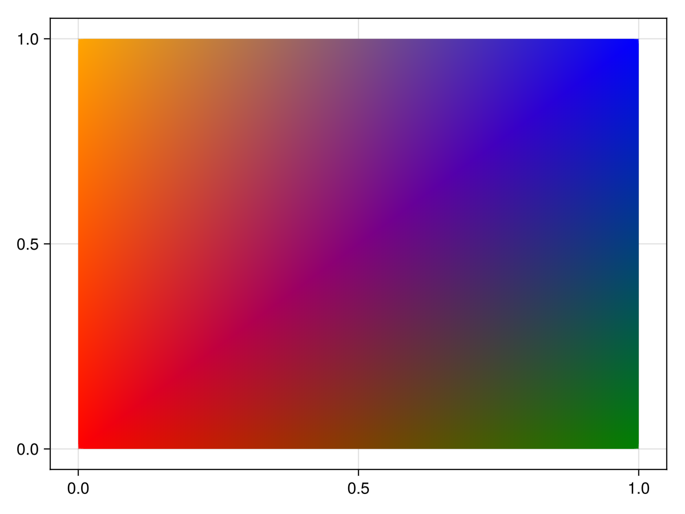
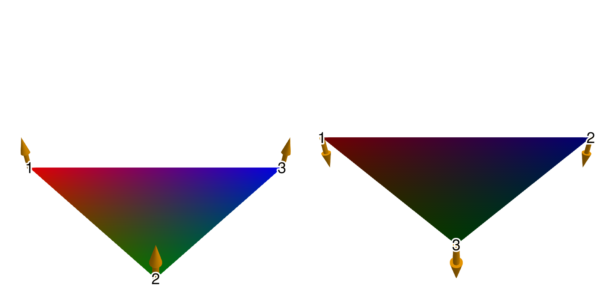
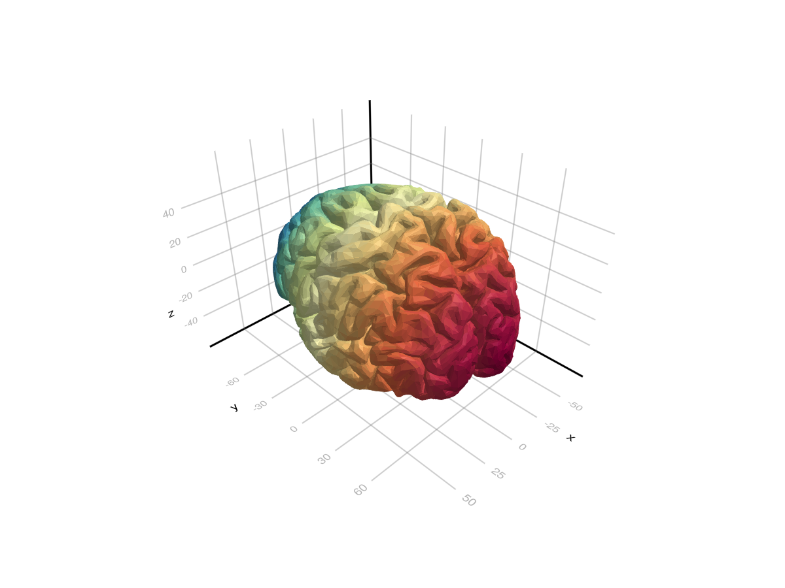
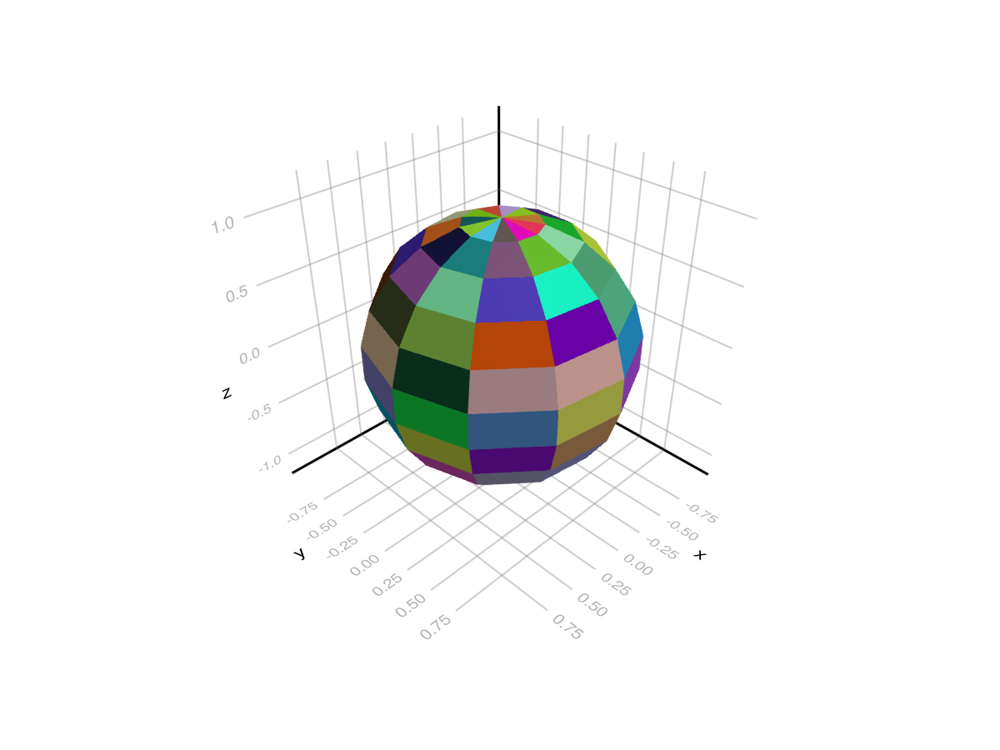
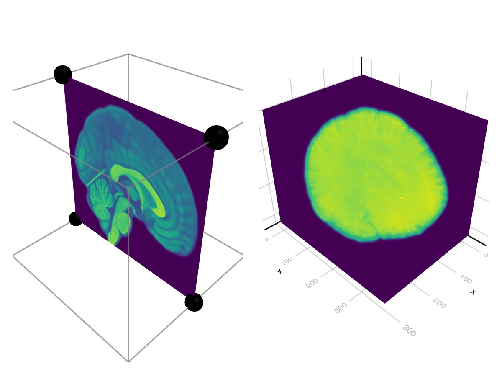
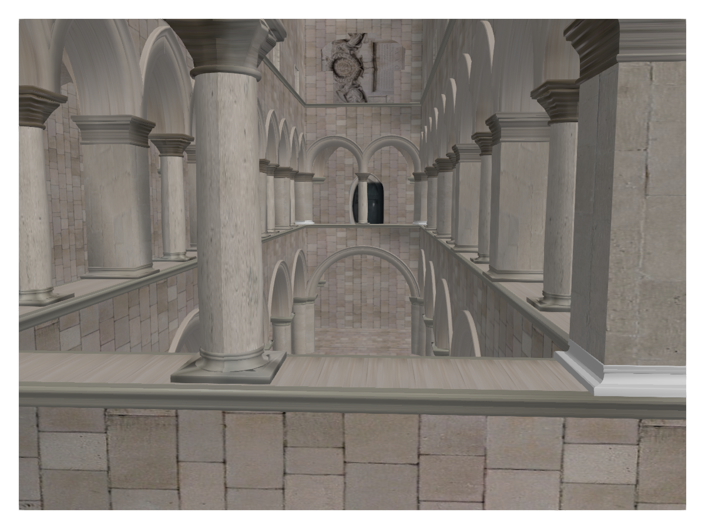

# mesh {#mesh}
<details class='jldocstring custom-block' open>
<summary><a id='MakieCore.mesh-reference-plots-mesh' href='#MakieCore.mesh-reference-plots-mesh'><span class="jlbinding">MakieCore.mesh</span></a> <Badge type="info" class="jlObjectType jlFunction" text="Function" /></summary>


```julia
mesh(x, y, z)
mesh(mesh_object)
mesh(x, y, z, faces)
mesh(xyz, faces)
```


Plots a 3D or 2D mesh. Supported `mesh_object`s include `Mesh` types from [GeometryBasics.jl](https://github.com/JuliaGeometry/GeometryBasics.jl).

**Plot type**

The plot type alias for the `mesh` function is `Mesh`.


<Badge type="info" class="source-link" text="source"><a href="https://github.com/MakieOrg/Makie.jl/blob/e1788feb7d2b5c349ae9fe7900dfde092b701913/MakieCore/src/recipes.jl#L520-L612" target="_blank" rel="noreferrer">source</a></Badge>

</details>


## Examples {#Examples}

### Simple mesh plots {#Simple-mesh-plots}

A mesh can be constructed from a set of vertex coordinates and faces.
<a id="example-b66a67a" />


```julia
using GLMakie
vertices = [
    0.0 0.0;
    1.0 0.0;
    1.0 1.0;
    0.0 1.0;
]

faces = [
    1 2 3;
    3 4 1;
]

colors = [:red, :green, :blue, :orange]

mesh(vertices, faces, color = colors, shading = NoShading)
```




Note that the order of vertices within a face matters for normal generation in 3D and thus affects shading. The normals follows the right hand rule, meaning the normals will face outwards if the vertices of a face are in a counter clockwise order.
<a id="example-272f752" />


```julia
using GLMakie
vertices = Point3f[(1,0,0), (1,1,0), (0,1,0)]
faces1 = [1 2 3]
faces2 = [1 3 2]
colors = [:red, :green, :blue]

f = Figure(size = (800, 400))
ax = LScene(f[1,1], show_axis = false)
p = mesh!(ax, vertices, faces1, color = colors)
arrows!(ax, vertices, p.converted[1][].normal, lengthscale = 0.1, arrowsize = Vec3f(0.05, 0.05, 0.1), color = :orange)
text!(ax, vertices[faces1[:]], text = ["1", "2", "3"], align = (:center, :center), fontsize = 20, strokecolor = :white, strokewidth = 2, overdraw = true)

ax = LScene(f[1,2], show_axis = false)
p = mesh!(ax, vertices, faces2, color = colors)
arrows!(ax, vertices, p.converted[1][].normal, lengthscale = 0.1, arrowsize = Vec3f(0.05, 0.05, 0.1), color = :orange)
text!(ax, vertices[faces2[:]], text = ["1", "2", "3"], align = (:center, :center), fontsize = 20, strokecolor = :white, strokewidth = 2, overdraw = true)

f
```




Another quick way to create a mesh plot is import a mesh using FileIO (which relies on MeshIO):
<a id="example-c776639" />


```julia
using GLMakie
using FileIO

brain = load(assetpath("brain.stl"))

mesh(
    brain,
    color = [tri[1][2] for tri in brain for i in 1:3],
    colormap = Reverse(:Spectral)
)
```




### Face colors and normals {#Face-colors-and-normals}
<a id="example-d15ea7b" />


```julia
using GLMakie
using GeometryBasics

# Reduce quality of sphere
s = Tessellation(Sphere(Point3f(0), 1f0), 12)
ps = coordinates(s)
fs = faces(s)

# Use a FaceView to with a new set of faces which refer to one color per face.
# Each face must have the same length as the respective face in fs.
# (Using the same face type guarantees this)
FT = eltype(fs); N = length(fs)
cs = FaceView(rand(RGBf, N), [FT(i) for i in 1:N])

# generate normals per face (this creates a FaceView as well)
ns = face_normals(ps, fs)

# Create mesh
m = GeometryBasics.mesh(ps, fs, normal = ns, color = cs)

mesh(m)
```




### Using GeometryBasics.Mesh and Buffer/Sampler type {#Using-GeometryBasics.Mesh-and-Buffer/Sampler-type}

We can also create a mesh to specify normals, uv coordinates:

```julia
using GeometryBasics, LinearAlgebra, GLMakie, FileIO


# Create vertices for a Sphere
r = 0.5f0
n = 30
θ = LinRange(0, pi, n)
φ2 = LinRange(0, 2pi, 2 * n)
x2 = [r * cos(φv) * sin(θv) for θv in θ, φv in φ2]
y2 = [r * sin(φv) * sin(θv) for θv in θ, φv in φ2]
z2 = [r * cos(θv) for θv in θ, φv in 2φ2]
points = vec([Point3f(xv, yv, zv) for (xv, yv, zv) in zip(x2, y2, z2)])

# The coordinates form a matrix, so to connect neighboring vertices with a face
# we can just use the faces of a rectangle with the same dimension as the matrix:
_faces = decompose(QuadFace{GLIndex}, Tessellation(Rect(0, 0, 1, 1), size(z2)))
# Normals of a centered sphere are easy, they're just the vertices normalized.
_normals = normalize.(points)

# Now we generate UV coordinates, which map the image (texture) to the vertices.
# (0, 0) means lower left edge of the image, while (1, 1) means upper right corner.
function gen_uv(shift)
    return vec(map(CartesianIndices(size(z2))) do ci
        tup = ((ci[1], ci[2]) .- 1) ./ ((size(z2) .* shift) .- 1)
        return Vec2f(reverse(tup))
    end)
end

# We add some shift to demonstrate how UVs work:
uv = gen_uv(0.0)
# We can use a Buffer to update single elements in an array directly on the GPU
# with GLMakie. They work just like normal arrays, but forward any updates written to them directly to the GPU
uv_buff = Buffer(uv)
gb_mesh = GeometryBasics.Mesh(points, _faces; uv = uv_buff, normal = _normals)

f, ax, pl = mesh(gb_mesh,  color = rand(100, 100), colormap=:blues)
wireframe!(ax, gb_mesh, color=(:black, 0.2), linewidth=2, transparency=true)
record(f, "uv_mesh.mp4", LinRange(0, 1, 100)) do shift
    uv_buff[1:end] = gen_uv(shift)
end
```

<video autoplay loop muted playsinline controls src="./uv_mesh.mp4" />


The uv coordinates that go out of bounds will get repeated per default. One can use a `Sampler` object to change that behaviour:

```julia
#=
Possible values:
:clamp_to_edge (default)
:mirrored_repeat
:repeat
=#
data = load(Makie.assetpath("earth.png"))
color = Sampler(rotl90(data'), x_repeat=:mirrored_repeat,y_repeat=:repeat)
f, ax, pl = mesh(gb_mesh,  color = color)
wireframe!(ax, gb_mesh, color=(:black, 0.2), linewidth=2, transparency=true)

record(f, "uv_mesh_mirror.mp4", LinRange(0, 1, 100)) do shift
    uv_buff[1:end] = gen_uv(shift)
end
```

<video autoplay loop muted playsinline controls src="./uv_mesh_mirror.mp4" />


### Volume Texture {#Volume-Texture}

One can pass a 3d array to `mesh(args...; color=volume), and index the volume via uvw coordinates. Here is an example of an interactive volume slice viewer:

```julia
using GLMakie, GeometryBasics, NIfTI
brain = Float32.(niread(Makie.assetpath("brain.nii.gz")).raw)
# Define the positions
positions = Observable([Point3f(0.5, 0, 0), Point3f(0.5, 1, 0), Point3f(0.5, 1, 1), Point3f(0.5, 0, 1)])
triangles = GLTriangleFace[(1, 2, 3), (3, 4, 1)]

# We will stay in the unit cube, so the uv coordinates are just the positions.
uv_mesh = map((p) -> GeometryBasics.Mesh(p, triangles; uv=Vec3f.(p)), positions)
# Pass the volume plot to the color
f, ax, pl = mesh(uv_mesh, color=brain, shading=NoShading, axis=(; show_axis=false))
# Visualize the unit cube in which the volume lives
wireframe!(ax, Rect3f(Vec3f(0), Vec3f(1)), transparency=true, color=(:gray, 0.5))
cam = cameracontrols(ax.scene)
# Only rotate when left + alt buttons are pressed, so we can better interact with the slice
cam.controls.rotation_button = Mouse.left & Keyboard.left_alt
# Have colors for each point, so we can highlight it on hover
colors = Observable(fill(:black, 4))
ms = meshscatter!(ax, positions, markersize=0.05, color=colors)
# Also plot the volume next to it with a maximum intensity projection.
Makie.volume(f[1, 2], brain)

# Use mouseevents for drag events etc.
m_events = addmouseevents!(ax.scene)
point_idx = Ref(0)
point_start = Ref(Point3f(0))
clear_color() = if any(x -> x == :red, colors[])
    colors[] .= :black
    notify(colors)
end
# Define the handler for handling drag events to move the slice and
# highlight hovered points.
onany(ax.scene.events.mouseposition, m_events.obs) do mp, event
    if event.type == Makie.MouseEventTypes.leftdragstart
        p, idx = Makie.pick(ax.scene)
        if p == ms
            point_idx[] = idx
            colors[][idx] = :red
            point_start[] = positions[][idx]
            notify(colors)
        else
            point_idx[] = 0
        end
    elseif event.type == Makie.MouseEventTypes.leftdrag
        if point_idx[] != 0
            ray = Makie.ray_at_cursor(ax.scene)
            p = point_start[]
            line_start = Point3f(0, p[2], p[3])
            line_end = Point3f(1, p[2], p[3])
            new_point = Makie.closest_point_on_line(line_start, line_end, ray)
            positions[][point_idx[]] = new_point
            notify(positions)
        end
    elseif event.type == Makie.MouseEventTypes.leftdragstop
        point_idx[] = 0
        clear_color()
    elseif event.type == Makie.MouseEventTypes.over
        p, idx = Makie.pick(ax.scene)
        if p == ms
            if colors[][idx] != :red
                colors[][idx] = :red
                notify(colors)
            end
        else
            clear_color()
            point_idx[] = 0
        end
    end
end
f
```



### Complex Meshes (Experimental) {#Complex-Meshes-Experimental}
<a id="example-67f1b9c" />


```julia
using GLMakie
using FileIO

# Load a mesh with material information. This will produce a GeometryBasics.MetaMesh
sponza = load(assetpath("sponza/sponza.obj"))

# The MetaMesh contains a standard GeometryBasics.Mesh in `sponza.mesh` with
# `mesh.views` defining the different sub-meshes, and material metadata in the
# `sponza.meta` Dict. The metadata includes:
# - meta[:material_names] which maps each view in `mesh.views` to a material name
# - meta[:materials] which maps a material name to a nested Dict of the loaded properties
# When a MetaMesh is given to Makie.mesh(), it will look for these entries and
# try to build a plot accordingly.
f, a, p = mesh(sponza)

# Set up camera
update_cam!(a.scene, Vec3f(-15, 7, 1), Vec3f(3, 5, 0), Vec3f(0,1,0))
cameracontrols(a).settings.center[] = false # don't recenter on display
cameracontrols(a).settings.fixed_axis[] = false # rotate freely
f
```




## Attributes {#Attributes}

### alpha {#alpha}

Defaults to `1.0`

The alpha value of the colormap or color attribute. Multiple alphas like in `plot(alpha=0.2, color=(:red, 0.5)`, will get multiplied.

### backlight {#backlight}

Defaults to `0.0`

Sets a weight for secondary light calculation with inverted normals.

### clip_planes {#clip_planes}

Defaults to `automatic`

Clip planes offer a way to do clipping in 3D space. You can set a Vector of up to 8 `Plane3f` planes here, behind which plots will be clipped (i.e. become invisible). By default clip planes are inherited from the parent plot or scene. You can remove parent `clip_planes` by passing `Plane3f[]`.

### color {#color}

Defaults to `@inherit patchcolor`

Sets the color of the mesh. Can be a `Vector{<:Colorant}` for per vertex colors or a single `Colorant`. A `Matrix{<:Colorant}` can be used to color the mesh with a texture, which requires the mesh to contain texture coordinates. A `<: AbstractPattern` can be used to apply a repeated, pixel sampled pattern to the mesh, e.g. for hatching.

### colormap {#colormap}

Defaults to `@inherit colormap :viridis`

Sets the colormap that is sampled for numeric `color`s. `PlotUtils.cgrad(...)`, `Makie.Reverse(any_colormap)` can be used as well, or any symbol from ColorBrewer or PlotUtils. To see all available color gradients, you can call `Makie.available_gradients()`.

### colorrange {#colorrange}

Defaults to `automatic`

The values representing the start and end points of `colormap`.

### colorscale {#colorscale}

Defaults to `identity`

The color transform function. Can be any function, but only works well together with `Colorbar` for `identity`, `log`, `log2`, `log10`, `sqrt`, `logit`, `Makie.pseudolog10` and `Makie.Symlog10`.

### cycle {#cycle}

Defaults to `[:color => :patchcolor]`

No docs available.

### depth_shift {#depth_shift}

Defaults to `0.0`

Adjusts the depth value of a plot after all other transformations, i.e. in clip space, where `-1 <= depth <= 1`. This only applies to GLMakie and WGLMakie and can be used to adjust render order (like a tunable overdraw).

### diffuse {#diffuse}

Defaults to `1.0`

Sets how strongly the red, green and blue channel react to diffuse (scattered) light.

### fxaa {#fxaa}

Defaults to `true`

Adjusts whether the plot is rendered with fxaa (anti-aliasing, GLMakie only).

### highclip {#highclip}

Defaults to `automatic`

The color for any value above the colorrange.

### inspectable {#inspectable}

Defaults to `@inherit inspectable`

Sets whether this plot should be seen by `DataInspector`. The default depends on the theme of the parent scene.

### inspector_clear {#inspector_clear}

Defaults to `automatic`

Sets a callback function `(inspector, plot) -> ...` for cleaning up custom indicators in DataInspector.

### inspector_hover {#inspector_hover}

Defaults to `automatic`

Sets a callback function `(inspector, plot, index) -> ...` which replaces the default `show_data` methods.

### inspector_label {#inspector_label}

Defaults to `automatic`

Sets a callback function `(plot, index, position) -> string` which replaces the default label generated by DataInspector.

### interpolate {#interpolate}

Defaults to `true`

sets whether colors should be interpolated

### lowclip {#lowclip}

Defaults to `automatic`

The color for any value below the colorrange.

### matcap {#matcap}

Defaults to `nothing`

No docs available.

### material {#material}

Defaults to `nothing`

RPRMakie only attribute to set complex RadeonProRender materials.         _Warning_, how to set an RPR material may change and other backends will ignore this attribute

### model {#model}

Defaults to `automatic`

Sets a model matrix for the plot. This overrides adjustments made with `translate!`, `rotate!` and `scale!`.

### nan_color {#nan_color}

Defaults to `:transparent`

The color for NaN values.

### overdraw {#overdraw}

Defaults to `false`

Controls if the plot will draw over other plots. This specifically means ignoring depth checks in GL backends

### shading {#shading}

Defaults to `automatic`

Sets the lighting algorithm used. Options are `NoShading` (no lighting), `FastShading` (AmbientLight + PointLight) or `MultiLightShading` (Multiple lights, GLMakie only). Note that this does not affect RPRMakie.

### shininess {#shininess}

Defaults to `32.0`

Sets how sharp the reflection is.

### space {#space}

Defaults to `:data`

Sets the transformation space for box encompassing the plot. See `Makie.spaces()` for possible inputs.

### specular {#specular}

Defaults to `0.2`

Sets how strongly the object reflects light in the red, green and blue channels.

### ssao {#ssao}

Defaults to `false`

Adjusts whether the plot is rendered with ssao (screen space ambient occlusion). Note that this only makes sense in 3D plots and is only applicable with `fxaa = true`.

### transformation {#transformation}

Defaults to `:automatic`

No docs available.

### transparency {#transparency}

Defaults to `false`

Adjusts how the plot deals with transparency. In GLMakie `transparency = true` results in using Order Independent Transparency.

### uv_transform {#uv_transform}

Defaults to `automatic`

Sets a transform for uv coordinates, which controls how a texture is mapped to a mesh. The attribute can be `I`, `scale::VecTypes{2}`, `(translation::VecTypes{2}, scale::VecTypes{2})`, any of :rotr90, :rotl90, :rot180, :swap_xy/:transpose, :flip_x, :flip_y, :flip_xy, or most generally a `Makie.Mat{2, 3, Float32}` or `Makie.Mat3f` as returned by `Makie.uv_transform()`. They can also be changed by passing a tuple `(op3, op2, op1)`.

### visible {#visible}

Defaults to `true`

Controls whether the plot will be rendered or not.
