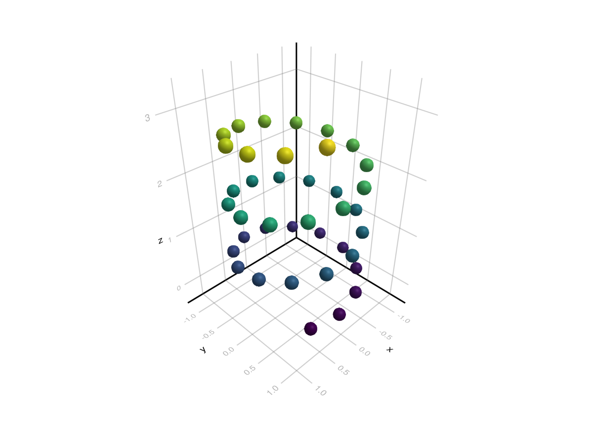
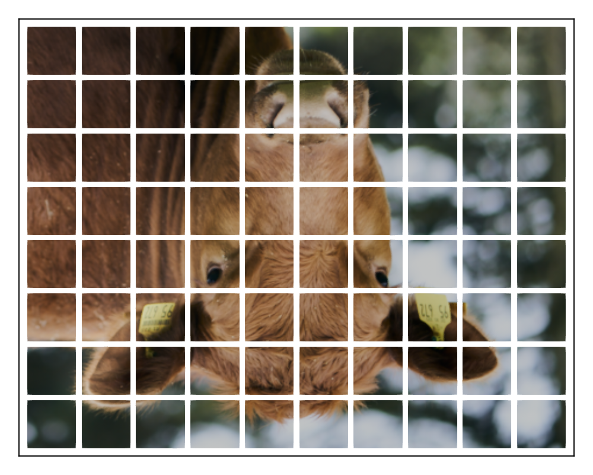

# meshscatter {#meshscatter}
<details class='jldocstring custom-block' open>
<summary><a id='MakieCore.meshscatter-reference-plots-meshscatter' href='#MakieCore.meshscatter-reference-plots-meshscatter'><span class="jlbinding">MakieCore.meshscatter</span></a> <Badge type="info" class="jlObjectType jlFunction" text="Function" /></summary>


```julia
meshscatter(positions)
meshscatter(x, y)
meshscatter(x, y, z)
```


Plots a mesh for each element in `(x, y, z)`, `(x, y)`, or `positions` (similar to `scatter`). `markersize` is a scaling applied to the primitive passed as `marker`.

**Plot type**

The plot type alias for the `meshscatter` function is `MeshScatter`.


<Badge type="info" class="source-link" text="source"><a href="https://github.com/MakieOrg/Makie.jl/blob/406a09fe6f430d0a43f0f3cf1a876583e9bafbf5/MakieCore/src/recipes.jl#L520-L615" target="_blank" rel="noreferrer">source</a></Badge>

</details>


## Examples {#Examples}
<a id="example-d533ca7" />


```julia
using GLMakie
xs = cos.(1:0.5:20)
ys = sin.(1:0.5:20)
zs = LinRange(0, 3, length(xs))

meshscatter(xs, ys, zs, markersize = 0.1, color = zs)
```



<a id="example-300115c" />


```julia
using GLMakie
using FileIO, GeometryBasics
cow = FileIO.load(joinpath(pkgdir(Makie), "assets", "cow.png"))

N = 8; M = 10
f = Figure(size = (500, 400))
a, p = meshscatter(
    f[1, 1],
    [Point2f(x, y) for x in 1:M for y in 1:N],
    color = cow,
    uv_transform = [
        # 1. undo y flip of uvs relative to pos
        # 2. grab relevant section from image
        # 3. rotate to match view
        (:rotl90, (Vec2f(x, y), Vec2f(1/M, 1/N)), :flip_y)
        for x in range(0, 1, length = M+1)[1:M]
        for y in range(0, 1, length = N+1)[1:N]
    ],
    markersize = Vec3f(0.9, 0.9, 1),
    marker = uv_normal_mesh(Rect2f(-0.5, -0.5, 1, 1))
)
hidedecorations!(a)
xlims!(a, 0.4, M+0.6)
ylims!(a, 0.4, N+0.6)
f
```




## Attributes {#Attributes}

### alpha {#alpha}

Defaults to `1.0`

The alpha value of the colormap or color attribute. Multiple alphas like in `plot(alpha=0.2, color=(:red, 0.5)`, will get multiplied.

### backlight {#backlight}

Defaults to `0.0`

Sets a weight for secondary light calculation with inverted normals.

### clip_planes {#clip_planes}

Defaults to `automatic`

Clip planes offer a way to do clipping in 3D space. You can set a Vector of up to 8 `Plane3f` planes here, behind which plots will be clipped (i.e. become invisible). By default clip planes are inherited from the parent plot or scene. You can remove parent `clip_planes` by passing `Plane3f[]`.

### color {#color}

Defaults to `@inherit markercolor`

Sets the color of the marker.

### colormap {#colormap}

Defaults to `@inherit colormap :viridis`

Sets the colormap that is sampled for numeric `color`s. `PlotUtils.cgrad(...)`, `Makie.Reverse(any_colormap)` can be used as well, or any symbol from ColorBrewer or PlotUtils. To see all available color gradients, you can call `Makie.available_gradients()`.

### colorrange {#colorrange}

Defaults to `automatic`

The values representing the start and end points of `colormap`.

### colorscale {#colorscale}

Defaults to `identity`

The color transform function. Can be any function, but only works well together with `Colorbar` for `identity`, `log`, `log2`, `log10`, `sqrt`, `logit`, `Makie.pseudolog10` and `Makie.Symlog10`.

### cycle {#cycle}

Defaults to `[:color]`

No docs available.

### depth_shift {#depth_shift}

Defaults to `0.0`

Adjusts the depth value of a plot after all other transformations, i.e. in clip space, where `-1 <= depth <= 1`. This only applies to GLMakie and WGLMakie and can be used to adjust render order (like a tunable overdraw).

### diffuse {#diffuse}

Defaults to `1.0`

Sets how strongly the red, green and blue channel react to diffuse (scattered) light.

### fxaa {#fxaa}

Defaults to `true`

Adjusts whether the plot is rendered with fxaa (anti-aliasing, GLMakie only).

### highclip {#highclip}

Defaults to `automatic`

The color for any value above the colorrange.

### inspectable {#inspectable}

Defaults to `@inherit inspectable`

Sets whether this plot should be seen by `DataInspector`. The default depends on the theme of the parent scene.

### inspector_clear {#inspector_clear}

Defaults to `automatic`

Sets a callback function `(inspector, plot) -> ...` for cleaning up custom indicators in DataInspector.

### inspector_hover {#inspector_hover}

Defaults to `automatic`

Sets a callback function `(inspector, plot, index) -> ...` which replaces the default `show_data` methods.

### inspector_label {#inspector_label}

Defaults to `automatic`

Sets a callback function `(plot, index, position) -> string` which replaces the default label generated by DataInspector.

### lowclip {#lowclip}

Defaults to `automatic`

The color for any value below the colorrange.

### marker {#marker}

Defaults to `:Sphere`

Sets the scattered mesh.

### markersize {#markersize}

Defaults to `0.1`

Sets the scale of the mesh. This can be given as a `Vector` to apply to each scattered mesh individually.

### material {#material}

Defaults to `nothing`

RPRMakie only attribute to set complex RadeonProRender materials.         _Warning_, how to set an RPR material may change and other backends will ignore this attribute

### model {#model}

Defaults to `automatic`

Sets a model matrix for the plot. This overrides adjustments made with `translate!`, `rotate!` and `scale!`.

### nan_color {#nan_color}

Defaults to `:transparent`

The color for NaN values.

### overdraw {#overdraw}

Defaults to `false`

Controls if the plot will draw over other plots. This specifically means ignoring depth checks in GL backends

### rotation {#rotation}

Defaults to `0.0`

Sets the rotation of the mesh. A numeric rotation is around the z-axis, a `Vec3f` causes the mesh to rotate such that the the z-axis is now that vector, and a quaternion describes a general rotation. This can be given as a Vector to apply to each scattered mesh individually.

### shading {#shading}

Defaults to `automatic`

Sets the lighting algorithm used. Options are `NoShading` (no lighting), `FastShading` (AmbientLight + PointLight) or `MultiLightShading` (Multiple lights, GLMakie only). Note that this does not affect RPRMakie.

### shininess {#shininess}

Defaults to `32.0`

Sets how sharp the reflection is.

### space {#space}

Defaults to `:data`

Sets the transformation space for box encompassing the plot. See `Makie.spaces()` for possible inputs.

### specular {#specular}

Defaults to `0.2`

Sets how strongly the object reflects light in the red, green and blue channels.

### ssao {#ssao}

Defaults to `false`

Adjusts whether the plot is rendered with ssao (screen space ambient occlusion). Note that this only makes sense in 3D plots and is only applicable with `fxaa = true`.

### transform_marker {#transform_marker}

Defaults to `true`

Controls whether the (complete) model matrix applies to the scattered mesh, rather than just the positions. (If this is false, `scale!`, `rotate!` and `translate!()` will not affect the scattered mesh.)

### transformation {#transformation}

Defaults to `:automatic`

No docs available.

### transparency {#transparency}

Defaults to `false`

Adjusts how the plot deals with transparency. In GLMakie `transparency = true` results in using Order Independent Transparency.

### uv_transform {#uv_transform}

Defaults to `automatic`

Sets a transform for uv coordinates, which controls how a texture is mapped to the scattered mesh. Note that the mesh needs to include uv coordinates for this, which is not the case by default for geometry primitives. You can use `GeometryBasics.uv_normal_mesh(prim)` with, for example `prim = Rect2f(0, 0, 1, 1)`. The attribute can be `I`, `scale::VecTypes{2}`, `(translation::VecTypes{2}, scale::VecTypes{2})`, any of :rotr90, :rotl90, :rot180, :swap_xy/:transpose, :flip_x, :flip_y, :flip_xy, or most generally a `Makie.Mat{2, 3, Float32}` or `Makie.Mat3f` as returned by `Makie.uv_transform()`. It can also be set per scattered mesh by passing a `Vector` of any of the above and operations can be changed by passing a tuple `(op3, op2, op1)`.

### visible {#visible}

Defaults to `true`

Controls whether the plot will be rendered or not.
