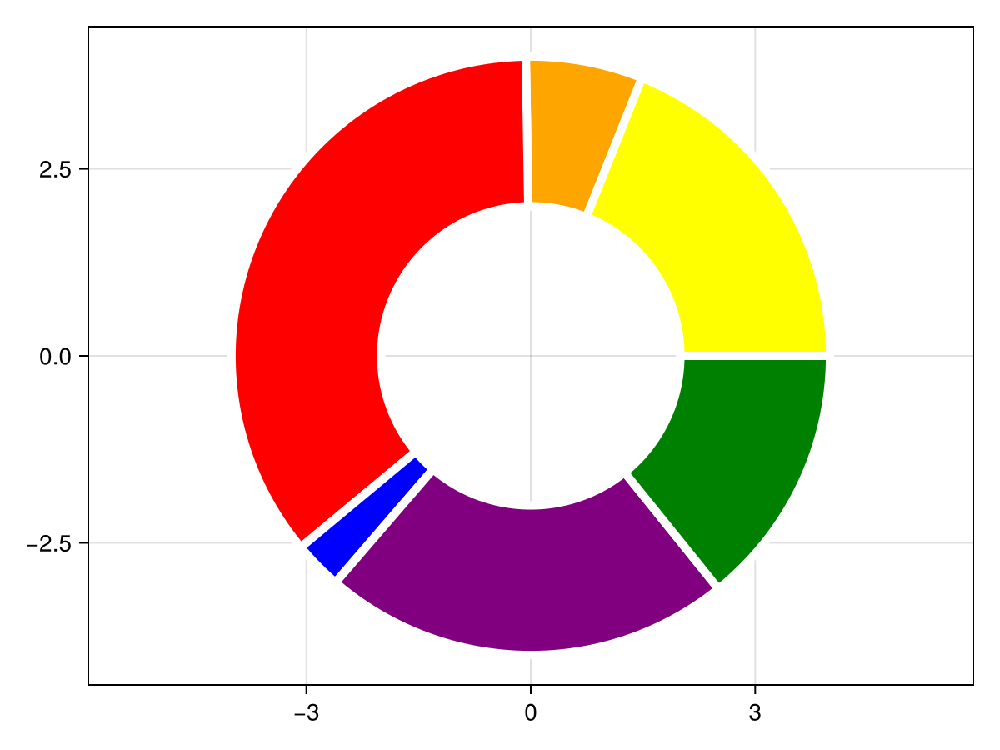
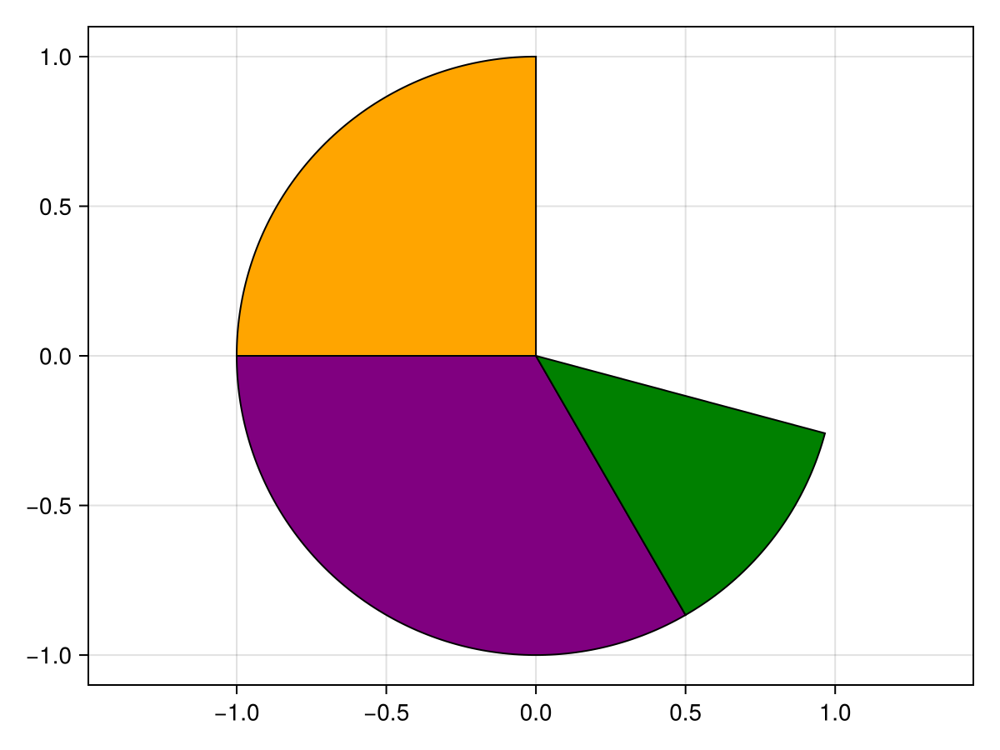
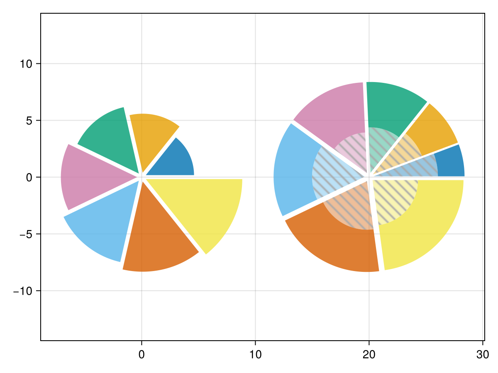
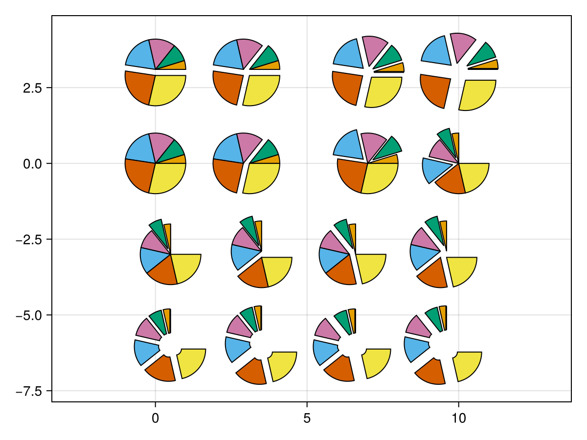

# pie {#pie}
<details class='jldocstring custom-block' open>
<summary><a id='Makie.pie-reference-plots-pie' href='#Makie.pie-reference-plots-pie'><span class="jlbinding">Makie.pie</span></a> <Badge type="info" class="jlObjectType jlFunction" text="Function" /></summary>


```julia
pie(values; kwargs...)
pie(point, values; kwargs...)
pie(x, y, values; kwargs...)
```


Creates a pie chart from the given `values`.

**Plot type**

The plot type alias for the `pie` function is `Pie`.


<Badge type="info" class="source-link" text="source"><a href="https://github.com/MakieOrg/Makie.jl/blob/d2876406fadce67d5357789b0b71495e7971e5c1/MakieCore/src/recipes.jl#L520-L581" target="_blank" rel="noreferrer">source</a></Badge>

</details>


## Examples {#Examples}
<a id="example-3161fce" />


```julia
using CairoMakie
data   = [36, 12, 68, 5, 42, 27]
colors = [:yellow, :orange, :red, :blue, :purple, :green]

f, ax, plt = pie(data,
                 color = colors,
                 radius = 4,
                 inner_radius = 2,
                 strokecolor = :white,
                 strokewidth = 5,
                 axis = (autolimitaspect = 1, )
                )

f
```



<a id="example-9dbd6bf" />


```julia
using CairoMakie
f, ax, plt = pie([π/2, 2π/3, π/4],
                normalize=false,
                offset = π/2,
                color = [:orange, :purple, :green],
                axis = (autolimitaspect = 1,)
                )

f
```



<a id="example-781bf37" />


```julia
using CairoMakie
fig = Figure()
ax = Axis(fig[1, 1]; autolimitaspect=1)

kw = (; offset_radius=0.4, strokecolor=:transparent, strokewidth=0)
pie!(ax, ones(7); radius=sqrt.(2:8) * 3, kw..., color=Makie.wong_colors(0.8)[1:7])

vs = [2, 3, 4, 5, 6, 7, 8]
vs_inner = [1, 1, 1, 1, 2, 2, 2]
rs = 8
rs_inner = sqrt.(vs_inner ./ vs) * rs

lp = Makie.LinePattern(; direction=Makie.Vec2f(1, -1), width=2, tilesize=(12, 12), linecolor=:darkgrey, background_color=:transparent)
# draw the inner pie twice since `color` can not be vector of `LinePattern` currently
pie!(ax, 20, 0, vs; radius=rs_inner, inner_radius=0, kw..., color=Makie.wong_colors(0.4)[eachindex(vs)])
pie!(ax, 20, 0, vs; radius=rs_inner, inner_radius=0, kw..., color=lp)
pie!(ax, 20, 0, vs; radius=rs, inner_radius=rs_inner, kw..., color=Makie.wong_colors(0.8)[eachindex(vs)])

fig
```


```
┌ Warning: LinePattern(background_color = ...) has been deprecated in favor of LinePattern(backgroundcolor = ...)
└ @ Makie ~/work/Makie.jl/Makie.jl/src/patterns.jl:75
```



<a id="example-7d22227" />


```julia
using CairoMakie
fig = Figure()
ax = Axis(fig[1, 1]; autolimitaspect=1)

vs = 0:6 |> Vector
vs_ = vs ./ sum(vs) .* (3/2*π)
cs = Makie.wong_colors()
Δx = [1, 1, 1, -1, -1, -1, 1] ./ 10
Δy = [1, 1, 1, 1, 1, -1, -1] ./ 10
Δr1 = [0, 0, 0.2, 0, 0.2, 0, 0]
Δr2 = [0, 0, 0.2, 0, 0, 0, 0]

pie!(ax, vs; color=cs)
pie!(ax, 3 .+ Δx, 0, vs; color=cs)
pie!(ax, 0, 3 .+ Δy, vs; color=cs)
pie!(ax, 3 .+ Δx, 3 .+ Δy, vs; color=cs)

pie!(ax, 7, 0, vs; color=cs, offset_radius=Δr1)
pie!(ax, 7, 3, vs; color=cs, offset_radius=0.2)
pie!(ax, 10 .+ Δx, 3 .+ Δy, vs; color=cs, offset_radius=0.2)
pie!(ax, 10, 0, vs_; color=cs, offset_radius=Δr1, normalize=false, offset=π/2)

pie!(ax, Point2(0.5, -3), vs_; color=cs, offset_radius=Δr2, normalize=false, offset=π/2)
pie!(ax, Point2.(3.5, -3 .+ Δy), vs_; color=cs, offset_radius=Δr2, normalize=false, offset=π/2)
pie!(ax, Point2.(6.5 .+ Δx, -3), vs_; color=cs, offset_radius=Δr2, normalize=false, offset=π/2)
pie!(ax, Point2.(9.5 .+ Δx, -3 .+ Δy), vs_; color=cs, offset_radius=Δr2, normalize=false, offset=π/2)

pie!(ax, 0.5, -6, vs_; inner_radius=0.2, color=cs, offset_radius=0.2, normalize=false, offset=π/2)
pie!(ax, 3.5, -6 .+ Δy, vs_; inner_radius=0.2, color=cs, offset_radius=0.2, normalize=false, offset=π/2)
pie!(ax, 6.5 .+ Δx, -6, vs_; inner_radius=0.2, color=cs, offset_radius=0.2, normalize=false, offset=π/2)
pie!(ax, 9.5 .+ Δx, -6 .+ Δy, vs_; inner_radius=0.2, color=cs, offset_radius=0.2, normalize=false, offset=π/2)

fig
```




## Attributes {#Attributes}

### clip_planes {#clip_planes}

Defaults to `automatic`

Clip planes offer a way to do clipping in 3D space. You can set a Vector of up to 8 `Plane3f` planes here, behind which plots will be clipped (i.e. become invisible). By default clip planes are inherited from the parent plot or scene. You can remove parent `clip_planes` by passing `Plane3f[]`.

### color {#color}

Defaults to `:gray`

No docs available.

### depth_shift {#depth_shift}

Defaults to `0.0`

Adjusts the depth value of a plot after all other transformations, i.e. in clip space, where `-1 <= depth <= 1`. This only applies to GLMakie and WGLMakie and can be used to adjust render order (like a tunable overdraw).

### fxaa {#fxaa}

Defaults to `true`

Adjusts whether the plot is rendered with fxaa (anti-aliasing, GLMakie only).

### inner_radius {#inner_radius}

Defaults to `0`

The inner radius of the pie segments. If this is larger than zero, the pie pieces become ring sections.

### inspectable {#inspectable}

Defaults to `@inherit inspectable`

Sets whether this plot should be seen by `DataInspector`. The default depends on the theme of the parent scene.

### inspector_clear {#inspector_clear}

Defaults to `automatic`

Sets a callback function `(inspector, plot) -> ...` for cleaning up custom indicators in DataInspector.

### inspector_hover {#inspector_hover}

Defaults to `automatic`

Sets a callback function `(inspector, plot, index) -> ...` which replaces the default `show_data` methods.

### inspector_label {#inspector_label}

Defaults to `automatic`

Sets a callback function `(plot, index, position) -> string` which replaces the default label generated by DataInspector.

### model {#model}

Defaults to `automatic`

Sets a model matrix for the plot. This overrides adjustments made with `translate!`, `rotate!` and `scale!`.

### normalize {#normalize}

Defaults to `true`

If `true`, the sum of all values is normalized to 2π (a full circle).

### offset {#offset}

Defaults to `0`

The angular offset of the first pie segment from the (1, 0) vector in radians.

### offset_radius {#offset_radius}

Defaults to `0`

The offset of each pie segment from the center along the radius

### overdraw {#overdraw}

Defaults to `false`

Controls if the plot will draw over other plots. This specifically means ignoring depth checks in GL backends

### radius {#radius}

Defaults to `1`

The outer radius of the pie segments.

### space {#space}

Defaults to `:data`

Sets the transformation space for box encompassing the plot. See `Makie.spaces()` for possible inputs.

### ssao {#ssao}

Defaults to `false`

Adjusts whether the plot is rendered with ssao (screen space ambient occlusion). Note that this only makes sense in 3D plots and is only applicable with `fxaa = true`.

### strokecolor {#strokecolor}

Defaults to `:black`

No docs available.

### strokewidth {#strokewidth}

Defaults to `1`

No docs available.

### transformation {#transformation}

Defaults to `:automatic`

No docs available.

### transparency {#transparency}

Defaults to `false`

Adjusts how the plot deals with transparency. In GLMakie `transparency = true` results in using Order Independent Transparency.

### vertex_per_deg {#vertex_per_deg}

Defaults to `1`

Controls how many polygon vertices are used for one degree of rotation.

### visible {#visible}

Defaults to `true`

Controls whether the plot will be rendered or not.
