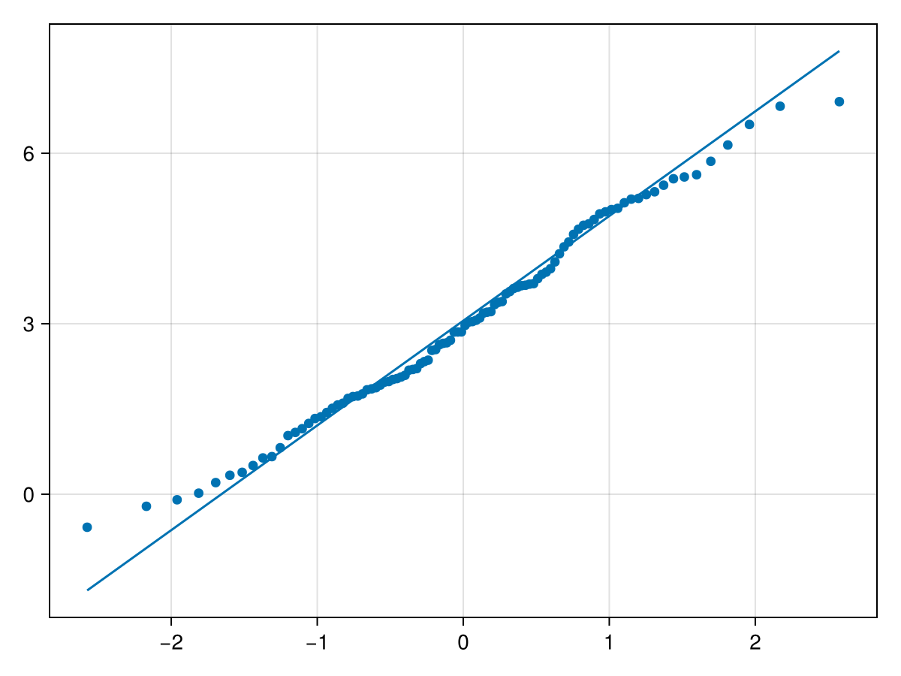

# qqnorm {#qqnorm}
<details class='jldocstring custom-block' open>
<summary><a id='Makie.qqnorm-reference-plots-qqnorm' href='#Makie.qqnorm-reference-plots-qqnorm'><span class="jlbinding">Makie.qqnorm</span></a> <Badge type="info" class="jlObjectType jlFunction" text="Function" /></summary>


```julia
qqnorm(y; kwargs...)
```


Shorthand for `qqplot(Normal(0,1), y)`, i.e., draw a Q-Q plot of `y` against the standard normal distribution. See `qqplot` for more details.

**Plot type**

The plot type alias for the `qqnorm` function is `QQNorm`.


<Badge type="info" class="source-link" text="source"><a href="https://github.com/MakieOrg/Makie.jl/blob/406a09fe6f430d0a43f0f3cf1a876583e9bafbf5/MakieCore/src/recipes.jl#L520-L579" target="_blank" rel="noreferrer">source</a></Badge>

</details>


## Examples {#Examples}

Test if `xs` is normally distributed.
<a id="example-c434ab6" />


```julia
using CairoMakie
xs = 2 .* randn(100) .+ 3

qqnorm(xs, qqline = :fitrobust)
```




## Attributes {#Attributes}

### clip_planes {#clip_planes}

Defaults to `automatic`

Clip planes offer a way to do clipping in 3D space. You can set a Vector of up to 8 `Plane3f` planes here, behind which plots will be clipped (i.e. become invisible). By default clip planes are inherited from the parent plot or scene. You can remove parent `clip_planes` by passing `Plane3f[]`.

### color {#color}

Defaults to `@inherit linecolor`

Control color of both line and markers (if `markercolor` is not specified).

### cycle {#cycle}

Defaults to `[:color]`

No docs available.

### depth_shift {#depth_shift}

Defaults to `0.0`

Adjusts the depth value of a plot after all other transformations, i.e. in clip space, where `-1 <= depth <= 1`. This only applies to GLMakie and WGLMakie and can be used to adjust render order (like a tunable overdraw).

### fxaa {#fxaa}

Defaults to `true`

Adjusts whether the plot is rendered with fxaa (anti-aliasing, GLMakie only).

### inspectable {#inspectable}

Defaults to `@inherit inspectable`

Sets whether this plot should be seen by `DataInspector`. The default depends on the theme of the parent scene.

### inspector_clear {#inspector_clear}

Defaults to `automatic`

Sets a callback function `(inspector, plot) -> ...` for cleaning up custom indicators in DataInspector.

### inspector_hover {#inspector_hover}

Defaults to `automatic`

Sets a callback function `(inspector, plot, index) -> ...` which replaces the default `show_data` methods.

### inspector_label {#inspector_label}

Defaults to `automatic`

Sets a callback function `(plot, index, position) -> string` which replaces the default label generated by DataInspector.

### linestyle {#linestyle}

Defaults to `nothing`

No docs available.

### linewidth {#linewidth}

Defaults to `@inherit linewidth`

No docs available.

### marker {#marker}

Defaults to `@inherit marker`

No docs available.

### markercolor {#markercolor}

Defaults to `automatic`

No docs available.

### markersize {#markersize}

Defaults to `@inherit markersize`

No docs available.

### model {#model}

Defaults to `automatic`

Sets a model matrix for the plot. This overrides adjustments made with `translate!`, `rotate!` and `scale!`.

### overdraw {#overdraw}

Defaults to `false`

Controls if the plot will draw over other plots. This specifically means ignoring depth checks in GL backends

### space {#space}

Defaults to `:data`

Sets the transformation space for box encompassing the plot. See `Makie.spaces()` for possible inputs.

### ssao {#ssao}

Defaults to `false`

Adjusts whether the plot is rendered with ssao (screen space ambient occlusion). Note that this only makes sense in 3D plots and is only applicable with `fxaa = true`.

### strokecolor {#strokecolor}

Defaults to `@inherit markerstrokecolor`

No docs available.

### strokewidth {#strokewidth}

Defaults to `@inherit markerstrokewidth`

No docs available.

### transformation {#transformation}

Defaults to `:automatic`

No docs available.

### transparency {#transparency}

Defaults to `false`

Adjusts how the plot deals with transparency. In GLMakie `transparency = true` results in using Order Independent Transparency.

### visible {#visible}

Defaults to `true`

Controls whether the plot will be rendered or not.
