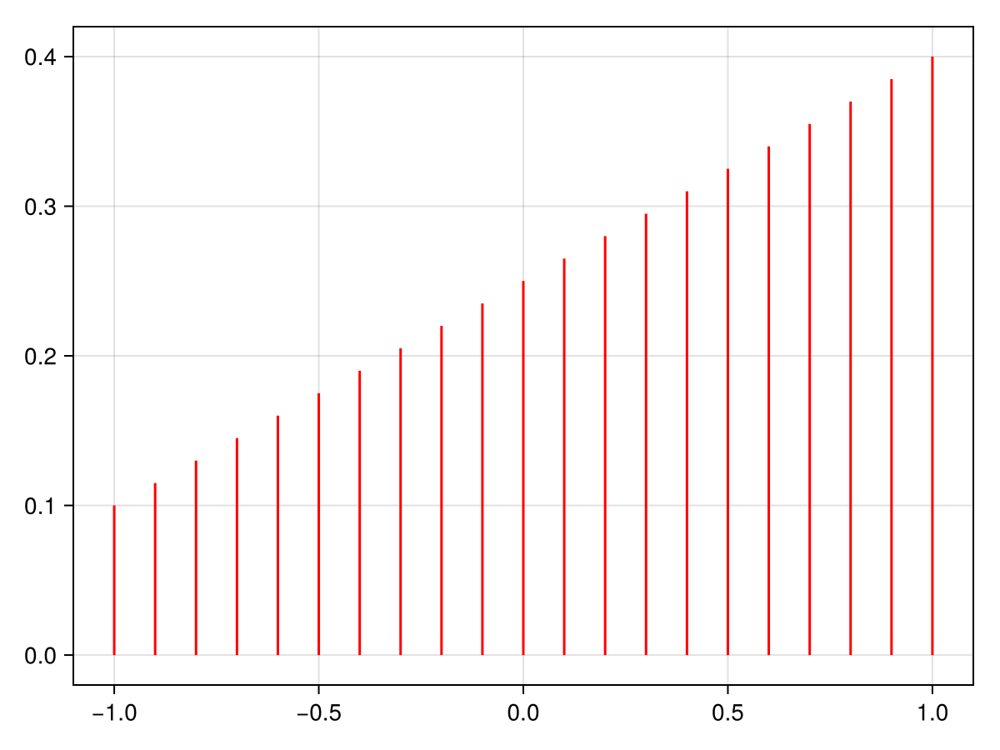
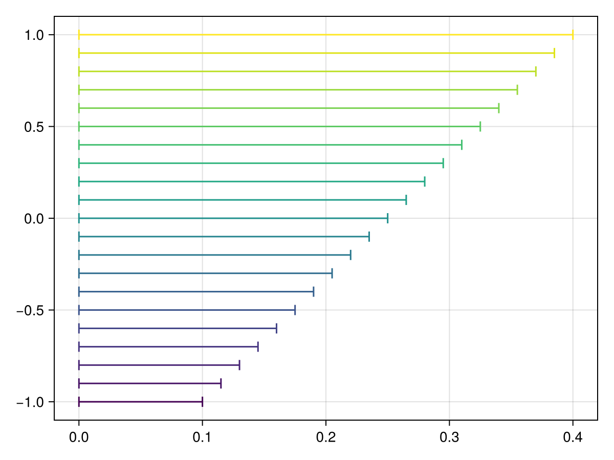

# rangebars {#rangebars}
<details class='jldocstring custom-block' open>
<summary><a id='Makie.rangebars-reference-plots-rangebars' href='#Makie.rangebars-reference-plots-rangebars'><span class="jlbinding">Makie.rangebars</span></a> <Badge type="info" class="jlObjectType jlFunction" text="Function" /></summary>


```julia
rangebars(val, low, high; kwargs...)
rangebars(val, low_high; kwargs...)
rangebars(val_low_high; kwargs...)
```


Plots rangebars at `val` in one dimension, extending from `low` to `high` in the other dimension given the chosen `direction`. The `low_high` argument can be a vector of tuples or intervals.

If you want to plot errors relative to a reference value, use `errorbars`.

**Plot type**

The plot type alias for the `rangebars` function is `Rangebars`.


<Badge type="info" class="source-link" text="source"><a href="https://github.com/MakieOrg/Makie.jl/blob/406a09fe6f430d0a43f0f3cf1a876583e9bafbf5/MakieCore/src/recipes.jl#L520-L595" target="_blank" rel="noreferrer">source</a></Badge>

</details>


## Examples {#Examples}
<a id="example-709f003" />


```julia
using CairoMakie
f = Figure()
Axis(f[1, 1])

vals = -1:0.1:1
lows = zeros(length(vals))
highs = LinRange(0.1, 0.4, length(vals))

rangebars!(vals, lows, highs, color = :red)

f
```



<a id="example-5ff0c55" />


```julia
using CairoMakie
f = Figure()
Axis(f[1, 1])

vals = -1:0.1:1
lows = zeros(length(vals))
highs = LinRange(0.1, 0.4, length(vals))

rangebars!(vals, lows, highs, color = LinRange(0, 1, length(vals)),
    whiskerwidth = 10, direction = :x)

f
```




## Attributes {#Attributes}

### alpha {#alpha}

Defaults to `1.0`

The alpha value of the colormap or color attribute. Multiple alphas like in `plot(alpha=0.2, color=(:red, 0.5)`, will get multiplied.

### clip_planes {#clip_planes}

Defaults to `automatic`

Clip planes offer a way to do clipping in 3D space. You can set a Vector of up to 8 `Plane3f` planes here, behind which plots will be clipped (i.e. become invisible). By default clip planes are inherited from the parent plot or scene. You can remove parent `clip_planes` by passing `Plane3f[]`.

### color {#color}

Defaults to `@inherit linecolor`

The color of the lines. Can be an array to color each bar separately.

### colormap {#colormap}

Defaults to `@inherit colormap :viridis`

Sets the colormap that is sampled for numeric `color`s. `PlotUtils.cgrad(...)`, `Makie.Reverse(any_colormap)` can be used as well, or any symbol from ColorBrewer or PlotUtils. To see all available color gradients, you can call `Makie.available_gradients()`.

### colorrange {#colorrange}

Defaults to `automatic`

The values representing the start and end points of `colormap`.

### colorscale {#colorscale}

Defaults to `identity`

The color transform function. Can be any function, but only works well together with `Colorbar` for `identity`, `log`, `log2`, `log10`, `sqrt`, `logit`, `Makie.pseudolog10` and `Makie.Symlog10`.

### cycle {#cycle}

Defaults to `[:color]`

No docs available.

### depth_shift {#depth_shift}

Defaults to `0.0`

Adjusts the depth value of a plot after all other transformations, i.e. in clip space, where `-1 <= depth <= 1`. This only applies to GLMakie and WGLMakie and can be used to adjust render order (like a tunable overdraw).

### direction {#direction}

Defaults to `:y`

The direction in which the bars are drawn. Can be `:x` or `:y`.

### fxaa {#fxaa}

Defaults to `true`

Adjusts whether the plot is rendered with fxaa (anti-aliasing, GLMakie only).

### highclip {#highclip}

Defaults to `automatic`

The color for any value above the colorrange.

### inspectable {#inspectable}

Defaults to `@inherit inspectable`

Sets whether this plot should be seen by `DataInspector`. The default depends on the theme of the parent scene.

### inspector_clear {#inspector_clear}

Defaults to `automatic`

Sets a callback function `(inspector, plot) -> ...` for cleaning up custom indicators in DataInspector.

### inspector_hover {#inspector_hover}

Defaults to `automatic`

Sets a callback function `(inspector, plot, index) -> ...` which replaces the default `show_data` methods.

### inspector_label {#inspector_label}

Defaults to `automatic`

Sets a callback function `(plot, index, position) -> string` which replaces the default label generated by DataInspector.

### linecap {#linecap}

Defaults to `@inherit linecap`

No docs available.

### linewidth {#linewidth}

Defaults to `@inherit linewidth`

The thickness of the lines in screen units.

### lowclip {#lowclip}

Defaults to `automatic`

The color for any value below the colorrange.

### model {#model}

Defaults to `automatic`

Sets a model matrix for the plot. This overrides adjustments made with `translate!`, `rotate!` and `scale!`.

### nan_color {#nan_color}

Defaults to `:transparent`

The color for NaN values.

### overdraw {#overdraw}

Defaults to `false`

Controls if the plot will draw over other plots. This specifically means ignoring depth checks in GL backends

### space {#space}

Defaults to `:data`

Sets the transformation space for box encompassing the plot. See `Makie.spaces()` for possible inputs.

### ssao {#ssao}

Defaults to `false`

Adjusts whether the plot is rendered with ssao (screen space ambient occlusion). Note that this only makes sense in 3D plots and is only applicable with `fxaa = true`.

### transformation {#transformation}

Defaults to `:automatic`

No docs available.

### transparency {#transparency}

Defaults to `false`

Adjusts how the plot deals with transparency. In GLMakie `transparency = true` results in using Order Independent Transparency.

### visible {#visible}

Defaults to `true`

Controls whether the plot will be rendered or not.

### whiskerwidth {#whiskerwidth}

Defaults to `0`

The width of the whiskers or line caps in screen units.
