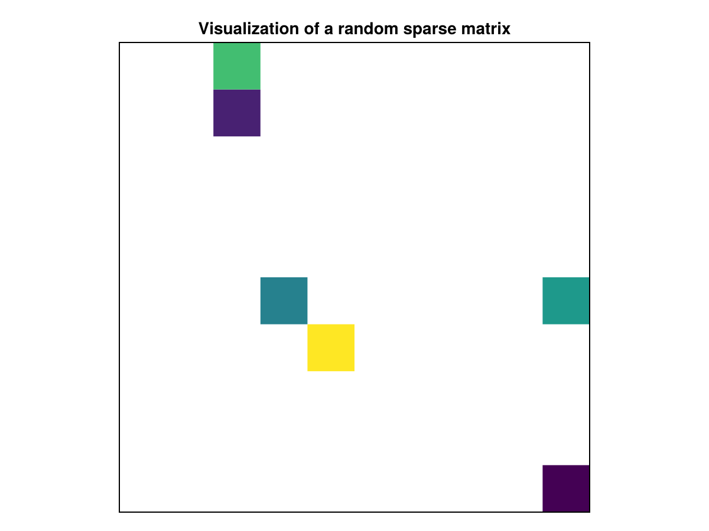

# spy {#spy}
<details class='jldocstring custom-block' open>
<summary><a id='Makie.spy-reference-plots-spy' href='#Makie.spy-reference-plots-spy'><span class="jlbinding">Makie.spy</span></a> <Badge type="info" class="jlObjectType jlFunction" text="Function" /></summary>


```julia
spy(z::AbstractSparseArray)
spy(x_range::NTuple{2, Number}, y_range::NTuple{2, Number}, z::AbstractSparseArray)
spy(x_range::ClosedInterval, y_range::ClosedInterval, z::AbstractSparseArray)
```


Visualizes big sparse matrices. Usage:

```julia
using SparseArrays, GLMakie
N = 200_000
x = sprand(Float64, N, N, (3(10^6)) / (N*N));
spy(x)
# or if you want to specify the range of x and y:
spy(0..1, 0..1, x)
```


**Plot type**

The plot type alias for the `spy` function is `Spy`.


<Badge type="info" class="source-link" text="source"><a href="https://github.com/MakieOrg/Makie.jl/blob/406a09fe6f430d0a43f0f3cf1a876583e9bafbf5/MakieCore/src/recipes.jl#L520-L622" target="_blank" rel="noreferrer">source</a></Badge>

</details>


## Examples {#Examples}
<a id="example-519e8a8" />


```julia
using CairoMakie
using SparseArrays

N = 10 # dimension of the sparse matrix
p = 0.1 # independent probability that an entry is zero

A = sprand(N, N, p)
f, ax, plt = spy(A, framecolor = :lightgrey, axis=(;
    aspect=1,
    title = "Visualization of a random sparse matrix")
)

hidedecorations!(ax) # remove axis labeling

f
```




## Attributes {#Attributes}

### alpha {#alpha}

Defaults to `1.0`

The alpha value of the colormap or color attribute. Multiple alphas like in `plot(alpha=0.2, color=(:red, 0.5)`, will get multiplied.

### clip_planes {#clip_planes}

Defaults to `automatic`

Clip planes offer a way to do clipping in 3D space. You can set a Vector of up to 8 `Plane3f` planes here, behind which plots will be clipped (i.e. become invisible). By default clip planes are inherited from the parent plot or scene. You can remove parent `clip_planes` by passing `Plane3f[]`.

### color {#color}

Defaults to `nothing`

Per default the color of the markers will be determined by the value in the matrix, but can be overwritten via `color`.

### colormap {#colormap}

Defaults to `@inherit colormap :viridis`

Sets the colormap that is sampled for numeric `color`s. `PlotUtils.cgrad(...)`, `Makie.Reverse(any_colormap)` can be used as well, or any symbol from ColorBrewer or PlotUtils. To see all available color gradients, you can call `Makie.available_gradients()`.

### colorrange {#colorrange}

Defaults to `automatic`

The values representing the start and end points of `colormap`.

### colorscale {#colorscale}

Defaults to `identity`

The color transform function. Can be any function, but only works well together with `Colorbar` for `identity`, `log`, `log2`, `log10`, `sqrt`, `logit`, `Makie.pseudolog10` and `Makie.Symlog10`.

### depth_shift {#depth_shift}

Defaults to `0.0`

Adjusts the depth value of a plot after all other transformations, i.e. in clip space, where `-1 <= depth <= 1`. This only applies to GLMakie and WGLMakie and can be used to adjust render order (like a tunable overdraw).

### framecolor {#framecolor}

Defaults to `:black`

By default a frame will be drawn around the data, which uses the `framecolor` attribute for its color.

### framesize {#framesize}

Defaults to `1`

The linewidth of the frame

### framevisible {#framevisible}

Defaults to `true`

Whether or not to draw the frame.

### fxaa {#fxaa}

Defaults to `true`

Adjusts whether the plot is rendered with fxaa (anti-aliasing, GLMakie only).

### highclip {#highclip}

Defaults to `automatic`

The color for any value above the colorrange.

### inspectable {#inspectable}

Defaults to `@inherit inspectable`

Sets whether this plot should be seen by `DataInspector`. The default depends on the theme of the parent scene.

### inspector_clear {#inspector_clear}

Defaults to `automatic`

Sets a callback function `(inspector, plot) -> ...` for cleaning up custom indicators in DataInspector.

### inspector_hover {#inspector_hover}

Defaults to `automatic`

Sets a callback function `(inspector, plot, index) -> ...` which replaces the default `show_data` methods.

### inspector_label {#inspector_label}

Defaults to `automatic`

Sets a callback function `(plot, index, position) -> string` which replaces the default label generated by DataInspector.

### lowclip {#lowclip}

Defaults to `automatic`

The color for any value below the colorrange.

### marker {#marker}

Defaults to `Rect`

Can be any of the markers supported by `scatter!`. Note, for huge sparse arrays, one should use `FastPixel`, which is a very fast, but can only render square markers. So, without `Axis(...; aspect=1)`, the markers won&#39;t have the correct size. Compare:

```julia
data = sprand(10, 10, 0.5)
f = Figure()
spy(f[1, 1], data; marker=FastPixel())
spy(f[1, 2], data; marker=FastPixel(), axis=(; aspect=1))
f
```


### marker_gap {#marker_gap}

Defaults to `0`

Makes the marker size smaller to create a gap between the markers. The unit of this is in data space.

### markersize {#markersize}

Defaults to `automatic`

markersize=automatic, will make the marker size fit the data - but can also be set manually.

### model {#model}

Defaults to `automatic`

Sets a model matrix for the plot. This overrides adjustments made with `translate!`, `rotate!` and `scale!`.

### nan_color {#nan_color}

Defaults to `:transparent`

The color for NaN values.

### overdraw {#overdraw}

Defaults to `false`

Controls if the plot will draw over other plots. This specifically means ignoring depth checks in GL backends

### space {#space}

Defaults to `:data`

Sets the transformation space for box encompassing the plot. See `Makie.spaces()` for possible inputs.

### ssao {#ssao}

Defaults to `false`

Adjusts whether the plot is rendered with ssao (screen space ambient occlusion). Note that this only makes sense in 3D plots and is only applicable with `fxaa = true`.

### transformation {#transformation}

Defaults to `:automatic`

No docs available.

### transparency {#transparency}

Defaults to `false`

Adjusts how the plot deals with transparency. In GLMakie `transparency = true` results in using Order Independent Transparency.

### visible {#visible}

Defaults to `true`

Controls whether the plot will be rendered or not.
