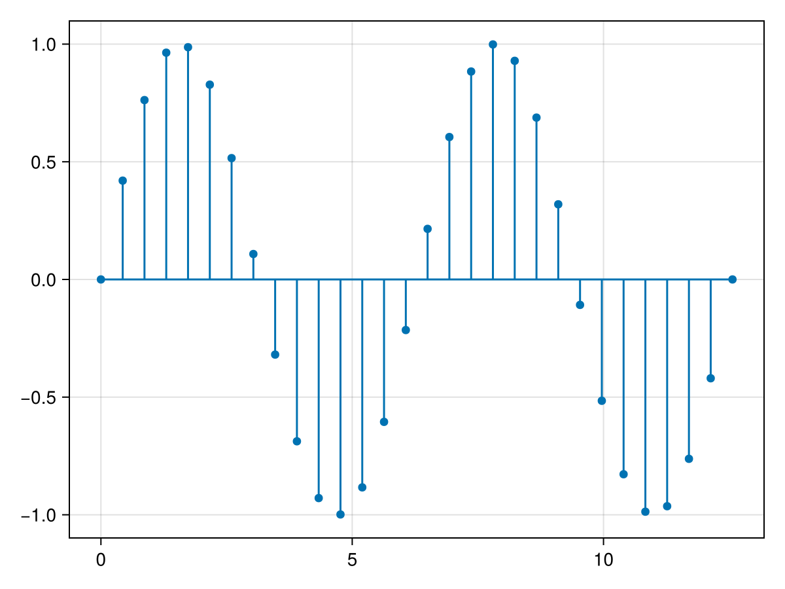
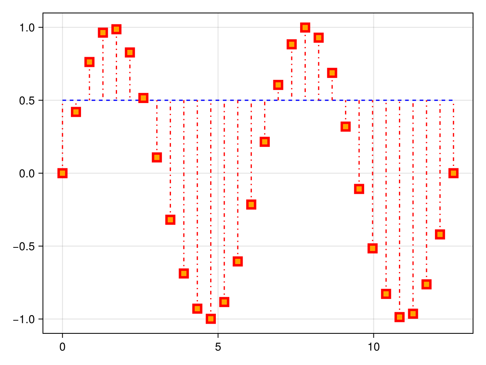
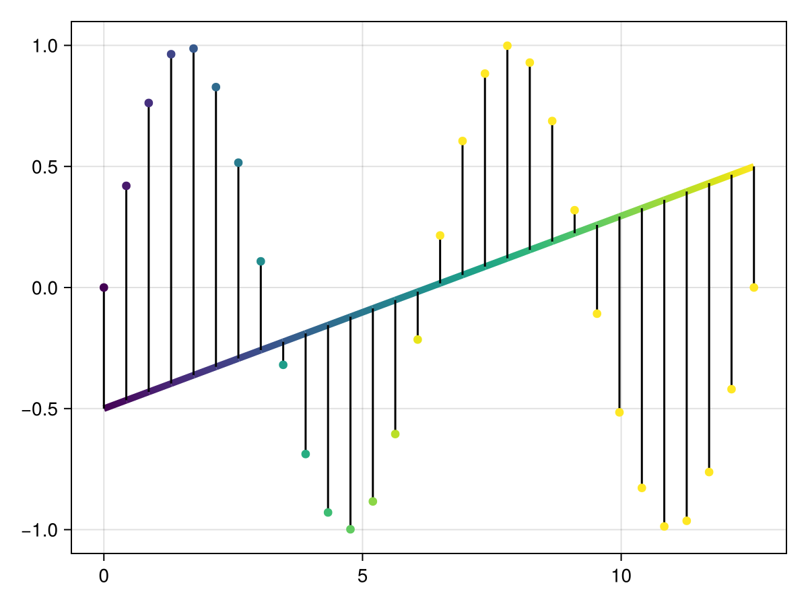
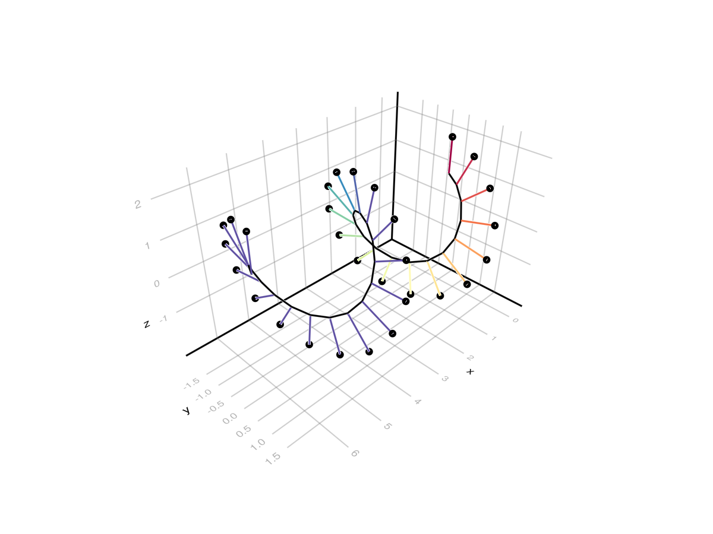

# stem {#stem}
<details class='jldocstring custom-block' open>
<summary><a id='Makie.stem-reference-plots-stem' href='#Makie.stem-reference-plots-stem'><span class="jlbinding">Makie.stem</span></a> <Badge type="info" class="jlObjectType jlFunction" text="Function" /></summary>


```julia
stem(xs, ys, [zs]; kwargs...)
```


Plots markers at the given positions extending from `offset` along stem lines.

The conversion trait of `stem` is `PointBased`.

**Plot type**

The plot type alias for the `stem` function is `Stem`.


<Badge type="info" class="source-link" text="source"><a href="https://github.com/MakieOrg/Makie.jl/blob/d2876406fadce67d5357789b0b71495e7971e5c1/MakieCore/src/recipes.jl#L520-L606" target="_blank" rel="noreferrer">source</a></Badge>

</details>


## Examples {#Examples}
<a id="example-2947aa3" />


```julia
using CairoMakie
f = Figure()
Axis(f[1, 1])

xs = LinRange(0, 4pi, 30)

stem!(xs, sin.(xs))

f
```



<a id="example-5138c26" />


```julia
using CairoMakie
f = Figure()
Axis(f[1, 1])

xs = LinRange(0, 4pi, 30)

stem!(xs, sin,
    offset = 0.5, trunkcolor = :blue, marker = :rect,
    stemcolor = :red, color = :orange,
    markersize = 15, strokecolor = :red, strokewidth = 3,
    trunklinestyle = :dash, stemlinestyle = :dashdot)

f
```



<a id="example-7da5f77" />


```julia
using CairoMakie
f = Figure()
Axis(f[1, 1])

xs = LinRange(0, 4pi, 30)

stem!(xs, sin.(xs),
    offset = LinRange(-0.5, 0.5, 30),
    color = LinRange(0, 1, 30), colorrange = (0, 0.5),
    trunkcolor = LinRange(0, 1, 30), trunkwidth = 5)

f
```



<a id="example-e07830a" />


```julia
using GLMakie
f = Figure()

xs = LinRange(0, 4pi, 30)

stem(f[1, 1], 0.5xs, 2 .* sin.(xs), 2 .* cos.(xs),
    offset = Point3f.(0.5xs, sin.(xs), cos.(xs)),
    stemcolor = LinRange(0, 1, 30), stemcolormap = :Spectral, stemcolorrange = (0, 0.5))

f
```




## Attributes {#Attributes}

### clip_planes {#clip_planes}

Defaults to `automatic`

Clip planes offer a way to do clipping in 3D space. You can set a Vector of up to 8 `Plane3f` planes here, behind which plots will be clipped (i.e. become invisible). By default clip planes are inherited from the parent plot or scene. You can remove parent `clip_planes` by passing `Plane3f[]`.

### color {#color}

Defaults to `@inherit markercolor`

No docs available.

### colormap {#colormap}

Defaults to `@inherit colormap`

No docs available.

### colorrange {#colorrange}

Defaults to `automatic`

No docs available.

### colorscale {#colorscale}

Defaults to `identity`

No docs available.

### cycle {#cycle}

Defaults to `[[:stemcolor, :color, :trunkcolor] => :color]`

No docs available.

### depth_shift {#depth_shift}

Defaults to `0.0`

Adjusts the depth value of a plot after all other transformations, i.e. in clip space, where `-1 <= depth <= 1`. This only applies to GLMakie and WGLMakie and can be used to adjust render order (like a tunable overdraw).

### fxaa {#fxaa}

Defaults to `true`

Adjusts whether the plot is rendered with fxaa (anti-aliasing, GLMakie only).

### inspectable {#inspectable}

Defaults to `@inherit inspectable`

Sets whether this plot should be seen by `DataInspector`. The default depends on the theme of the parent scene.

### inspector_clear {#inspector_clear}

Defaults to `automatic`

Sets a callback function `(inspector, plot) -> ...` for cleaning up custom indicators in DataInspector.

### inspector_hover {#inspector_hover}

Defaults to `automatic`

Sets a callback function `(inspector, plot, index) -> ...` which replaces the default `show_data` methods.

### inspector_label {#inspector_label}

Defaults to `automatic`

Sets a callback function `(plot, index, position) -> string` which replaces the default label generated by DataInspector.

### marker {#marker}

Defaults to `:circle`

No docs available.

### markersize {#markersize}

Defaults to `@inherit markersize`

No docs available.

### model {#model}

Defaults to `automatic`

Sets a model matrix for the plot. This overrides adjustments made with `translate!`, `rotate!` and `scale!`.

### offset {#offset}

Defaults to `0`

Can be a number, in which case it sets `y` for 2D, and `z` for 3D stems. It can be a `Point2` for 2D plots, as well as a `Point3` for 3D plots. It can also be an iterable of any of these at the same length as `xs`, `ys`, `zs`.

### overdraw {#overdraw}

Defaults to `false`

Controls if the plot will draw over other plots. This specifically means ignoring depth checks in GL backends

### space {#space}

Defaults to `:data`

Sets the transformation space for box encompassing the plot. See `Makie.spaces()` for possible inputs.

### ssao {#ssao}

Defaults to `false`

Adjusts whether the plot is rendered with ssao (screen space ambient occlusion). Note that this only makes sense in 3D plots and is only applicable with `fxaa = true`.

### stemcolor {#stemcolor}

Defaults to `@inherit linecolor`

No docs available.

### stemcolormap {#stemcolormap}

Defaults to `@inherit colormap`

No docs available.

### stemcolorrange {#stemcolorrange}

Defaults to `automatic`

No docs available.

### stemlinestyle {#stemlinestyle}

Defaults to `nothing`

No docs available.

### stemwidth {#stemwidth}

Defaults to `@inherit linewidth`

No docs available.

### strokecolor {#strokecolor}

Defaults to `@inherit markerstrokecolor`

No docs available.

### strokewidth {#strokewidth}

Defaults to `@inherit markerstrokewidth`

No docs available.

### transformation {#transformation}

Defaults to `:automatic`

No docs available.

### transparency {#transparency}

Defaults to `false`

Adjusts how the plot deals with transparency. In GLMakie `transparency = true` results in using Order Independent Transparency.

### trunkcolor {#trunkcolor}

Defaults to `@inherit linecolor`

No docs available.

### trunkcolormap {#trunkcolormap}

Defaults to `@inherit colormap`

No docs available.

### trunkcolorrange {#trunkcolorrange}

Defaults to `automatic`

No docs available.

### trunklinestyle {#trunklinestyle}

Defaults to `nothing`

No docs available.

### trunkwidth {#trunkwidth}

Defaults to `@inherit linewidth`

No docs available.

### visible {#visible}

Defaults to `true`

Controls whether the plot will be rendered or not.
