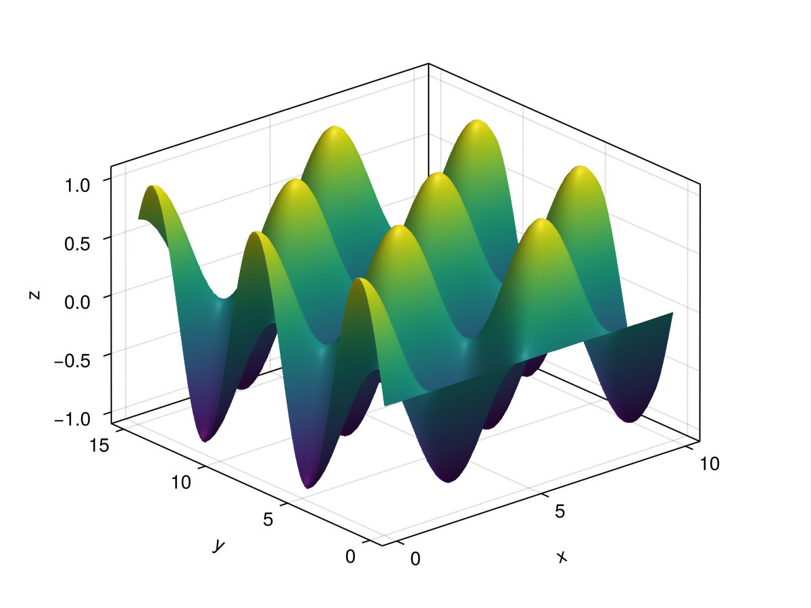
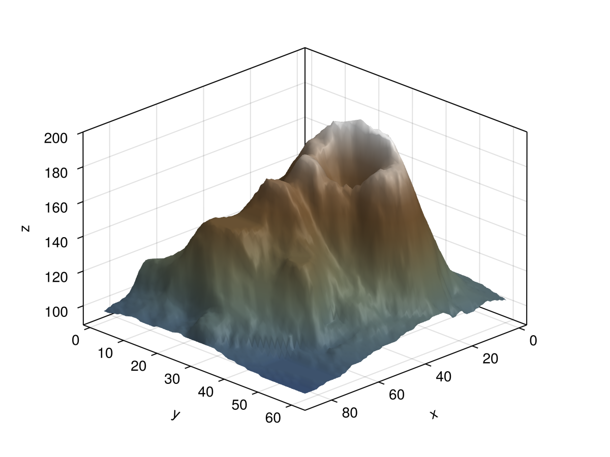
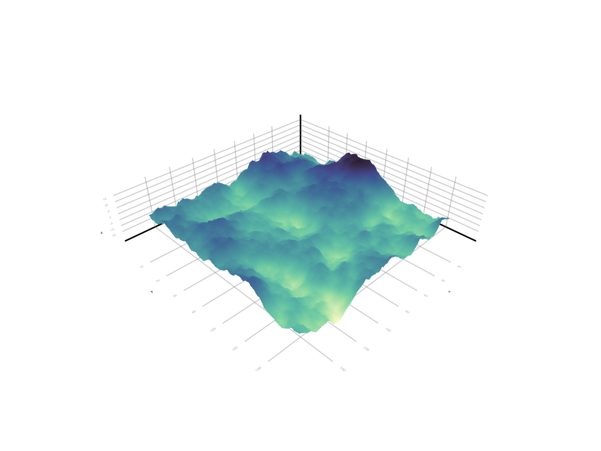
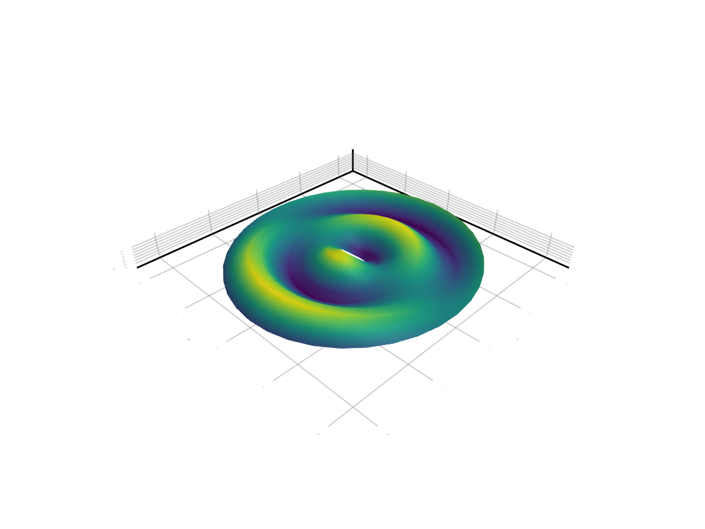
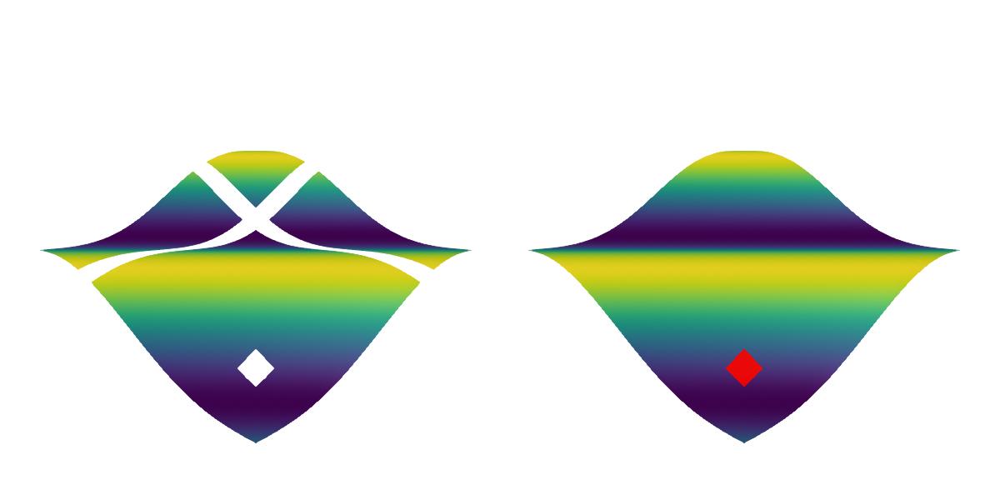
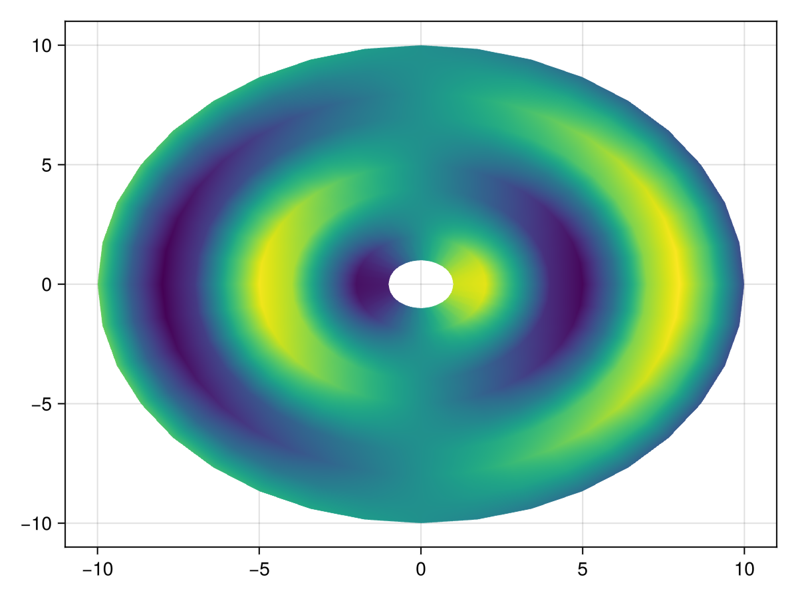

# surface {#surface}
<details class='jldocstring custom-block' open>
<summary><a id='MakieCore.surface-reference-plots-surface' href='#MakieCore.surface-reference-plots-surface'><span class="jlbinding">MakieCore.surface</span></a> <Badge type="info" class="jlObjectType jlFunction" text="Function" /></summary>


```julia
surface(x, y, z)
surface(z)
```


Plots a surface, where `(x, y)` define a grid whose heights are the entries in `z`. `x` and `y` may be `Vectors` which define a regular grid, **or** `Matrices` which define an irregular grid.

**Plot type**

The plot type alias for the `surface` function is `Surface`.


<Badge type="info" class="source-link" text="source"><a href="https://github.com/MakieOrg/Makie.jl/blob/d2876406fadce67d5357789b0b71495e7971e5c1/MakieCore/src/recipes.jl#L520-L605" target="_blank" rel="noreferrer">source</a></Badge>

</details>


## Examples {#Examples}

### Gridded surfaces {#Gridded-surfaces}

By default surface data is placed on a grid matching the size of the input data. The grid can be specified explicitly by passing a Range or Vector of values as the X and Y arguments. The positions/vertices of the surface are then effectively derived as `Point.(X, Y', Z)`. Intervals (e.g `0..1`) can be used to specify the start and endpoint only, implying a linear range in between.
<a id="example-c2017ae" />


```julia
using GLMakie
xs = LinRange(0, 10, 100)
ys = LinRange(0, 15, 100)
zs = [cos(x) * sin(y) for x in xs, y in ys]

surface(xs, ys, zs, axis=(type=Axis3,))
```



<a id="example-9cdde29" />


```julia
using GLMakie
using DelimitedFiles

volcano = readdlm(Makie.assetpath("volcano.csv"), ',', Float64)

surface(volcano,
    colormap = :darkterrain,
    colorrange = (80, 190),
    axis=(type=Axis3, azimuth = pi/4))
```



<a id="example-c99f09b" />


```julia
using GLMakie
using SparseArrays
using LinearAlgebra

# This example was provided by Moritz Schauer (@mschauer).

#=
Define the precision matrix (inverse covariance matrix)
for the Gaussian noise matrix.  It approximately coincides
with the Laplacian of the 2d grid or the graph representing
the neighborhood relation of pixels in the picture,
https://en.wikipedia.org/wiki/Laplacian_matrix
=#
function gridlaplacian(m, n)
    S = sparse(0.0I, n*m, n*m)
    linear = LinearIndices((1:m, 1:n))
    for i in 1:m
        for j in 1:n
            for (i2, j2) in ((i + 1, j), (i, j + 1))
                if i2 <= m && j2 <= n
                    S[linear[i, j], linear[i2, j2]] -= 1
                    S[linear[i2, j2], linear[i, j]] -= 1
                    S[linear[i, j], linear[i, j]] += 1
                    S[linear[i2, j2], linear[i2, j2]] += 1
                end
            end
        end
    end
    return S
end

# d is used to denote the size of the data
d = 150

 # Sample centered Gaussian noise with the right correlation by the method
 # based on the Cholesky decomposition of the precision matrix
data = 0.1randn(d,d) + reshape(
        cholesky(gridlaplacian(d,d) + 0.003I) \ randn(d*d),
        d, d
)

surface(data; shading = NoShading, colormap = :deep)
surface(data; shading = NoShading, colormap = :deep)
```




### Quad Mesh surface {#Quad-Mesh-surface}

X and Y values can also be given as a Matrix. In this case the surface positions follow as `Point.(X, Y, Z)` so the surface is no longer restricted to an XY grid.
<a id="example-6112afc" />


```julia
using GLMakie
rs = 1:10
thetas = 0:10:360

xs = rs .* cosd.(thetas')
ys = rs .* sind.(thetas')
zs = sin.(rs) .* cosd.(thetas')

surface(xs, ys, zs)
```




### NaN Handling {#NaN-Handling}

If a vertex of the surface is NaN, meaning that either X, Y or Z contribute NaN to it, all connected faces can not be drawn. Thus the surface will have a hole around a NaN vertex. If just a color is NaN it will be drawn with `nan_color`.
<a id="example-d745051" />


```julia
using GLMakie
xs = ys = vcat(1:9, NaN, 11:30)
zs = [2 * sin(x+y) for x in range(-3, 3, length=30), y in range(-3, 3, length=30)]
zs_nan = copy(zs)
zs_nan[25, 25] = NaN

f = Figure(size = (600, 300))
surface(f[1, 1], xs, ys, zs_nan, axis = (show_axis = false,))
surface(f[1, 2], 1:30, 1:30, zs, color = zs_nan, nan_color = :red, axis = (show_axis = false,))
f
```




### 2D Surface {#2D-Surface}

A surface plot can act as an off-grid version of heatmap or image in 2D. For this it is recommended to pass data through `color` instead of the Z argument to avoid the plot interfering with others based on its Z values.
<a id="example-e0b564c" />


```julia
using GLMakie
rs = 1:10
thetas = 0:10:360

xs = rs .* cosd.(thetas')
ys = rs .* sind.(thetas')
zs = sin.(rs) .* cosd.(thetas')

surface(xs, ys, zeros(size(zs)), color = zs, shading = NoShading)
```




## Attributes {#Attributes}

### alpha {#alpha}

Defaults to `1.0`

The alpha value of the colormap or color attribute. Multiple alphas like in `plot(alpha=0.2, color=(:red, 0.5)`, will get multiplied.

### backlight {#backlight}

Defaults to `0.0`

Sets a weight for secondary light calculation with inverted normals.

### clip_planes {#clip_planes}

Defaults to `automatic`

Clip planes offer a way to do clipping in 3D space. You can set a Vector of up to 8 `Plane3f` planes here, behind which plots will be clipped (i.e. become invisible). By default clip planes are inherited from the parent plot or scene. You can remove parent `clip_planes` by passing `Plane3f[]`.

### color {#color}

Defaults to `nothing`

Can be set to an `Matrix{<: Union{Number, Colorant}}` to color surface independent of the `z` component. If `color=nothing`, it defaults to `color=z`. Can also be a `Makie.AbstractPattern`.

### colormap {#colormap}

Defaults to `@inherit colormap :viridis`

Sets the colormap that is sampled for numeric `color`s. `PlotUtils.cgrad(...)`, `Makie.Reverse(any_colormap)` can be used as well, or any symbol from ColorBrewer or PlotUtils. To see all available color gradients, you can call `Makie.available_gradients()`.

### colorrange {#colorrange}

Defaults to `automatic`

The values representing the start and end points of `colormap`.

### colorscale {#colorscale}

Defaults to `identity`

The color transform function. Can be any function, but only works well together with `Colorbar` for `identity`, `log`, `log2`, `log10`, `sqrt`, `logit`, `Makie.pseudolog10` and `Makie.Symlog10`.

### depth_shift {#depth_shift}

Defaults to `0.0`

Adjusts the depth value of a plot after all other transformations, i.e. in clip space, where `-1 <= depth <= 1`. This only applies to GLMakie and WGLMakie and can be used to adjust render order (like a tunable overdraw).

### diffuse {#diffuse}

Defaults to `1.0`

Sets how strongly the red, green and blue channel react to diffuse (scattered) light.

### fxaa {#fxaa}

Defaults to `true`

Adjusts whether the plot is rendered with fxaa (anti-aliasing, GLMakie only).

### highclip {#highclip}

Defaults to `automatic`

The color for any value above the colorrange.

### inspectable {#inspectable}

Defaults to `@inherit inspectable`

Sets whether this plot should be seen by `DataInspector`. The default depends on the theme of the parent scene.

### inspector_clear {#inspector_clear}

Defaults to `automatic`

Sets a callback function `(inspector, plot) -> ...` for cleaning up custom indicators in DataInspector.

### inspector_hover {#inspector_hover}

Defaults to `automatic`

Sets a callback function `(inspector, plot, index) -> ...` which replaces the default `show_data` methods.

### inspector_label {#inspector_label}

Defaults to `automatic`

Sets a callback function `(plot, index, position) -> string` which replaces the default label generated by DataInspector.

### interpolate {#interpolate}

Defaults to `true`

[(W)GLMakie only] Specifies whether the surface matrix gets sampled with interpolation.

### invert_normals {#invert_normals}

Defaults to `false`

Inverts the normals generated for the surface. This can be useful to illuminate the other side of the surface.

### lowclip {#lowclip}

Defaults to `automatic`

The color for any value below the colorrange.

### material {#material}

Defaults to `nothing`

RPRMakie only attribute to set complex RadeonProRender materials.         _Warning_, how to set an RPR material may change and other backends will ignore this attribute

### model {#model}

Defaults to `automatic`

Sets a model matrix for the plot. This overrides adjustments made with `translate!`, `rotate!` and `scale!`.

### nan_color {#nan_color}

Defaults to `:transparent`

The color for NaN values.

### overdraw {#overdraw}

Defaults to `false`

Controls if the plot will draw over other plots. This specifically means ignoring depth checks in GL backends

### shading {#shading}

Defaults to `automatic`

Sets the lighting algorithm used. Options are `NoShading` (no lighting), `FastShading` (AmbientLight + PointLight) or `MultiLightShading` (Multiple lights, GLMakie only). Note that this does not affect RPRMakie.

### shininess {#shininess}

Defaults to `32.0`

Sets how sharp the reflection is.

### space {#space}

Defaults to `:data`

Sets the transformation space for box encompassing the plot. See `Makie.spaces()` for possible inputs.

### specular {#specular}

Defaults to `0.2`

Sets how strongly the object reflects light in the red, green and blue channels.

### ssao {#ssao}

Defaults to `false`

Adjusts whether the plot is rendered with ssao (screen space ambient occlusion). Note that this only makes sense in 3D plots and is only applicable with `fxaa = true`.

### transformation {#transformation}

Defaults to `:automatic`

No docs available.

### transparency {#transparency}

Defaults to `false`

Adjusts how the plot deals with transparency. In GLMakie `transparency = true` results in using Order Independent Transparency.

### uv_transform {#uv_transform}

Defaults to `automatic`

Sets a transform for uv coordinates, which controls how a texture is mapped to a surface. The attribute can be `I`, `scale::VecTypes{2}`, `(translation::VecTypes{2}, scale::VecTypes{2})`, any of :rotr90, :rotl90, :rot180, :swap_xy/:transpose, :flip_x, :flip_y, :flip_xy, or most generally a `Makie.Mat{2, 3, Float32}` or `Makie.Mat3f` as returned by `Makie.uv_transform()`. They can also be changed by passing a tuple `(op3, op2, op1)`.

### visible {#visible}

Defaults to `true`

Controls whether the plot will be rendered or not.
