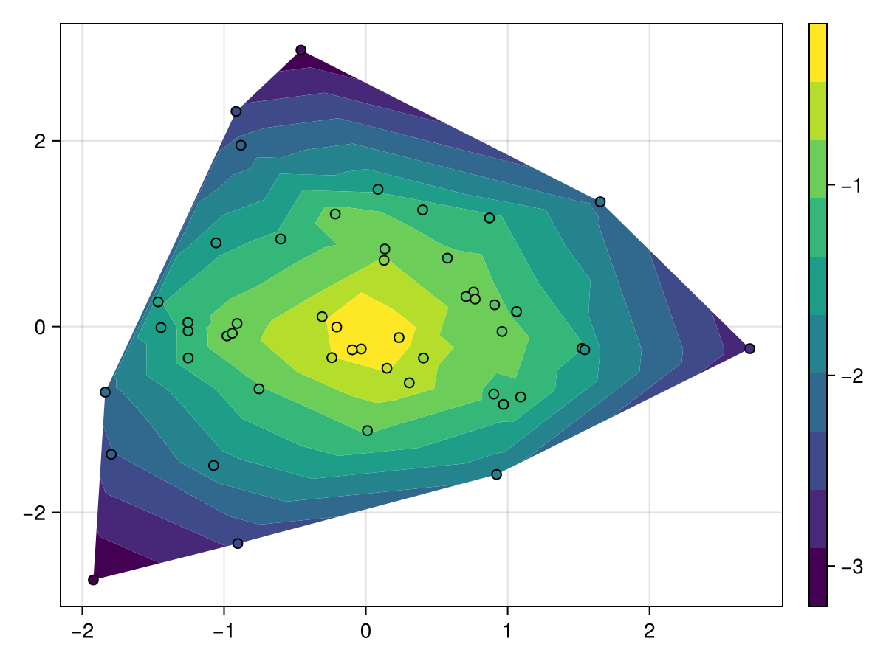
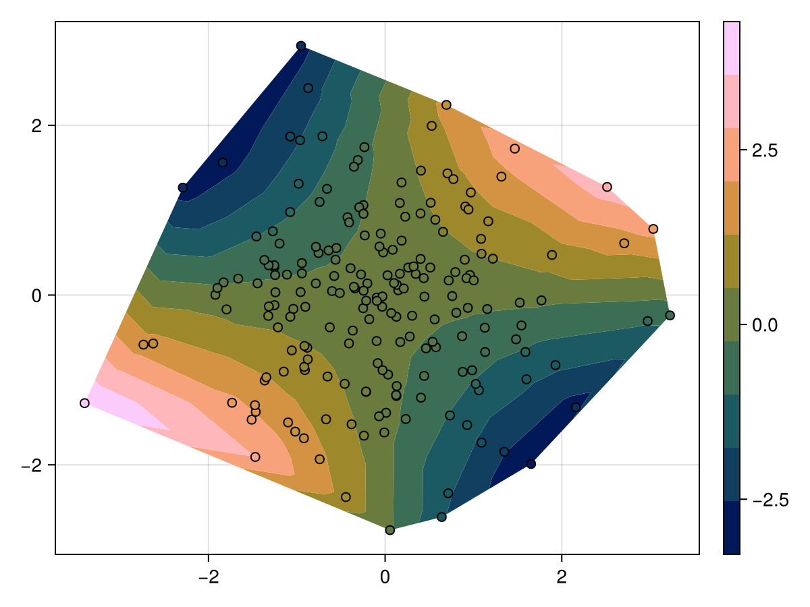
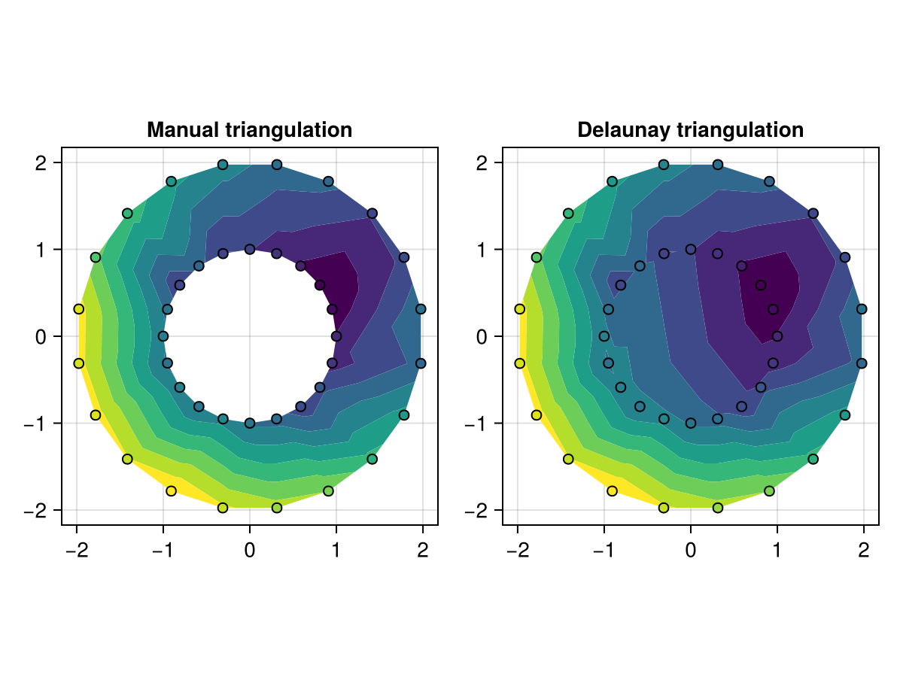
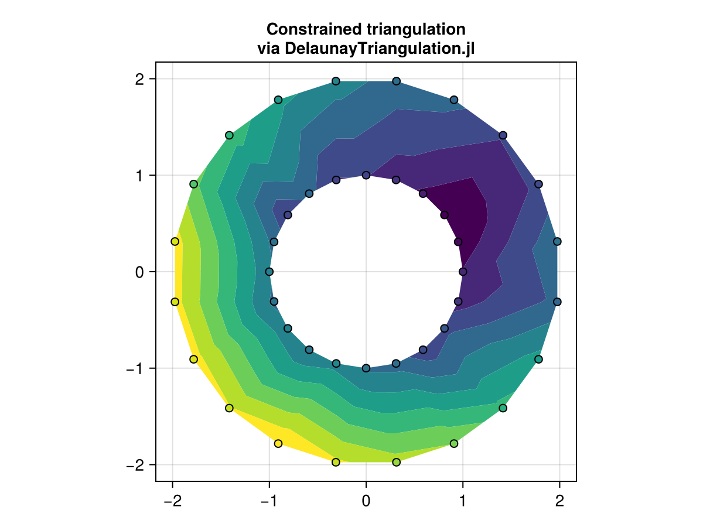
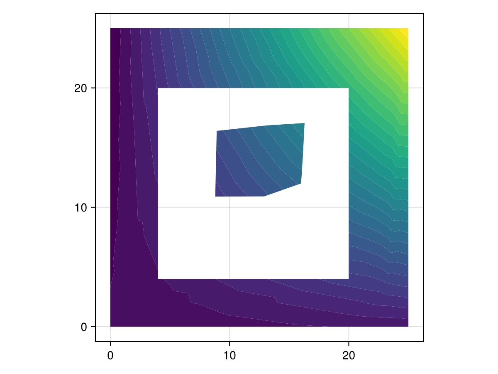
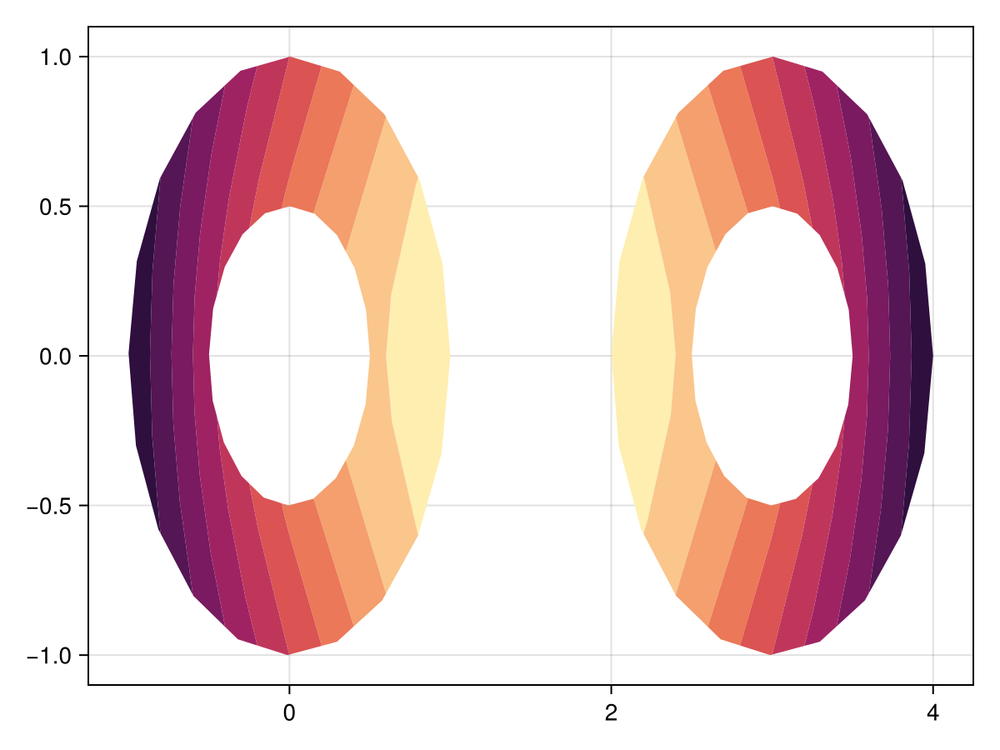
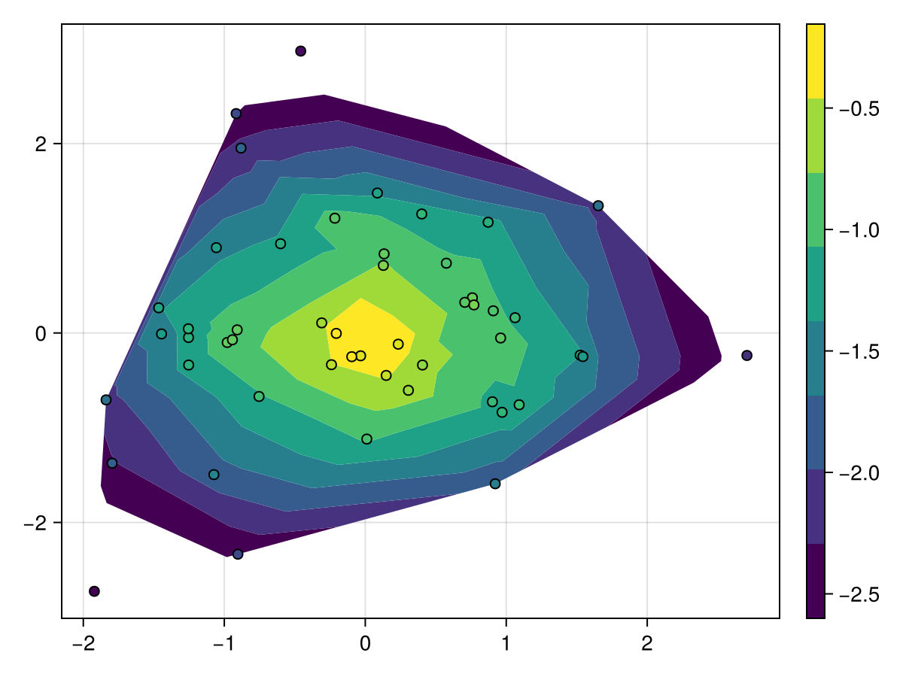

# tricontourf {#tricontourf}
<details class='jldocstring custom-block' open>
<summary><a id='Makie.tricontourf-reference-plots-tricontourf' href='#Makie.tricontourf-reference-plots-tricontourf'><span class="jlbinding">Makie.tricontourf</span></a> <Badge type="info" class="jlObjectType jlFunction" text="Function" /></summary>


```julia
tricontourf(triangles::Triangulation, zs; kwargs...)
tricontourf(xs, ys, zs; kwargs...)
```


Plots a filled tricontour of the height information in `zs` at the horizontal positions `xs` and vertical positions `ys`. A `Triangulation` from DelaunayTriangulation.jl can also be provided instead of `xs` and `ys` for specifying the triangles, otherwise an unconstrained triangulation of `xs` and `ys` is computed.

**Plot type**

The plot type alias for the `tricontourf` function is `Tricontourf`.


<Badge type="info" class="source-link" text="source"><a href="https://github.com/MakieOrg/Makie.jl/blob/406a09fe6f430d0a43f0f3cf1a876583e9bafbf5/MakieCore/src/recipes.jl#L520-L603" target="_blank" rel="noreferrer">source</a></Badge>

</details>


## Examples {#Examples}
<a id="example-f959c0d" />


```julia
using CairoMakie
using Random
Random.seed!(1234)

x = randn(50)
y = randn(50)
z = -sqrt.(x .^ 2 .+ y .^ 2) .+ 0.1 .* randn.()

f, ax, tr = tricontourf(x, y, z)
scatter!(x, y, color = z, strokewidth = 1, strokecolor = :black)
Colorbar(f[1, 2], tr)
f
```



<a id="example-7e858e6" />


```julia
using CairoMakie
using Random
Random.seed!(1234)

x = randn(200)
y = randn(200)
z = x .* y

f, ax, tr = tricontourf(x, y, z, colormap = :batlow)
scatter!(x, y, color = z, colormap = :batlow, strokewidth = 1, strokecolor = :black)
Colorbar(f[1, 2], tr)
f
```




#### Triangulation modes {#Triangulation-modes}

Manual triangulations can be passed as a 3xN matrix of integers, where each column of three integers specifies the indices of the corners of one triangle in the vector of points.
<a id="example-e5513d6" />


```julia
using CairoMakie
using Random
Random.seed!(123)

n = 20
angles = range(0, 2pi, length = n+1)[1:end-1]
x = [cos.(angles); 2 .* cos.(angles .+ pi/n)]
y = [sin.(angles); 2 .* sin.(angles .+ pi/n)]
z = (x .- 0.5).^2 + (y .- 0.5).^2 .+ 0.5.*randn.()

triangulation_inner = reduce(hcat, map(i -> [0, 1, n] .+ i, 1:n))
triangulation_outer = reduce(hcat, map(i -> [n-1, n, 0] .+ i, 1:n))
triangulation = hcat(triangulation_inner, triangulation_outer)

f, ax, _ = tricontourf(x, y, z, triangulation = triangulation,
    axis = (; aspect = 1, title = "Manual triangulation"))
scatter!(x, y, color = z, strokewidth = 1, strokecolor = :black)

tricontourf(f[1, 2], x, y, z, triangulation = Makie.DelaunayTriangulation(),
    axis = (; aspect = 1, title = "Delaunay triangulation"))
scatter!(x, y, color = z, strokewidth = 1, strokecolor = :black)

f
```




By default, `tricontourf` performs unconstrained triangulations. Greater control over the triangulation, such as allowing for enforced boundaries, can be achieved by using [DelaunayTriangulation.jl](https://github.com/DanielVandH/DelaunayTriangulation.jl) and passing the resulting triangulation as the first argument of `tricontourf`. For example, the above annulus can also be plotted as follows:
<a id="example-9e306c7" />


```julia
using CairoMakie
using DelaunayTriangulation
using Random

Random.seed!(123)

n = 20
angles = range(0, 2pi, length = n+1)[1:end-1]
x = [cos.(angles); 2 .* cos.(angles .+ pi/n)]
y = [sin.(angles); 2 .* sin.(angles .+ pi/n)]
z = (x .- 0.5).^2 + (y .- 0.5).^2 .+ 0.5.*randn.()

inner = [n:-1:1; n] # clockwise inner
outer = [(n+1):(2n); n+1] # counter-clockwise outer
boundary_nodes = [[outer], [inner]]
points = [x'; y']
tri = triangulate(points; boundary_nodes = boundary_nodes)
f, ax, _ = tricontourf(tri, z;
    axis = (; aspect = 1, title = "Constrained triangulation\nvia DelaunayTriangulation.jl"))
scatter!(x, y, color = z, strokewidth = 1, strokecolor = :black)
f
```




Boundary nodes make it possible to support more complicated regions, possibly with holes, than is possible by only providing points themselves.
<a id="example-3daebe9" />


```julia
using CairoMakie
using DelaunayTriangulation

## Start by defining the boundaries, and then convert to the appropriate interface
curve_1 = [
    [(0.0, 0.0), (5.0, 0.0), (10.0, 0.0), (15.0, 0.0), (20.0, 0.0), (25.0, 0.0)],
    [(25.0, 0.0), (25.0, 5.0), (25.0, 10.0), (25.0, 15.0), (25.0, 20.0), (25.0, 25.0)],
    [(25.0, 25.0), (20.0, 25.0), (15.0, 25.0), (10.0, 25.0), (5.0, 25.0), (0.0, 25.0)],
    [(0.0, 25.0), (0.0, 20.0), (0.0, 15.0), (0.0, 10.0), (0.0, 5.0), (0.0, 0.0)]
] # outer-most boundary: counter-clockwise
curve_2 = [
    [(4.0, 6.0), (4.0, 14.0), (4.0, 20.0), (18.0, 20.0), (20.0, 20.0)],
    [(20.0, 20.0), (20.0, 16.0), (20.0, 12.0), (20.0, 8.0), (20.0, 4.0)],
    [(20.0, 4.0), (16.0, 4.0), (12.0, 4.0), (8.0, 4.0), (4.0, 4.0), (4.0, 6.0)]
] # inner boundary: clockwise
curve_3 = [
    [(12.906, 10.912), (16.0, 12.0), (16.16, 14.46), (16.29, 17.06),
    (13.13, 16.86), (8.92, 16.4), (8.8, 10.9), (12.906, 10.912)]
] # this is inside curve_2, so it's counter-clockwise
curves = [curve_1, curve_2, curve_3]
points = [
    (3.0, 23.0), (9.0, 24.0), (9.2, 22.0), (14.8, 22.8), (16.0, 22.0),
    (23.0, 23.0), (22.6, 19.0), (23.8, 17.8), (22.0, 14.0), (22.0, 11.0),
    (24.0, 6.0), (23.0, 2.0), (19.0, 1.0), (16.0, 3.0), (10.0, 1.0), (11.0, 3.0),
    (6.0, 2.0), (6.2, 3.0), (2.0, 3.0), (2.6, 6.2), (2.0, 8.0), (2.0, 11.0),
    (5.0, 12.0), (2.0, 17.0), (3.0, 19.0), (6.0, 18.0), (6.5, 14.5),
    (13.0, 19.0), (13.0, 12.0), (16.0, 8.0), (9.8, 8.0), (7.5, 6.0),
    (12.0, 13.0), (19.0, 15.0)
]
boundary_nodes, points = convert_boundary_points_to_indices(curves; existing_points=points)
edges = Set(((1, 19), (19, 12), (46, 4), (45, 12)))

## Extract the x, y
tri = triangulate(points; boundary_nodes = boundary_nodes, segments = edges)
z = [(x - 1) * (y + 1) for (x, y) in DelaunayTriangulation.each_point(tri)] # note that each_point preserves the index order
f, ax, _ = tricontourf(tri, z, levels = 30; axis = (; aspect = 1))
f
```



<a id="example-fff621a" />


```julia
using CairoMakie
using DelaunayTriangulation

using Random
Random.seed!(1234)

θ = [LinRange(0, 2π * (1 - 1/19), 20); 0]
xy = Vector{Vector{Vector{NTuple{2,Float64}}}}()
cx = [0.0, 3.0]
for i in 1:2
    push!(xy, [[(cx[i] + cos(θ), sin(θ)) for θ in θ]])
    push!(xy, [[(cx[i] + 0.5cos(θ), 0.5sin(θ)) for θ in reverse(θ)]])
end
boundary_nodes, points = convert_boundary_points_to_indices(xy)
tri = triangulate(points; boundary_nodes=boundary_nodes)
z = [(x - 3/2)^2 + y^2 for (x, y) in DelaunayTriangulation.each_point(tri)] # note that each_point preserves the index order

f, ax, tr = tricontourf(tri, z, colormap = :matter)
f
```




#### Relative mode {#Relative-mode}

Sometimes it&#39;s beneficial to drop one part of the range of values, usually towards the outer boundary. Rather than specifying the levels to include manually, you can set the `mode` attribute to `:relative` and specify the levels from 0 to 1, relative to the current minimum and maximum value.
<a id="example-ba8bea7" />


```julia
using CairoMakie
using Random
Random.seed!(1234)

x = randn(50)
y = randn(50)
z = -sqrt.(x .^ 2 .+ y .^ 2) .+ 0.1 .* randn.()

f, ax, tr = tricontourf(x, y, z, mode = :relative, levels = 0.2:0.1:1)
scatter!(x, y, color = z, strokewidth = 1, strokecolor = :black)
Colorbar(f[1, 2], tr)
f
```




## Attributes {#Attributes}

### alpha {#alpha}

Defaults to `1.0`

The alpha value of the colormap or color attribute.

### clip_planes {#clip_planes}

Defaults to `automatic`

Clip planes offer a way to do clipping in 3D space. You can set a Vector of up to 8 `Plane3f` planes here, behind which plots will be clipped (i.e. become invisible). By default clip planes are inherited from the parent plot or scene. You can remove parent `clip_planes` by passing `Plane3f[]`.

### colormap {#colormap}

Defaults to `@inherit colormap`

Sets the colormap from which the band colors are sampled.

### colorscale {#colorscale}

Defaults to `identity`

Color transform function

### depth_shift {#depth_shift}

Defaults to `0.0`

Adjusts the depth value of a plot after all other transformations, i.e. in clip space, where `-1 <= depth <= 1`. This only applies to GLMakie and WGLMakie and can be used to adjust render order (like a tunable overdraw).

### edges {#edges}

Defaults to `nothing`

No docs available.

### extendhigh {#extendhigh}

Defaults to `nothing`

This sets the color of an optional additional band from the highest value of `levels` to `maximum(zs)`. If it&#39;s `:auto`, the high end of the colormap is picked and the remaining colors are shifted accordingly. If it&#39;s any color representation, this color is used. If it&#39;s `nothing`, no band is added.

### extendlow {#extendlow}

Defaults to `nothing`

This sets the color of an optional additional band from `minimum(zs)` to the lowest value in `levels`. If it&#39;s `:auto`, the lower end of the colormap is picked and the remaining colors are shifted accordingly. If it&#39;s any color representation, this color is used. If it&#39;s `nothing`, no band is added.

### fxaa {#fxaa}

Defaults to `true`

Adjusts whether the plot is rendered with fxaa (anti-aliasing, GLMakie only).

### inspectable {#inspectable}

Defaults to `@inherit inspectable`

Sets whether this plot should be seen by `DataInspector`. The default depends on the theme of the parent scene.

### inspector_clear {#inspector_clear}

Defaults to `automatic`

Sets a callback function `(inspector, plot) -> ...` for cleaning up custom indicators in DataInspector.

### inspector_hover {#inspector_hover}

Defaults to `automatic`

Sets a callback function `(inspector, plot, index) -> ...` which replaces the default `show_data` methods.

### inspector_label {#inspector_label}

Defaults to `automatic`

Sets a callback function `(plot, index, position) -> string` which replaces the default label generated by DataInspector.

### levels {#levels}

Defaults to `10`

Can be either an `Int` which results in n bands delimited by n+1 equally spaced levels, or it can be an `AbstractVector{<:Real}` that lists n consecutive edges from low to high, which result in n-1 bands.

### mode {#mode}

Defaults to `:normal`

Sets the way in which a vector of levels is interpreted, if it&#39;s set to `:relative`, each number is interpreted as a fraction between the minimum and maximum values of `zs`. For example, `levels = 0.1:0.1:1.0` would exclude the lower 10% of data.

### model {#model}

Defaults to `automatic`

Sets a model matrix for the plot. This overrides adjustments made with `translate!`, `rotate!` and `scale!`.

### nan_color {#nan_color}

Defaults to `:transparent`

No docs available.

### overdraw {#overdraw}

Defaults to `false`

Controls if the plot will draw over other plots. This specifically means ignoring depth checks in GL backends

### space {#space}

Defaults to `:data`

Sets the transformation space for box encompassing the plot. See `Makie.spaces()` for possible inputs.

### ssao {#ssao}

Defaults to `false`

Adjusts whether the plot is rendered with ssao (screen space ambient occlusion). Note that this only makes sense in 3D plots and is only applicable with `fxaa = true`.

### transformation {#transformation}

Defaults to `:automatic`

No docs available.

### transparency {#transparency}

Defaults to `false`

Adjusts how the plot deals with transparency. In GLMakie `transparency = true` results in using Order Independent Transparency.

### triangulation {#triangulation}

Defaults to `DelaunayTriangulation()`

The mode with which the points in `xs` and `ys` are triangulated. Passing `DelaunayTriangulation()` performs a Delaunay triangulation. You can also pass a preexisting triangulation as an `AbstractMatrix{<:Int}` with size (3, n), where each column specifies the vertex indices of one triangle, or as a `Triangulation` from DelaunayTriangulation.jl.

### visible {#visible}

Defaults to `true`

Controls whether the plot will be rendered or not.
