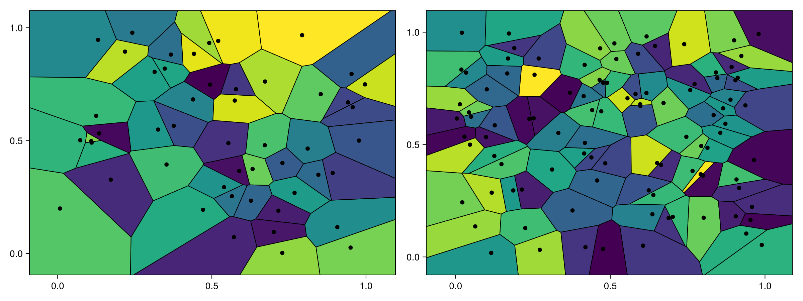
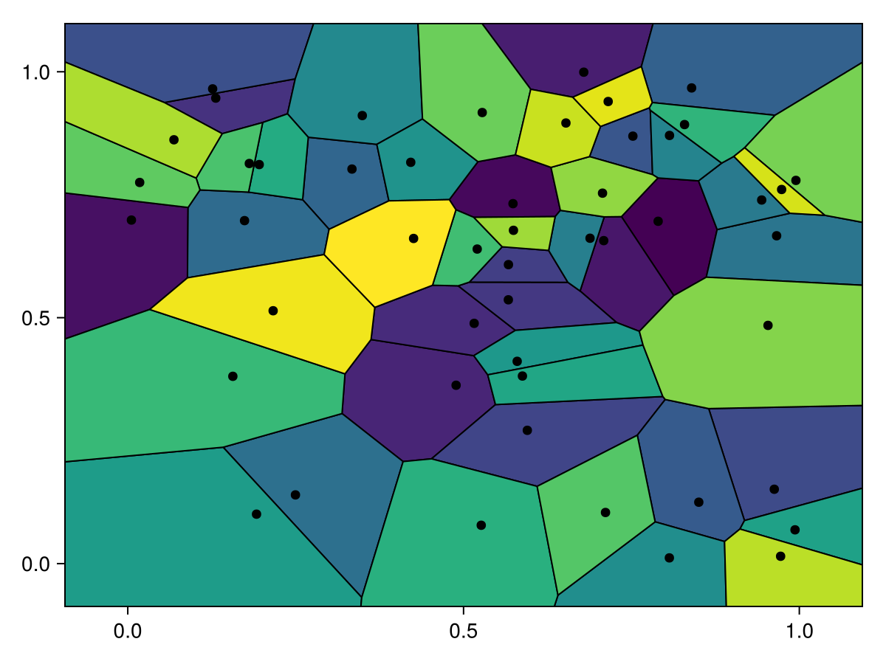
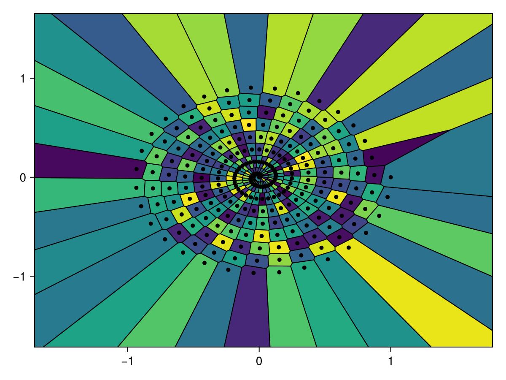
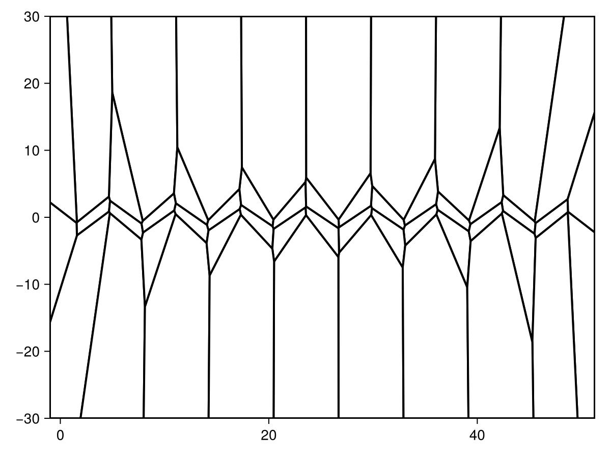
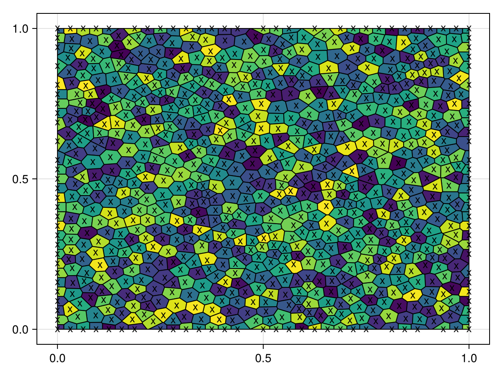
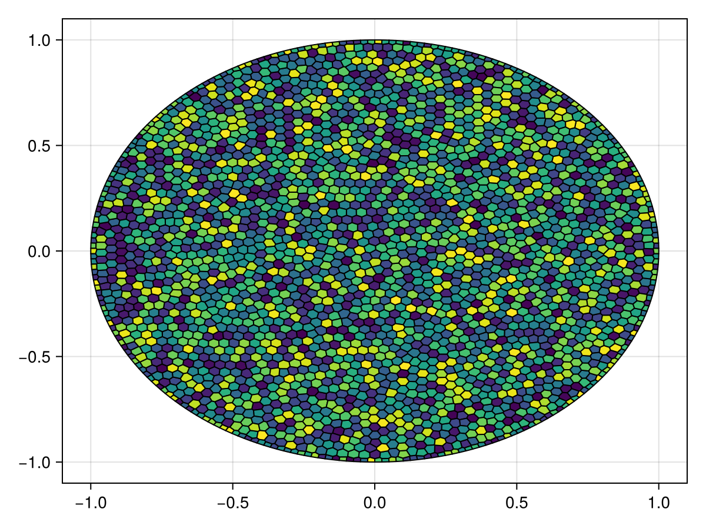

# voronoiplot {#voronoiplot}
<details class='jldocstring custom-block' open>
<summary><a id='Makie.voronoiplot-reference-plots-voronoiplot' href='#Makie.voronoiplot-reference-plots-voronoiplot'><span class="jlbinding">Makie.voronoiplot</span></a> <Badge type="info" class="jlObjectType jlFunction" text="Function" /></summary>


```julia
voronoiplot(x, y, values; kwargs...)
voronoiplot(values; kwargs...)
voronoiplot(x, y; kwargs...)
voronoiplot(positions; kwargs...)
voronoiplot(vorn::VoronoiTessellation; kwargs...)
```


Generates and plots a Voronoi tessalation from `heatmap`- or point-like data. The tessellation can also be passed directly as a `VoronoiTessellation` from DelaunayTriangulation.jl.

**Plot type**

The plot type alias for the `voronoiplot` function is `Voronoiplot`.


<Badge type="info" class="source-link" text="source"><a href="https://github.com/MakieOrg/Makie.jl/blob/d2876406fadce67d5357789b0b71495e7971e5c1/MakieCore/src/recipes.jl#L520-L572" target="_blank" rel="noreferrer">source</a></Badge>

</details>


## Examples {#Examples}

A `voronoiplot` generates a cell for each passed position similar to `heatmap`, however the cells are not restricted to a rectangular shape. It can be called with point based (like `scatter` or `lines`) or `heatmap`-like inputs.
<a id="example-59b354a" />


```julia
using CairoMakie
using Random
Random.seed!(1234)


f = Figure(size=(1200, 450))
ax = Axis(f[1, 1])
voronoiplot!(ax, rand(Point2f, 50))

ax = Axis(f[1, 2])
voronoiplot!(ax, rand(10, 10), rand(10, 10), rand(10, 10))
f
```




`voronoiplot` uses the Voronoi tessellation from [DelaunayTriangulation.jl](https://github.com/DanielVandH/DelaunayTriangulation.jl) to generate the cells. You can also do this yourself and directly plot the `VoronoiTessellation` object returned.
<a id="example-c787c47" />


```julia
using CairoMakie
using DelaunayTriangulation

using Random
Random.seed!(1234)

points = rand(2, 50)
tri = triangulate(points)
vorn = voronoi(tri)
f, ax, tr = voronoiplot(vorn)
f
```




When considering standard tessellations the unbounded polygons are clipped at a bounding box determined automatically by default, or from a user-provided clipping shape (a rectangle or circle). The automatic bounding box is determined by the bounding box of generators of the tessellation, meaning the provided points, extended out by some factor `unbounded_edge_extension_factor` (default `0.1`) proportional to the lengths of the bounding box&#39;s sides.
<a id="example-101d0b7" />


```julia
using CairoMakie
using DelaunayTriangulation

using Random
Random.seed!(1234)

z = LinRange(0, 1, 250) .* exp.(LinRange(0, 16pi, 250) .* im)
f, ax, tr = voronoiplot(real(z), imag(z), unbounded_edge_extension_factor = 0.4, markersize = 7)
f
```



<a id="example-6e8365a" />


```julia
using CairoMakie
using DelaunayTriangulation

using Random
Random.seed!(1234)

x = LinRange(0, 16pi, 50)
y = sin.(x)
bb = BBox(-1, 16pi + 1, -30, 30) # (xmin, xmax, ymin, ymax)
f, ax, tr = voronoiplot(x, y, show_generators=false,
    clip=bb, color=:white, strokewidth=2)
f
```




For clipped and centroidal tessellations, there are no unbounded polygons.
<a id="example-49daf65" />


```julia
using CairoMakie
using DelaunayTriangulation

using Random
Random.seed!(1234)

points = [(0.0, 0.0), (1.0, 0.0), (1.0, 1.0), (0.0, 1.0)]
tri = triangulate(points)
refine!(tri; max_area = 0.001)
vorn = voronoi(tri, clip = true)
f, ax, tr = voronoiplot(vorn, show_generators = true, markersize = 13, marker = 'x')
f
```



<a id="example-3e9d27b" />


```julia
using CairoMakie
using DelaunayTriangulation

using Random
Random.seed!(1234)

angles = range(0, 2pi, length = 251)[1:end-1]
x = cos.(angles)
y = sin.(angles)
points = tuple.(x, y)
tri = triangulate(points)
refine!(tri; max_area = 0.001)
vorn = voronoi(tri, clip = true)
smooth_vorn = centroidal_smooth(vorn)
f, ax, tr = voronoiplot(smooth_vorn, show_generators=false)
f
```




## Attributes {#Attributes}

### alpha {#alpha}

Defaults to `1.0`

The alpha value of the colormap or color attribute. Multiple alphas like in `plot(alpha=0.2, color=(:red, 0.5)`, will get multiplied.

### clip {#clip}

Defaults to `automatic`

Sets the clipping area for the generated polygons which can be a `Rect2` (or `BBox`), `Tuple` with entries `(xmin, xmax, ymin, ymax)` or as a `Circle`. Anything outside the specified area will be removed. If the `clip` is not set it is automatically determined using `unbounded_edge_extension_factor` as a `Rect`.

### color {#color}

Defaults to `automatic`

Sets the color of the polygons. If `automatic`, the polygons will be individually colored according to the colormap.

### colormap {#colormap}

Defaults to `@inherit colormap :viridis`

Sets the colormap that is sampled for numeric `color`s. `PlotUtils.cgrad(...)`, `Makie.Reverse(any_colormap)` can be used as well, or any symbol from ColorBrewer or PlotUtils. To see all available color gradients, you can call `Makie.available_gradients()`.

### colorrange {#colorrange}

Defaults to `automatic`

The values representing the start and end points of `colormap`.

### colorscale {#colorscale}

Defaults to `identity`

The color transform function. Can be any function, but only works well together with `Colorbar` for `identity`, `log`, `log2`, `log10`, `sqrt`, `logit`, `Makie.pseudolog10` and `Makie.Symlog10`.

### highclip {#highclip}

Defaults to `automatic`

The color for any value above the colorrange.

### lowclip {#lowclip}

Defaults to `automatic`

The color for any value below the colorrange.

### marker {#marker}

Defaults to `@inherit marker`

Sets the shape of the points.

### markercolor {#markercolor}

Defaults to `@inherit markercolor`

Sets the color of the points.

### markersize {#markersize}

Defaults to `@inherit markersize`

Sets the size of the points.

### nan_color {#nan_color}

Defaults to `:transparent`

The color for NaN values.

### show_generators {#show_generators}

Defaults to `true`

Determines whether to plot the individual generators.

### smooth {#smooth}

Defaults to `false`

No docs available.

### strokecolor {#strokecolor}

Defaults to `@inherit patchstrokecolor`

Sets the strokecolor of the polygons.

### strokewidth {#strokewidth}

Defaults to `1.0`

Sets the width of the polygon stroke.

### unbounded_edge_extension_factor {#unbounded_edge_extension_factor}

Defaults to `0.1`

Sets the extension factor for the unbounded edges, used in `DelaunayTriangulation.polygon_bounds`.
